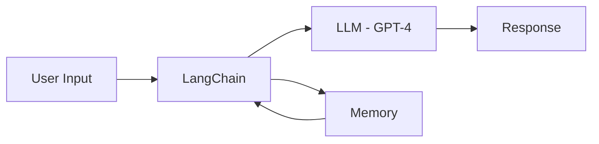
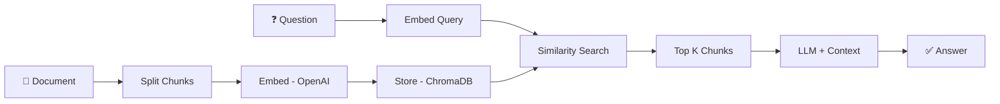
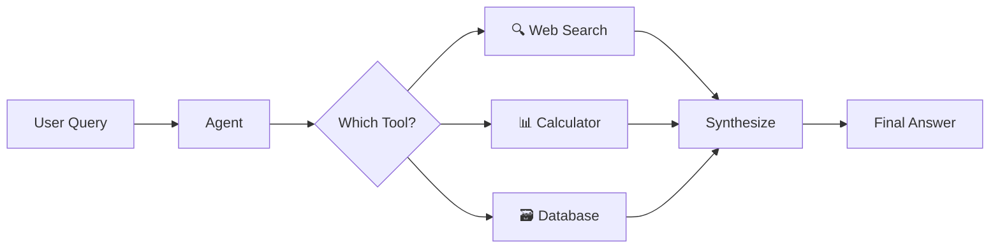

<p align="center">
  
</p>

<h1 align="center">🤖 Awesome AI Agents</h1>

<p align="center">
  <strong>A curated collection of production-ready AI agents with working code. Fork → Build → PR → Get credited!</strong>
</p>

<p align="center">
  <em>Open-source, community-driven, and always growing. ⭐ Star to bookmark. 🍴 Fork to contribute.</em>
</p>

<p align="center">
  
  
  
  <a href="https://github.com/sponsors/RayeesYousufGenAi"></a>
</p>

<p align="center">
  
  
  
  
</p>

<p align="center">
  <a href="#-agents-collection">🤖 Agents</a> •
  <a href="#-quick-start">🚀 Quick Start</a> •
  <a href="#-how-to-contribute-your-own-agent">🤝 Contribute</a> •
  <a href="#-propose-a-new-agent">💡 Propose</a> •
  <a href="#-sponsors--support">💖 Sponsor</a> •
  <a href="#-community">💬 Community</a>
</p>

---

## 🎯 What Is This?

An **open-source collection of AI agents** that you can run, learn from, and contribute to. Each agent is a standalone application with working code, documentation, and dependencies — ready to run in minutes.

### Why This Repo?

| 🔥 Feature | Description |
|-------------|-------------|
| **Working Code** | Every agent runs out of the box — no broken examples |
| **Community-Driven** | Anyone can contribute new agents via Pull Requests |
| **Well-Documented** | Each agent has its own README with setup instructions |
| **Production Patterns** | Learn real-world AI agent architecture patterns |
| **Always Growing** | New agents added by the community every week |

> 🍴 **Want to contribute?** Fork this repo, add your agent, and submit a PR. Your name goes in the Contributors section! See the [Contributing Guide](#-how-to-contribute-your-own-agent) below.

---

## 🤖 Agents Collection

| # | Agent | Description | Tech Stack | Author |
|---|-------|-------------|------------|--------|
| 01 | [🤖 Smart Chatbot](agents/chatbot/) | Conversational AI with memory | LangChain, GPT-4, Streamlit | [@RayeesYousufGenAi](https://github.com/RayeesYousufGenAi) |
| 02 | [📄 RAG Assistant](agents/rag-assistant/) | Ask questions about PDF documents | LangChain, ChromaDB, GPT-4 | [@RayeesYousufGenAi](https://github.com/RayeesYousufGenAi) |
| 03 | [🔍 Code Reviewer](agents/code-reviewer/) | AI code review with bug detection | OpenAI GPT-4, Streamlit | [@RayeesYousufGenAi](https://github.com/RayeesYousufGenAi) |
| 04 | [📊 Data Analyst](agents/data-analyst/) | Upload CSV, get AI-powered insights | OpenAI, Pandas, Streamlit | [@RayeesYousufGenAi](https://github.com/RayeesYousufGenAi) |
| 05 | [🌐 Web Researcher](agents/web-researcher/) | Research topics with AI + web scraping | OpenAI, BeautifulSoup | [@RayeesYousufGenAi](https://github.com/RayeesYousufGenAi) |
| 06 | [📺 YouTube Summarizer](agents/youtube-summarizer/) | Summarize YouTube videos from transcripts | OpenAI, youtube-transcript-api | [@RayeesYousufGenAi](https://github.com/RayeesYousufGenAi) |
| 07 | [📄 Resume Builder](agents/resume-builder/) | Create professional resumes from user input | OpenAI, FPDF, Streamlit | [@RayeesYousufGenAi](https://github.com/RayeesYousufGenAi) |
| 08 | [📧 AI Email Writer](agents/email-writer/) | Professional email generator with tone selection | Gemini API, Streamlit | [@Bijaykund8](https://github.com/Bijaykund8) |
| 09 | [🔗 LinkedIn Gen](agents/linkedin-generator/) | Generate viral posts from any topic | LangChain, OpenAI | [@RayeesYousufGenAi](https://github.com/RayeesYousufGenAi) |
| 10 | [🧬 ArXiv Analyzer](agents/arxiv-analyzer/) | Search & summarize scientific research papers | ArXiv, LangChain, OpenAI | [@RayeesYousufGenAi](https://github.com/RayeesYousufGenAi) |
| 11 | [📈 SEO Optimizer](agents/seo-optimizer/) | Generate meta-tags and SEO content tips | OpenAI, LangChain | [@RayeesYousufGenAi](https://github.com/RayeesYousufGenAi) |
| 12 | [📧 Email Personalizer](agents/email-personalizer/) | Personalized cold emails from bios | OpenAI, LangChain | [@RayeesYousufGenAi](https://github.com/RayeesYousufGenAi) |
| 13 | [🧪 Unit Test Gen](agents/unit-test-gen/) | Generate Pytest/Unittest suites from code | OpenAI, LangChain | [@RayeesYousufGenAi](https://github.com/RayeesYousufGenAi) |
| 14 | [📉 Stock Sentiment](agents/stock-sentiment/) | Ticker sentiment from news headlines | yFinance, OpenAI | [@RayeesYousufGenAi](https://github.com/RayeesYousufGenAi) |
| 15 | [⚖️ Legal Simplifier](agents/legal-simplifier/) | Decode complex legal contracts to English | OpenAI, LangChain | [@RayeesYousufGenAi](https://github.com/RayeesYousufGenAi) |
| 16 | [🐦 Twitter Architect](agents/twitter-architect/) | Viral Twitter/X thread generator | OpenAI, LangChain | [@RayeesYousufGenAi](https://github.com/RayeesYousufGenAi) |
| 17 | [📇 Flashcard Gen](agents/flashcard-gen/) | Generate study flashcards from PDFs | PyPDF, OpenAI | [@RayeesYousufGenAi](https://github.com/RayeesYousufGenAi) |
| 18 | [📝 Meeting Summarizer](agents/meeting-minutes/) | Executive summaries & action items from transcripts | OpenAI, LangChain | [@RayeesYousufGenAi](https://github.com/RayeesYousufGenAi) |
| 19 | [🐳 Docker Expert](agents/docker-expert/) | Optimize & secure your Dockerfiles | OpenAI, LangChain | [@RayeesYousufGenAi](https://github.com/RayeesYousufGenAi) |
| 20 | [👨‍🏫 Interview Coach](agents/interview-coach/) | Mock technical interviews with AI feedback | OpenAI, LangChain | [@RayeesYousufGenAi](https://github.com/RayeesYousufGenAi) |
| 21 | [🏷️ Brand Name Gen](agents/brand-name-gen/) | Generate catchy startup & product names | OpenAI, LangChain | [@RayeesYousufGenAi](https://github.com/RayeesYousufGenAi) |
| 22 | [📸 Insta Caption Writer](agents/insta-caption-writer/) | Viral Instagram captions with hashtags | OpenAI, LangChain | [@RayeesYousufGenAi](https://github.com/RayeesYousufGenAi) |
| 23 | [📖 API Doc Bot](agents/api-doc-gen/) | Convert code to clean API documentation | OpenAI, LangChain | [@RayeesYousufGenAi](https://github.com/RayeesYousufGenAi) |
| 24 | [🎋 Git Assistant](agents/git-assistant/) | Meaningful commit messages from diffs | OpenAI, LangChain | [@RayeesYousufGenAi](https://github.com/RayeesYousufGenAi) |
| 25 | [🌎 Language Tutor](agents/language-tutor/) | Conversation partner with grammar review | OpenAI, LangChain | [@RayeesYousufGenAi](https://github.com/RayeesYousufGenAi) |
| 26 | [✈️ Travel Planner](agents/travel-planner/) | Custom itineraries based on budget | OpenAI, LangChain | [@RayeesYousufGenAi](https://github.com/RayeesYousufGenAi) |
| 27 | [💸 Expense Tracker](agents/expense-tracker/) | Auto-categorize spending from logs | OpenAI, LangChain | [@RayeesYousufGenAi](https://github.com/RayeesYousufGenAi) |
| 28 | [📜 Patent Searcher](agents/patent-searcher/) | Analyze invention novelty & prior art | OpenAI, LangChain | [@RayeesYousufGenAi](https://github.com/RayeesYousufGenAi) |
| 29 | [🎵 Lyrics Writer](agents/lyrics-writer/) | Song lyrics generator for any genre | OpenAI, LangChain | [@RayeesYousufGenAi](https://github.com/RayeesYousufGenAi) |
| 30 | [🍳 Recipe Gen](agents/recipe-gen/) | Custom recipes based on fridge items | OpenAI, LangChain | [@RayeesYousufGenAi](https://github.com/RayeesYousufGenAi) |
| 31 | [🎨 Prompt Engineer](agents/prompt-engineer/) | Viral art prompts for Midjourney/DALL-E | OpenAI, LangChain | [@RayeesYousufGenAi](https://github.com/RayeesYousufGenAi) |
| 32 | [🎬 Vibe Recommender](agents/recommender-bot/) | Niche movie & book picks by 'vibe' | OpenAI, LangChain | [@RayeesYousufGenAi](https://github.com/RayeesYousufGenAi) |
| 33 | [🏷️ Price Monitor](agents/price-tracker/) | Evaluate if a product is a good deal | OpenAI, LangChain | [@RayeesYousufGenAi](https://github.com/RayeesYousufGenAi) |
| 34 | [📊 Survey Analyzer](agents/survey-analyzer/) | Extract insights from raw feedback | OpenAI, LangChain | [@RayeesYousufGenAi](https://github.com/RayeesYousufGenAi) |
| 35 | [📡 Competitor Intel](agents/competitor-monitor/) | Analyze competitor strategy & moat | OpenAI, LangChain | [@RayeesYousufGenAi](https://github.com/RayeesYousufGenAi) |
| 36 | [🪴 Plant Doctor](agents/plant-doctor/) | Diagnose plant issues & recovery plan | OpenAI, LangChain | [@RayeesYousufGenAi](https://github.com/RayeesYousufGenAi) |
| 37 | [🏗️ Code Diagrammer](agents/code-to-diagram/) | Create Mermaid diagrams from code | OpenAI, LangChain | [@RayeesYousufGenAi](https://github.com/RayeesYousufGenAi) |
| 38 | [🧾 Invoice Gen](agents/invoice-gen/) | Itemized invoices from messy work logs | OpenAI, LangChain | [@RayeesYousufGenAi](https://github.com/RayeesYousufGenAi) |
| 39 | [💸 Tax Assistant](agents/tax-assistant/) | Freelance tax deduction guidance | OpenAI, LangChain | [@RayeesYousufGenAi](https://github.com/RayeesYousufGenAi) |
| 40 | [📜 Contract Compare](agents/contract-compare/) | Semantic diffing for legal contracts | OpenAI, LangChain | [@RayeesYousufGenAi](https://github.com/RayeesYousufGenAi) |

> 🆕 **Your agent could be next!** See [How to Contribute](#-how-to-contribute-your-own-agent) or [Propose a new agent idea](#-propose-a-new-agent).

---

## 🚀 Quick Start

### Option 1: Using Docker (Recommended)

Run all agents at once with Docker Compose:

```bash
export OPENAI_API_KEY="your-key-here"
docker compose up
```

Or run in detached mode (background):

```bash
export OPENAI_API_KEY="your-key-here"
docker compose up -d
```

**Service Ports:**

| Service | Port | URL |
|---------|------|-----|
| Chatbot | 8501 | http://localhost:8501 |
| RAG Assistant | 8502 | http://localhost:8502 |
| Code Reviewer | 8503 | http://localhost:8503 |
| Data Analyst | 8504 | http://localhost:8504 |
| Web Researcher | 8505 | http://localhost:8505 |

### Option 2: Manual Setup

#### 1. Clone the repo

```bash
git clone https://github.com/RayeesYousufGenAi/awesome-ai-agents.git
cd awesome-ai-agents
```

#### 2. Pick an agent and install its dependencies

```bash
cd agents/chatbot          # or any agent folder
pip install -r requirements.txt
```

#### 3. Set your API key

```bash
export OPENAI_API_KEY="your-key-here"
```

#### 4. Run it!

```bash
streamlit run app.py
```

> 💡 Each agent has its own `README.md` with specific setup instructions.

---

## 🏗️ Project Structure

```
awesome-ai-agents/
│
├── 📁 agents/                      # All AI agents live here
│   ├── 📁 chatbot/                 # Smart conversational agent
│   │   ├── app.py
│   │   ├── README.md
│   │   └── requirements.txt
│   ├── 📁 rag-assistant/           # PDF Q&A with RAG
│   ├── 📁 code-reviewer/           # AI code review
│   ├── 📁 data-analyst/            # CSV data analysis
│   ├── 📁 web-researcher/          # Topic research + URL analysis
│   ├── 📁 youtube-summarizer/      # YouTube video summarization
│   └── 📁 your-agent-here/         # ← Add yours!
│
├── 📁 assets/                      # Logos and images
│
├── 📁 .github/
│   ├── PULL_REQUEST_TEMPLATE.md    # PR template with checklist
│   └── ISSUE_TEMPLATE/
│       ├── bug_report.md           # Bug report template
│       ├── new_agent.md            # Propose a new agent
│       └── feature_request.md      # Request improvements
│
├── 📖 README.md                    # You are here
├── 🤝 CONTRIBUTING.md              # Step-by-step contribution guide
├── 📜 CODE_OF_CONDUCT.md           # Community guidelines
├── 📜 LICENSE                      # MIT License
└── 🚫 .gitignore
```

---

## 🤝 How to Contribute Your Own Agent

We **love** contributions! Adding a new AI agent is the best way to contribute. Here's the quick version:

### Step 1: Fork & Clone
```bash
# Click "Fork" button at the top of this page ☝️
git clone https://github.com/YOUR-USERNAME/awesome-ai-agents.git
cd awesome-ai-agents
```

### Step 2: Create Your Agent
```bash
mkdir -p agents/your-agent-name
```

Add these files:
```
agents/your-agent-name/
├── app.py              # Your agent code
├── README.md           # Documentation
└── requirements.txt    # Dependencies
```

### Step 3: Submit a Pull Request
```bash
git checkout -b add-agent/your-agent-name
git add .
git commit -m "✨ Add: Your Agent Name"
git push origin add-agent/your-agent-name
```

Then open a **Pull Request** on GitHub! Our PR template will guide you through the checklist.

### Step 4: Get Credited! 🎉

Once merged, your name and agent appear in this README. You also become a project **contributor**.

> 📖 **Full guide:** See [CONTRIBUTING.md](CONTRIBUTING.md) for detailed step-by-step instructions with templates and requirements.

---

## 💡 Propose a New Agent

Have an idea for a cool AI agent but don't have time to build it? **Propose it!** Someone from the community might pick it up.

👉 [**Open a "New Agent" issue →**](https://github.com/RayeesYousufGenAi/awesome-ai-agents/issues/new?template=new_agent.md)

### Agent Ideas Looking for Builders 🔨

Check our [open issues with the `new-agent` label](https://github.com/RayeesYousufGenAi/awesome-ai-agents/labels/new-agent) to find agents that need to be built! These are great for first-time contributors.

---

## 🚀 The 50+ Agents Roadmap

We are on a mission to build **50+ production-ready AI agents**. This repository is not just a collection; it's a growing ecosystem for developers to learn and build real-world AI applications.

**Current Progress:**
`40/1000` [🟦🟦🟦🟦🟦⬜⬜⬜⬜⬜] **4% Complete**

> [!TIP]
> **Want to contribute?** Check our [**IDEAS_BANK.md**](IDEAS_BANK.md) for 100+ agent ideas across every industry! Pick an idea, build it, and help us reach 1000.

---

## 🏗️ Architecture Patterns

Learn common patterns used across the agents:

### 1. Conversational Agent (Chatbot)


### 2. RAG (Retrieval-Augmented Generation)


### 3. Tool-Using Agent


---

## 📊 Tech Stack Overview

| Technology | Used For | Agents |
|-----------|----------|--------|
| **OpenAI GPT-4** | Language model | All agents |
| **LangChain** | Chains & memory | Chatbot, RAG |
| **ChromaDB** | Vector storage | RAG Assistant |
| **Streamlit** | Web UI | All agents |
| **BeautifulSoup** | Web scraping | Web Researcher |
| **Pandas** | Data processing | Data Analyst |

---

## ❓ FAQ

<details>
<summary><b>How do I get an OpenAI API key?</b></summary>

1. Go to [platform.openai.com](https://platform.openai.com)
2. Create an account → API Keys → Create new key
3. Set it as: `export OPENAI_API_KEY="sk-your-key"`

</details>

<details>
<summary><b>Can I use a different LLM (Claude, Gemini, etc.)?</b></summary>

Yes! Most agents use OpenAI, but you can easily swap the LLM. For example, replace `ChatOpenAI` with `ChatAnthropic` for Claude. Contributions for multi-LLM support are welcome!

</details>

<details>
<summary><b>How do I add my agent to the collection?</b></summary>

Fork → Add your agent in `agents/your-name/` → Submit a PR. See [CONTRIBUTING.md](CONTRIBUTING.md) for the full step-by-step guide.

</details>

<details>
<summary><b>My PR was rejected. Why?</b></summary>

Common reasons: code doesn't run, missing README, hardcoded API keys, or duplicate of existing agent. Check the PR template requirements and fix the issues.

</details>

<details>
<summary><b>Can I use these agents commercially?</b></summary>

Yes! This project is MIT licensed. You can use, modify, and distribute commercially. Just include the license.

</details>

---

## 💖 Sponsors & Support

Building and maintaining high-quality open-source AI agents takes significant time and effort. If you find this repository useful for your learning, projects, or business, please consider supporting the development!

Your sponsorship helps me:
- Add more advanced AI agents (Voice, Vision, multi-agent frameworks)
- Maintain and update existing code (API changes, library updates)
- Create more comprehensive tutorials and documentation

<p align="center">
  <a href="https://github.com/sponsors/RayeesYousufGenAi">
    
  </a>
  <a href="https://paypal.me/rayeesyousuf">
    
  </a>
</p>

---

## 💬 Community

| Channel | Link | Purpose |
|---------|------|---------|
| 💬 **Discussions** | [GitHub Discussions](https://github.com/RayeesYousufGenAi/awesome-ai-agents/discussions) | Q&A, ideas, show & tell |
| 🐛 **Bug Reports** | [Open an Issue](https://github.com/RayeesYousufGenAi/awesome-ai-agents/issues/new?template=bug_report.md) | Report broken agents |
| 🤖 **Propose Agent** | [New Agent Issue](https://github.com/RayeesYousufGenAi/awesome-ai-agents/issues/new?template=new_agent.md) | Suggest new agents |
| 💡 **Features** | [Feature Request](https://github.com/RayeesYousufGenAi/awesome-ai-agents/issues/new?template=feature_request.md) | Suggest improvements |

---

## ⭐ Star History

If you find this collection useful, please **star** the repo! It helps others discover it.

[](https://star-history.com/#RayeesYousufGenAi/awesome-ai-agents&Date)

---

## 🙌 Contributors

Thanks to everyone who has contributed agents and improvements!

<a href="https://github.com/RayeesYousufGenAi/awesome-ai-agents/graphs/contributors">
  
</a>

> 🍴 **Your face could be here!** Fork the repo and submit a PR to get credited.

---

## 📜 License

This project is licensed under the **MIT License** — see the [LICENSE](LICENSE) file for details.

---

## 👤 Author

<p align="center">
  <strong>Rayees Yousuf</strong><br/>
  AI Automation & Agent Builder
</p>

<p align="center">
  <a href="https://www.linkedin.com/in/rayeesyousuf/">
    
  </a>
  <a href="https://github.com/RayeesYousufGenAi">
    
  </a>
</p>

---

<p align="center">
  <strong>⭐ Star this repo</strong> to bookmark it • <strong>🍴 Fork it</strong> to contribute • <strong>📢 Share it</strong> to help others
</p>

<p align="center">
  <sub>Built with ❤️ by the community. Every contribution counts. 🚀</sub>
</p>
