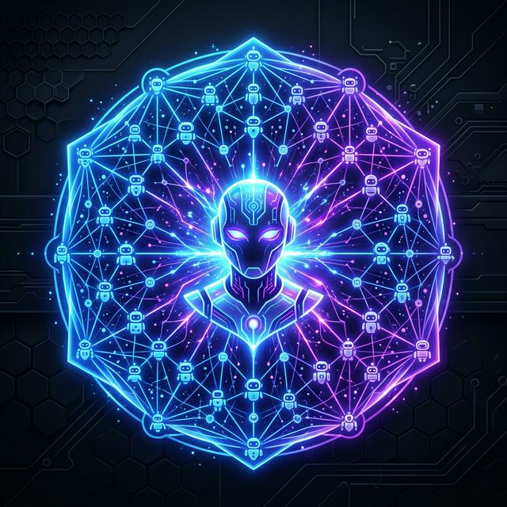

<p align="center">
  
</p>

<h1 align="center">⚡ Awesome AI Agents ⚡</h1>

<p align="center">
  <strong>The Ultimate Open-Source Hub for 1000+ Production-Ready AI Agents</strong> <br>
  <em>Clone. Build. Launch. Scale.</em>
</p>

<p align="center">
  <a href="https://github.com/RayeesYousufGenAi/awesome-ai-agents"></a>
  
  <a href="https://github.com/RayeesYousufGenAi/awesome-ai-agents/pulls"></a>
  
</p>

---

## 🚀 The 1000-Agent Mission

Welcome to the largest, most actively maintained directory of **working AI agents** on the internet. We aren't just a list of links—we are a **builder's hub**. Every single directory in this repository is designed to be a standalone, full-stack, production-ready AI agent that you can clone and run in seconds.

### 🌟 Why This Hub Exists
*   **🛠️ Working Code First**: Stop fighting broken implementations. Every agent includes a strict `requirements.txt` and a dedicated `README.md`.
*   **🧠 Architecture Patterns**: Learn real-world implementations of RAG, ReAct, Task Planning, and Multi-Agent Orchestration (CrewAI, LangChain, AutoGen).
*   **🤝 Community Powered**: Built by developers, for developers. Submit a PR, and your name gets etched into the Hall of Fame.
*   **⚡ Copy-Paste Deployments**: Use our *Agent Master Template* to rapidly scaffold your next big idea.

---

## 💻 How to Use This Repository

1. **Find an Agent:** Scroll through the categorized list below.
2. **Navigate to the Folder:** Click the link to view the agent's dedicated repository folder.
3. **Install & Run:** Follow the sub-folder's `README.md` to install dependencies (`pip install -r requirements.txt`) and launch (`python app.py`).

---

## 🤖 The Massive Agent Directory

| # | Agent | Description | Tech Stack | Author |
|---|-------|-------------|------------|--------|
| **Core** | | | | |
| 01 | [🤖 Smart Chatbot](agents/chatbot/) | Conversational AI with memory | LangChain, GPT-4 | [@RayeesYousufGenAi](https://github.com/RayeesYousufGenAi) |
| 02 | [📄 RAG Assistant](agents/rag-assistant/) | Chat with your PDFs & Docs | LangChain, ChromaDB | [@RayeesYousufGenAi](https://github.com/RayeesYousufGenAi) |
| 03 | [🔍 Code Reviewer](agents/code-reviewer/) | AI code review with bug detection | GPT-4, Streamlit | [@RayeesYousufGenAi](https://github.com/RayeesYousufGenAi) |
| 04 | [📊 Data Analyst](agents/data-analyst/) | CSV insights & visualization | Pandas, OpenAI | [@RayeesYousufGenAi](https://github.com/RayeesYousufGenAi) |
| 05 | [🌐 Web Researcher](agents/web-researcher/) | AI web searching & scraping | BeautifulSoup, OpenAI | [@RayeesYousufGenAi](https://github.com/RayeesYousufGenAi) |
| **Community Highlights** | | | | |
| 06 | [📺 YouTube Summarizer](agents/youtube-summarizer/) | Summarize YT videos instantly | [@llrightll](https://github.com/llrightll) | ✨ |
| 07 | [📄 Resume Builder](agents/resume-builder/) | Career-ready professional resumes | [@llrightll](https://github.com/llrightll) | ✨ |
| 08 | [📧 AI Email Writer](agents/email-writer/) | Tone-aware professional emails | [@Bijaykund8](https://github.com/Bijaykund8) & [@rishi250111256-collab](https://github.com/rishi250111256-collab) | ✨ |
| 09 | [🗄️ SQL Generator](agents/sql-generator/) | Natural language to Secure SQL | [@llrightll](https://github.com/llrightll) | 🛡️ |
| **Expansion Batch** | | | | |
| 10 | [🧬 ArXiv Analyzer](agents/arxiv-analyzer/) | Scientific research paper auditor | ArXiv, OpenAI | [@RayeesYousufGenAi](https://github.com/RayeesYousufGenAi) |
| 11 | [📈 SEO Optimizer](agents/seo-optimizer/) | Marketing & SEO meta-tag gen | OpenAI | [@RayeesYousufGenAi](https://github.com/RayeesYousufGenAi) |
| 12 | [📧 Email Personalizer](agents/email-personalizer/) | Hyper-personalized cold outreach | OpenAI | [@RayeesYousufGenAi](https://github.com/RayeesYousufGenAi) |
| 13 | [🧪 Unit Test Gen](agents/unit-test-gen/) | Pytest/Unittest suite generation | OpenAI | [@RayeesYousufGenAi](https://github.com/RayeesYousufGenAi) |
| 14 | [📉 Stock Sentiment](agents/stock-sentiment/) | Ticker sentiment from finance news | yFinance, OpenAI | [@RayeesYousufGenAi](https://github.com/RayeesYousufGenAi) |
| 15 | [⚖️ Legal Simplifier](agents/legal-simplifier/) | Complex legal jargon decoder | GPT-4o | [@RayeesYousufGenAi](https://github.com/RayeesYousufGenAi) |
| 16 | [🐦 Twitter Architect](agents/twitter-architect/) | Viral thread builder for X | GPT-4o | [@RayeesYousufGenAi](https://github.com/RayeesYousufGenAi) |
| 17 | [📇 Flashcard Gen](agents/flashcard-gen/) | Study cards from massive PDFs | PyPDF | [@RayeesYousufGenAi](https://github.com/RayeesYousufGenAi) |
| 18 | [📝 Meeting Summarizer](agents/meeting-minutes/) | Action items from transcripts | GPT-4o | [@RayeesYousufGenAi](https://github.com/RayeesYousufGenAi) |
| 19 | [🐳 Docker Expert](agents/docker-expert/) | Optimize & secure Dockerfiles | DevOps AI | [@RayeesYousufGenAi](https://github.com/RayeesYousufGenAi) |
| 20 | [👨‍🏫 Interview Coach](agents/interview-coach/) | Technical mock interview AI | Career AI | [@RayeesYousufGenAi](https://github.com/RayeesYousufGenAi) |
| 21 | [🏷️ Brand Name Gen](agents/brand-name-gen/) | Catchy startup naming engine | Branding AI | [@RayeesYousufGenAi](https://github.com/RayeesYousufGenAi) |
| 22 | [📸 Insta Caption](agents/insta-caption-writer/) | Viral captions with hashtags | Social AI | [@RayeesYousufGenAi](https://github.com/RayeesYousufGenAi) |
| 23 | [📖 API Doc Bot](agents/api-doc-gen/) | Code to clean documentation | Documentation | [@RayeesYousufGenAi](https://github.com/RayeesYousufGenAi) |
| 24 | [🎋 Git Assistant](agents/git-assistant/) | Auto-commit messages from diffs | Git AI | [@RayeesYousufGenAi](https://github.com/RayeesYousufGenAi) |
| 25 | [🌎 Language Tutor](agents/language-tutor/) | Conversational language partner | Education | [@RayeesYousufGenAi](https://github.com/RayeesYousufGenAi) |
| 26 | [✈️ Travel Planner](agents/travel-planner/) | Budget-aware custom itineraries | Travel AI | [@RayeesYousufGenAi](https://github.com/RayeesYousufGenAi) |
| 27 | [💸 Expense Tracker](agents/expense-tracker/) | Auto-categorize spending logs | Finance AI | [@RayeesYousufGenAi](https://github.com/RayeesYousufGenAi) |
| 28 | [📜 Patent Searcher](agents/patent-searcher/) | Novelty & prior art analyzer | Legal AI | [@RayeesYousufGenAi](https://github.com/RayeesYousufGenAi) |
| 29 | [🎵 Lyrics Writer](agents/lyrics-writer/) | AI song lyrics generator | Creative AI | [@RayeesYousufGenAi](https://github.com/RayeesYousufGenAi) |
| 30 | [🍳 Recipe Gen](agents/recipe-gen/) | Recipes from fridge items | Cooking AI | [@RayeesYousufGenAi](https://github.com/RayeesYousufGenAi) |
| 31 | [🎨 Prompt Engineer](agents/prompt-engineer/) | Viral art prompts for Midjourney | Art AI | [@RayeesYousufGenAi](https://github.com/RayeesYousufGenAi) |
| 32 | [🎬 Vibe Recommender](agents/recommender-bot/) | Niche movie & book picks | Entertainment | [@RayeesYousufGenAi](https://github.com/RayeesYousufGenAi) |
| 33 | [🏷️ Price Monitor](agents/price-tracker/) | E-commerce deal evaluator | Shopping AI | [@RayeesYousufGenAi](https://github.com/RayeesYousufGenAi) |
| 34 | [📊 Survey Analyzer](agents/survey-analyzer/) | Feedback synthesis engine | Analysis AI | [@RayeesYousufGenAi](https://github.com/RayeesYousufGenAi) |
| 35 | [📡 Competitor Intel](agents/competitor-monitor/) | Strategy & moat analyzer | Business AI | [@RayeesYousufGenAi](https://github.com/RayeesYousufGenAi) |
| 36 | [🪴 Plant Doctor](agents/plant-doctor/) | Diagnose plant diseases & fix | Botanical AI | [@RayeesYousufGenAi](https://github.com/RayeesYousufGenAi) |
| 37 | [🏗️ Code Diagrammer](agents/code-to-diagram/) | Code to Mermaid diagrams | Dev AI | [@RayeesYousufGenAi](https://github.com/RayeesYousufGenAi) |
| 38 | [🧾 Invoice Gen](agents/invoice-gen/) | Billing from messy work logs | Productivity | [@RayeesYousufGenAi](https://github.com/RayeesYousufGenAi) |
| 39 | [💸 Tax Assistant](agents/tax-assistant/) | Freelance tax deduction guide | Finance AI | [@RayeesYousufGenAi](https://github.com/RayeesYousufGenAi) |
| 40 | [📜 Contract Compare](agents/contract-compare/) | Semantic diffing for legal doc | Legal AI | [@RayeesYousufGenAi](https://github.com/RayeesYousufGenAi) |
| 41 | [🔐 Privacy Analyst](agents/privacy-analyst/) | Policy auditing & grading | Security AI | [@RayeesYousufGenAi](https://github.com/RayeesYousufGenAi) |
| 42 | [🎬 YouTube Gen](agents/youtube-desc-gen/) | SEO metadata & timestamps | Content AI | [@RayeesYousufGenAi](https://github.com/RayeesYousufGenAi) |
| 43 | [👤 Bio Optimizer](agents/bio-optimizer/) | High-conversion social bios | Branding | [@RayeesYousufGenAi](https://github.com/RayeesYousufGenAi) |
| 44 | [🗄️ SQL Optimizer](agents/sql-optimizer/) | Query bottleneck detection | Database AI | [@RayeesYousufGenAi](https://github.com/RayeesYousufGenAi) |
| 45 | [💪 Workout Planner](agents/workout-coach/) | Custom routines by equipment | Health AI | [@RayeesYousufGenAi](https://github.com/RayeesYousufGenAi) |
| 46 | [📊 Pitch Deck Gen](agents/pitch-deck-gen/) | VC-standard startup outlines | Business AI | [@RayeesYousufGenAi](https://github.com/RayeesYousufGenAi) |
| 47 | [🌎 Domain Finder](agents/domain-finder/) | Startup naming & availability | Branding | [@RayeesYousufGenAi](https://github.com/RayeesYousufGenAi) |
| 48 | [📞 Cold Call Gen](agents/cold-call-gen/) | Non-cringe sales scripts | Sales AI | [@RayeesYousufGenAi](https://github.com/RayeesYousufGenAi) |
| 49 | [🆕 Release Notes](agents/release-notes-gen/) | Tech logs to user-friendly | Product AI | [@RayeesYousufGenAi](https://github.com/RayeesYousufGenAi) |
| 50 | [🤖 Agent Master](agents/agent-master-template/) | Instant generator for next 900+ | Meta Agent | [@RayeesYousufGenAi](https://github.com/RayeesYousufGenAi) |
| **Expansion Batch 6** | | | | |
| 51 | [🔗 LinkedIn Gen](agents/linkedin-generator/) | Viral post generator | Social AI | [@RayeesYousufGenAi](https://github.com/RayeesYousufGenAi) |
| 52 | [🌍 Subtitle Trans](agents/subtitle-translator/) | SRT Translation with timing | Media AI | [@RayeesYousufGenAi](https://github.com/RayeesYousufGenAi) |
| 53 | [📅 Content Calendar](agents/content-calendar/) | 30-day social strategy | Content AI | [@RayeesYousufGenAi](https://github.com/RayeesYousufGenAi) |
| 54 | [⚖️ Product Compare](agents/product-compare/) | Side-by-side spec analysis | Shopping | [@RayeesYousufGenAi](https://github.com/RayeesYousufGenAi) |
| 55 | [💌 Cover Letter](agents/cover-letter/) | Job-specific career impact | Career AI | [@RayeesYousufGenAi](https://github.com/RayeesYousufGenAi) |
| 56 | [✍️ Grammar Pro](agents/grammar-pro/) | Advanced tone & flow optimization| Writer AI | [@RayeesYousufGenAi](https://github.com/RayeesYousufGenAi) |
| 57 | [🌤️ Standup Gen](agents/standup-gen/) | Notes to professional updates | Business AI | [@RayeesYousufGenAi](https://github.com/RayeesYousufGenAi) |
| 58 | [💻 Stack Recommender](agents/stack-recommender/) | Scalable tech architecture | CTO AI | [@RayeesYousufGenAi](https://github.com/RayeesYousufGenAi) |
| 59 | [💼 Job Post Gen](agents/job-post-gen/) | Catchy & inclusive hiring | HR AI | [@RayeesYousufGenAi](https://github.com/RayeesYousufGenAi) |
| 60 | [🛠️ Code Refactorer](agents/code-refactor/) | Fix spaghetti, improve DRY | Dev AI | [@RayeesYousufGenAi](https://github.com/RayeesYousufGenAi) |
| **Batch 7: DevOps & Infra** | | | | |
| 61 | [☁️ AWS Cost Optimizer](agents/aws-cost-optimizer/) | Find zombie EC2s & save money | DevOps | [@RayeesYousufGenAi](https://github.com/RayeesYousufGenAi) |
| 62 | [☸️ K8s Troubleshooter](agents/k8s-troubleshooter/) | Parse pod logs & fix CrashLoop | DevOps | [@RayeesYousufGenAi](https://github.com/RayeesYousufGenAi) |
| 63 | [🏗️ Terraform Gen](agents/terraform-gen/) | Text to IaC templates | DevOps | [@RayeesYousufGenAi](https://github.com/RayeesYousufGenAi) |
| 64 | [🔥 Incident Responder](agents/incident-responder/) | PagerDuty alert classification | SRE | [@RayeesYousufGenAi](https://github.com/RayeesYousufGenAi) |
| 65 | [🚦 CI/CD Builder](agents/cicd-builder/) | Auto-generate GitHub Actions | DevOps | [@RayeesYousufGenAi](https://github.com/RayeesYousufGenAi) |
| 66 | [🔒 IAM Policy Gen](agents/iam-policy-gen/) | Least-privilege JSON generation | SecOps | [@RayeesYousufGenAi](https://github.com/RayeesYousufGenAi) |
| 67 | [📊 Datadog Analyst](agents/datadog-analyst/) | APM trace summarization | SRE | [@RayeesYousufGenAi](https://github.com/RayeesYousufGenAi) |
| 68 | [🐳 Dockerfile SecFix](agents/dockerfile-secfix/) | Patch CVEs in container base | SecOps | [@RayeesYousufGenAi](https://github.com/RayeesYousufGenAi) |
| 69 | [🕸️ Nginx Config Gen](agents/nginx-config-gen/) | Reverse proxy & SSL setups | DevOps | [@RayeesYousufGenAi](https://github.com/RayeesYousufGenAi) |
| 70 | [🔄 Db Migration Bot](agents/db-migration-bot/) | Auto-write Flyway/Liquibase | DataEng | [@RayeesYousufGenAi](https://github.com/RayeesYousufGenAi) |
| **Batch 8: Finance & Trading** | | | | |
| 71 | [📉 Options Analyzer](agents/options-analyzer/) | Black-Scholes risk modeling | FinTech | [@RayeesYousufGenAi](https://github.com/RayeesYousufGenAi) |
| 72 | [🧾 Receipt OCR](agents/receipt-ocr/) | Extract line-items from PDFs | Finance | [@RayeesYousufGenAi](https://github.com/RayeesYousufGenAi) |
| 73 | [💹 Crypto Arbitrage](agents/crypto-arbitrage/) | Multi-exchange spread scanner | Web3 | [@RayeesYousufGenAi](https://github.com/RayeesYousufGenAi) |
| 74 | [🏦 Loan Scorer](agents/loan-scorer/) | Alternative credit assessment | FinTech | [@RayeesYousufGenAi](https://github.com/RayeesYousufGenAi) |
| 75 | [🤖 Algorithmic Trader](agents/algo-trader/) | Backtesting moving averages | Quant | [@RayeesYousufGenAi](https://github.com/RayeesYousufGenAi) |
| 76 | [📑 Form 10-K Reader](agents/10k-reader/) | Extract risks from SEC filings | FinTech | [@RayeesYousufGenAi](https://github.com/RayeesYousufGenAi) |
| 77 | [💱 Forex Predictor](agents/forex-predictor/) | Macro-economic news parsing | Quant | [@RayeesYousufGenAi](https://github.com/RayeesYousufGenAi) |
| 78 | [💳 Fraud Detector](agents/fraud-detector/) | Anomaly detection in txns | SecOps | [@RayeesYousufGenAi](https://github.com/RayeesYousufGenAi) |
| 79 | [📊 Portfolio Balancer](agents/portfolio-balancer/) | Modern Portfolio Theory AI | Wealth | [@RayeesYousufGenAi](https://github.com/RayeesYousufGenAi) |
| 80 | [📋 Audit Assistant](agents/audit-assistant/) | Reconciliation anomaly flags | Accounting| [@RayeesYousufGenAi](https://github.com/RayeesYousufGenAi) |
| **Batch 9: Healthcare & Biotech** | | | | |
| 81 | [🧬 DNA Sequencer](agents/dna-sequencer/) | Pattern matching in genomics | Biotech | [@RayeesYousufGenAi](https://github.com/RayeesYousufGenAi) |
| 82 | [🏥 EHR Summarizer](agents/ehr-summarizer/) | Patient history compression | MedTech | [@RayeesYousufGenAi](https://github.com/RayeesYousufGenAi) |
| 83 | [⚕️ Symptom Checker](agents/symptom-checker/) | Triage based on clinical DBs | MedTech | [@RayeesYousufGenAi](https://github.com/RayeesYousufGenAi) |
| 84 | [💊 Drug Interaction](agents/drug-interaction/) | Polypharmacy risk alerts | MedTech | [@RayeesYousufGenAi](https://github.com/RayeesYousufGenAi) |
| 85 | [🧠 Mental Health Bot](agents/mental-health-bot/) | CBT-focused companion | Wellness | [@RayeesYousufGenAi](https://github.com/RayeesYousufGenAi) |
| 86 | [🩸 Lab Results Decx](agents/lab-results-decoder/) | Explain CBC panels to patients | Health | [@RayeesYousufGenAi](https://github.com/RayeesYousufGenAi) |
| 87 | [🏃‍♂️ Garmin Analyzer](agents/garmin-analyzer/) | V02 Max & sleep correlations | Fitness | [@RayeesYousufGenAi](https://github.com/RayeesYousufGenAi) |
| 88 | [🍏 Diet Generator](agents/diet-generator/) | Macro-perfect meal plans | Nutrition| [@RayeesYousufGenAi](https://github.com/RayeesYousufGenAi) |
| 89 | [🦷 Dental Doc](agents/dental-doc/) | Post-op care instructions | MedTech | [@RayeesYousufGenAi](https://github.com/RayeesYousufGenAi) |
| 90 | [📝 Clinical Notes](agents/clinical-notes/) | SOAP note auto-generation | MedTech | [@RayeesYousufGenAi](https://github.com/RayeesYousufGenAi) |
| **Batch 10: Human Resources** | | | | |
| 91 | [🤝 Onboarding Bot](agents/onboarding-bot/) | 30-day new hire companion | HR Tech | [@RayeesYousufGenAi](https://github.com/RayeesYousufGenAi) |
| 92 | [📋 Resume Screener](agents/resume-screener/) | Blind compliance matching | HR Tech | [@RayeesYousufGenAi](https://github.com/RayeesYousufGenAi) |
| 93 | [🗣️ Culture Fit AI](agents/culture-fit-ai/) | Behavioral interview simulator| HR Tech | [@RayeesYousufGenAi](https://github.com/RayeesYousufGenAi) |
| 94 | [💸 Comp Benchmarker](agents/comp-benchmarker/) | Market salary rate analysis | Finance | [@RayeesYousufGenAi](https://github.com/RayeesYousufGenAi) |
| 95 | [🛡️ Policy Q&A](agents/policy-qna/) | Chat with employee handbook | HR Tech | [@RayeesYousufGenAi](https://github.com/RayeesYousufGenAi) |
| 96 | [📅 Leave Manager](agents/leave-manager/) | PTO forecasting & approvals | HR Tech | [@RayeesYousufGenAi](https://github.com/RayeesYousufGenAi) |
| 97 | [🎓 Skill Matrix](agents/skill-matrix/) | Identify team training gaps | HR Tech | [@RayeesYousufGenAi](https://github.com/RayeesYousufGenAi) |
| 98 | [🎉 Morale Booster](agents/morale-booster/) | Slack shoutout generator | Culture | [@RayeesYousufGenAi](https://github.com/RayeesYousufGenAi) |
| 99 | [⚖️ Bias Checker](agents/bias-checker/) | Job description neutralizer | HR Tech | [@RayeesYousufGenAi](https://github.com/RayeesYousufGenAi) |
| 100 | [🚪 Offboarding Bot](agents/offboarding-bot/) | Exit interview synthesis | HR Tech | [@RayeesYousufGenAi](https://github.com/RayeesYousufGenAi) |
| **Batch 11: Real Estate & PropTech** | | | | |
| 101 | [🏠 Zillow Scraper](agents/zillow-scraper/) | Identify under-priced homes | PropTech | [@RayeesYousufGenAi](https://github.com/RayeesYousufGenAi) |
| 102 | [📜 Lease Analyzer](agents/lease-analyzer/) | Highlight sketchy clauses | Legal | [@RayeesYousufGenAi](https://github.com/RayeesYousufGenAi) |
| 103 | [📸 Room Stager](agents/room-stager/) | Empty room to furnished UI | PropTech | [@RayeesYousufGenAi](https://github.com/RayeesYousufGenAi) |
| 104 | [ neighbourhood-intel](agents/neighborhood-intel/) | Crime, school, walkability | Data AI | [@RayeesYousufGenAi](https://github.com/RayeesYousufGenAi) |
| 105 | [💰 Mortgage Calc](agents/mortgage-calc/) | AI-driven refinance advice | FinTech | [@RayeesYousufGenAi](https://github.com/RayeesYousufGenAi) |
| 106 | [🏗️ Rehab Estimator](agents/rehab-estimator/) | Fixer-upper cost projection | PropTech | [@RayeesYousufGenAi](https://github.com/RayeesYousufGenAi) |
| 107 | [🏢 Commercial ROI](agents/commercial-roi/) | Cap rate & NOI projections | PropTech | [@RayeesYousufGenAi](https://github.com/RayeesYousufGenAi) |
| 108 | [🪧 Listing Writer](agents/listing-writer/) | Catchy MLS descriptions | PropTech | [@RayeesYousufGenAi](https://github.com/RayeesYousufGenAi) |
| 109 | [🔨 HOA Bot](agents/hoa-bot/) | Dispute & fine automation | PropTech | [@RayeesYousufGenAi](https://github.com/RayeesYousufGenAi) |
| 110 | [📦 Mover Planner](agents/mover-planner/) | Logistics & box estimations | PropTech | [@RayeesYousufGenAi](https://github.com/RayeesYousufGenAi) |
| **Batch 12: Sales & CRM** | | | | |
| 111 | [🎯 Lead Scorer](agents/lead-scorer/) | Propensity-to-buy modeling | Sales | [@RayeesYousufGenAi](https://github.com/RayeesYousufGenAi) |
| 112 | [📝 CRM Data Entry](agents/crm-data-entry/) | Call transcript to Salesforce | Sales | [@RayeesYousufGenAi](https://github.com/RayeesYousufGenAi) |
| 113 | [🥊 Objection Handler](agents/objection-handler/) | Real-time rebuttal prompts | Sales | [@RayeesYousufGenAi](https://github.com/RayeesYousufGenAi) |
| 114 | [📧 Drip Campaigner](agents/drip-campaigner/) | 7-touch sequence generation | Sales | [@RayeesYousufGenAi](https://github.com/RayeesYousufGenAi) |
| 115 | [🤝 Partner Intel](agents/partner-intel/) | Channel partner vetting | Sales | [@RayeesYousufGenAi](https://github.com/RayeesYousufGenAi) |
| 116 | [🕵️‍♂️ LinkedIn Scraper](agents/linkedin-scraper/) | Extract decision-makers | Sales | [@RayeesYousufGenAi](https://github.com/RayeesYousufGenAi) |
| 117 | [🎁 Closer Bot](agents/closer-bot/) | Discount threshold optimizer | Sales | [@RayeesYousufGenAi](https://github.com/RayeesYousufGenAi) |
| 118 | [📞 Voicemail Gen](agents/voicemail-gen/) | High-callback drop scripts | Sales | [@RayeesYousufGenAi](https://github.com/RayeesYousufGenAi) |
| 119 | [⚖️ Proposal Builder](agents/proposal-builder/) | RFP response automation | Sales | [@RayeesYousufGenAi](https://github.com/RayeesYousufGenAi) |
| 120 | [📉 Churn Predictor](agents/churn-predictor/) | Usage drop-off alerts | Success | [@RayeesYousufGenAi](https://github.com/RayeesYousufGenAi) |
| **Batch 13: E-Commerce & Retail** | | | | |
| 121 | [🛒 Cart Abandon Bot](agents/cart-abandon-bot/) | Personalized recovery emails | E-Comm | [@RayeesYousufGenAi](https://github.com/RayeesYousufGenAi) |
| 122 | [📦 Inventory Forecast](agents/inventory-forecast/) | Supply chain demand AI | E-Comm | [@RayeesYousufGenAi](https://github.com/RayeesYousufGenAi) |
| 123 | [🗣️ Reviw Analyzer](agents/review-analyzer/) | Sentiment from Amazon reviews| E-Comm | [@RayeesYousufGenAi](https://github.com/RayeesYousufGenAi) |
| 124 | [📸 Product Desc Gen](agents/product-desc-gen/) | Image to SEO description | E-Comm | [@RayeesYousufGenAi](https://github.com/RayeesYousufGenAi) |
| 125 | [🎟️ Promo Optimizer](agents/promo-optimizer/) | Dynamic coupon discounting | E-Comm | [@RayeesYousufGenAi](https://github.com/RayeesYousufGenAi) |
| 126 | [🚚 Logistics Router](agents/logistics-router/) | Last-mile delivery optimization| E-Comm | [@RayeesYousufGenAi](https://github.com/RayeesYousufGenAi) |
| 127 | [👗 Style Recommender](agents/style-recommender/) | Visual similar outfit finding| Retail | [@RayeesYousufGenAi](https://github.com/RayeesYousufGenAi) |
| 128 | [🧾 Fraud Returns](agents/fraud-returns/) | serial returner identification | Retail | [@RayeesYousufGenAi](https://github.com/RayeesYousufGenAi) |
| 129 | [🌍 Shopify Translator](agents/shopify-translator/) | Multi-lang store localization| E-Comm | [@RayeesYousufGenAi](https://github.com/RayeesYousufGenAi) |
| 130 | [🛍️ BFCM Planner](agents/bfcm-planner/) | Black Friday campaign builder | E-Comm | [@RayeesYousufGenAi](https://github.com/RayeesYousufGenAi) |
| **Batch 14: Cybersecurity** | | | | |
| 131 | [🕵️‍♂️ Phishing Catcher](agents/phishing-catcher/) | Email header & link analyzer | SecOps | [@RayeesYousufGenAi](https://github.com/RayeesYousufGenAi) |
| 132 | [🛡️ Vuln Scanner](agents/vuln-scanner/) | CVE matching against SBOM | SecOps | [@RayeesYousufGenAi](https://github.com/RayeesYousufGenAi) |
| 133 | [🧱 WAF Rule Gen](agents/waf-rule-gen/) | Regex generation for WAFs | SecOps | [@RayeesYousufGenAi](https://github.com/RayeesYousufGenAi) |
| 134 | [📚 Malware Analyst](agents/malware-analyst/) | Static binary decompiler | SecOps | [@RayeesYousufGenAi](https://github.com/RayeesYousufGenAi) |
| 135 | [🔑 Password Auditor](agents/password-auditor/) | Hash crackability estimation | SecOps | [@RayeesYousufGenAi](https://github.com/RayeesYousufGenAi) |
| 136 | [📡 OSINT Gatherer](agents/osint-gatherer/) | Public data footprint check | SecOps | [@RayeesYousufGenAi](https://github.com/RayeesYousufGenAi) |
| 137 | [🕵️‍♀️ Bug Bounty Bot](agents/bug-bounty-bot/) | Auto XSS/SQLi payload testing| SecOps | [@RayeesYousufGenAi](https://github.com/RayeesYousufGenAi) |
| 138 | [📄 Compliance Checker](agents/compliance-checker/) | SOC2 / GDPR gap analysis | SecOps | [@RayeesYousufGenAi](https://github.com/RayeesYousufGenAi) |
| 139 | [🔐 Crypto Auditor](agents/crypto-auditor/) | Smart contract re-entrancy | Web3 | [@RayeesYousufGenAi](https://github.com/RayeesYousufGenAi) |
| 140 | [🚨 SIEM Triage](agents/siem-triage/) | Splunk log correlation | SecOps | [@RayeesYousufGenAi](https://github.com/RayeesYousufGenAi) |
| **Batch 15: Education & Academia** | | | | |
| 141 | [📚 Syllabi Gen](agents/syllabi-gen/) | High school course planner | EdTech | [@RayeesYousufGenAi](https://github.com/RayeesYousufGenAi) |
| 142 | [📝 Essay Grader](agents/essay-grader/) | Feedback on thesis & grammar | EdTech | [@RayeesYousufGenAi](https://github.com/RayeesYousufGenAi) |
| 143 | [🔢 Math Step-by-Step](agents/math-step/) | Calculus problem describer | EdTech | [@RayeesYousufGenAi](https://github.com/RayeesYousufGenAi) |
| 144 | [🔬 Lab Report Pro](agents/lab-report-pro/) | Data formatting for chem | EdTech | [@RayeesYousufGenAi](https://github.com/RayeesYousufGenAi) |
| 145 | [📖 Lit Reviewer](agents/lit-reviewer/) | Synthesis of 20+ papers | Academia| [@RayeesYousufGenAi](https://github.com/RayeesYousufGenAi) |
| 146 | [🎓 Grant Writer](agents/grant-writer/) | NSF proposal formatting | Academia| [@RayeesYousufGenAi](https://github.com/RayeesYousufGenAi) |
| 147 | [🗣️ Debate Coach](agents/debate-coach/) | Argument counter-points | EdTech | [@RayeesYousufGenAi](https://github.com/RayeesYousufGenAi) |
| 148 | [🎧 Lecture Podcast](agents/lecture-podcast/) | Notes to 10min audio summary | EdTech | [@RayeesYousufGenAi](https://github.com/RayeesYousufGenAi) |
| 149 | [🧩 Quiz Generator](agents/quiz-generator/) | Multiple-choice from text | EdTech | [@RayeesYousufGenAi](https://github.com/RayeesYousufGenAi) |
| 150 | [ dyslexia-reader](agents/dyslexia-reader/) | Bionic reading text formatter | EdTech | [@RayeesYousufGenAi](https://github.com/RayeesYousufGenAi) |
| **Batch 16: Audio & Video Ops** | | | | |
| 151 | [🎬 B-Roll Finder](agents/b-roll-finder/) | Stock footage script matching| Media | [@RayeesYousufGenAi](https://github.com/RayeesYousufGenAi) |
| 152 | [🎙️ Podcast Editor](agents/podcast-editor/) | Remove "umms" and silences | Media | [@RayeesYousufGenAi](https://github.com/RayeesYousufGenAi) |
| 153 | [🎵 Beat Maker](agents/beat-maker/) | MIDI chord progression gen | Audio | [@RayeesYousufGenAi](https://github.com/RayeesYousufGenAi) |
| 154 | [🎞️ Video Scripter](agents/video-scripter/) | TikTok retention workflows | Media | [@RayeesYousufGenAi](https://github.com/RayeesYousufGenAi) |
| 155 | [🔊 Foley Artist](agents/foley-artist/) | Sound effect recommendation | Audio | [@RayeesYousufGenAi](https://github.com/RayeesYousufGenAi) |
| 156 | [📸 Thumbnail Gen](agents/thumbnail-gen/) | High CTR image composition | Media | [@RayeesYousufGenAi](https://github.com/RayeesYousufGenAi) |
| 157 | [📺 Shorts Clipper](agents/shorts-clipper/) | Find viral 60s in long-form | Media | [@RayeesYousufGenAi](https://github.com/RayeesYousufGenAi) |
| 158 | [🎨 Color Grader](agents/color-grader/) | LUT suggestion based on mood | Media | [@RayeesYousufGenAi](https://github.com/RayeesYousufGenAi) |
| 159 | [🗣️ Dubbing Sync](agents/dubbing-sync/) | Lip-sync delay calculator | Media | [@RayeesYousufGenAi](https://github.com/RayeesYousufGenAi) |
| 160 | [📈 Retention Algo](agents/retention-algo/) | Predict video drop-off points| Media | [@RayeesYousufGenAi](https://github.com/RayeesYousufGenAi) |
| **Batch 17: Gaming & VR** | | | | |
| 161 | [🎮 NPC Brain](agents/npc-brain/) | Dynamic dialog trees | Gaming | [@RayeesYousufGenAi](https://github.com/RayeesYousufGenAi) |
| 162 | [🗺️ Level Builder](agents/level-builder/) | Procedural dungeon generation| Gaming | [@RayeesYousufGenAi](https://github.com/RayeesYousufGenAi) |
| 163 | [👾 Lore Master](agents/lore-master/) | Consistency in world-building| Gaming | [@RayeesYousufGenAi](https://github.com/RayeesYousufGenAi) |
| 164 | [⚖️ Game Balancer](agents/game-balancer/) | Weapon stat optimization | Gaming | [@RayeesYousufGenAi](https://github.com/RayeesYousufGenAi) |
| 165 | [🎲 D&D DM Bot](agents/dnd-dm-bot/) | Tabletop campaign manager | Gaming | [@RayeesYousufGenAi](https://github.com/RayeesYousufGenAi) |
| 166 | [🔍 QA Playtester](agents/qa-playtester/) | Automated collision detection| Gaming | [@RayeesYousufGenAi](https://github.com/RayeesYousufGenAi) |
| 167 | [🎨 Texture Gen](agents/texture-gen/) | Seamless material prompts | Gaming | [@RayeesYousufGenAi](https://github.com/RayeesYousufGenAi) |
| 168 | [📈 Player Churn](agents/player-churn/) | Micro-transaction dropoff | Gaming | [@RayeesYousufGenAi](https://github.com/RayeesYousufGenAi) |
| 169 | [🗣️ Toxicity Mod](agents/toxicity-mod/) | In-game voice chat moderation| Gaming | [@RayeesYousufGenAi](https://github.com/RayeesYousufGenAi) |
| 170 | [🏆 Quest Generator](agents/quest-generator/) | Unique fetch/kill sidequests | Gaming | [@RayeesYousufGenAi](https://github.com/RayeesYousufGenAi) |
| **Batch 18: IoT & Hardware** | | | | |
| 171 | [🌡️ HVAC Optimizer](agents/hvac-optimizer/) | Smart home energy savings | IoT | [@RayeesYousufGenAi](https://github.com/RayeesYousufGenAi) |
| 172 | [🚗 OBD2 Analyzer](agents/obd2-analyzer/) | Car diagnostic code decode | Auto | [@RayeesYousufGenAi](https://github.com/RayeesYousufGenAi) |
| 173 | [🤖 Arduino Coder](agents/arduino-coder/) | Sensor integration scripts | IoT | [@RayeesYousufGenAi](https://github.com/RayeesYousufGenAi) |
| 174 | [📹 CCTV Monitor](agents/cctv-monitor/) | Package/Person/Vehicle alert | Vision | [@RayeesYousufGenAi](https://github.com/RayeesYousufGenAi) |
| 175 | [🖨️ 3D Print Fail](agents/3d-print-fail/) | Spaghetti detection via cam | Vision | [@RayeesYousufGenAi](https://github.com/RayeesYousufGenAi) |
| 176 | [🔋 Battery Health](agents/battery-health/) | Lithium degradation predict | IoT | [@RayeesYousufGenAi](https://github.com/RayeesYousufGenAi) |
| 177 | [📡 RFID Tracker](agents/rfid-tracker/) | Warehouse item location | Supply | [@RayeesYousufGenAi](https://github.com/RayeesYousufGenAi) |
| 178 | [💧 Leak Detector](agents/leak-detector/) | Water flow anomaly alerts | Smart | [@RayeesYousufGenAi](https://github.com/RayeesYousufGenAi) |
| 179 | [🏭 Predictive Maint](agents/predictive-maint/) | Machine downtime acoustic | Indus | [@RayeesYousufGenAi](https://github.com/RayeesYousufGenAi) |
| 180 | [🌞 Solar Planner](agents/solar-planner/) | Roof irradiance yield calc | Energy | [@RayeesYousufGenAi](https://github.com/RayeesYousufGenAi) |
| **Batch 19: Lifestyle & Personal** | | | | |
| 181 | [🍷 Wine Sommelier](agents/wine-sommelier/) | Pairing based on ingredients | Life | [@RayeesYousufGenAi](https://github.com/RayeesYousufGenAi) |
| 182 | [👗 Wardrobe AI](agents/wardrobe-ai/) | Outfit assembly from closet | Fashion | [@RayeesYousufGenAi](https://github.com/RayeesYousufGenAi) |
| 183 | [🧘 Meditation Hub](agents/meditation-hub/) | Mindful scripts by mood | Health | [@RayeesYousufGenAi](https://github.com/RayeesYousufGenAi) |
| 184 | [🎁 Gift Finder](agents/gift-finder/) | Suggestions by hobby/age | Shop | [@RayeesYousufGenAi](https://github.com/RayeesYousufGenAi) |
| 185 | [📅 Habit Tracker](agents/habit-tracker/) | Gamified dopamine schedules | Prod. | [@RayeesYousufGenAi](https://github.com/RayeesYousufGenAi) |
| 186 | [🚗 Roadtrip Plan](agents/roadtrip-plan/) | Scenic routing & stops | Travel | [@RayeesYousufGenAi](https://github.com/RayeesYousufGenAi) |
| 187 | [🐶 Dog Trainer](agents/dog-trainer/) | Behavioral modification steps| Pets | [@RayeesYousufGenAi](https://github.com/RayeesYousufGenAi) |
| 188 | [🧹 Chore Splitter](agents/chore-splitter/) | Fair roommate tasks via AI | Home | [@RayeesYousufGenAi](https://github.com/RayeesYousufGenAi) |
| 189 | [🛠️ DIY Fixer](agents/diy-fixer/) | Appliance repair instructions| Home | [@RayeesYousufGenAi](https://github.com/RayeesYousufGenAi) |
| 190 | [📚 TBR Organizer](agents/tbr-organizer/) | To-Be-Read book prioritization| Life | [@RayeesYousufGenAi](https://github.com/RayeesYousufGenAi) |
| **Batch 20: Web3 & Crypto** | | | | |
| 191 | [🦍 NFT Appraiser](agents/nft-appraiser/) | Historical floor price calc | Web3 | [@RayeesYousufGenAi](https://github.com/RayeesYousufGenAi) |
| 192 | [🕵️‍♂️ Rugpull Det.](agents/rugpull-analyzer/) | Token sniffer for liquidity | SecOps | [@RayeesYousufGenAi](https://github.com/RayeesYousufGenAi) |
| 193 | [💼 Wallet Tracker](agents/wallet-tracker/) | Whale movement alerts | Web3 | [@RayeesYousufGenAi](https://github.com/RayeesYousufGenAi) |
| 194 | [📜 Smart Contract](agents/smart-contract-gen/) | ERC-20 Solidity scaffolding | Web3 | [@RayeesYousufGenAi](https://github.com/RayeesYousufGenAi) |
| 195 | [💱 Yield Farmer](agents/yield-farmer/) | APY optimization routes | Web3 | [@RayeesYousufGenAi](https://github.com/RayeesYousufGenAi) |
| 196 | [⛽ Gas Optimizer](agents/gas-optimizer/) | EVM opcode cost reductions | Web3 | [@RayeesYousufGenAi](https://github.com/RayeesYousufGenAi) |
| 197 | [🤖 DAO Voter](agents/dao-voter/) | Governance proposal digest | Web3 | [@RayeesYousufGenAi](https://github.com/RayeesYousufGenAi) |
| 198 | [🪂 Airdrop Hunter](agents/airdrop-hunter/) | Testnet interaction lists | Web3 | [@RayeesYousufGenAi](https://github.com/RayeesYousufGenAi) |
| 199 | [⚖️ Tokenomics Sim](agents/tokenomics-sim/) | Inflation/Deflation modeling | Web3 | [@RayeesYousufGenAi](https://github.com/RayeesYousufGenAi) |
| 200 | [🛡️ DApp Securer](agents/dapp-securer/) | Frontend Web3 injection check| SecOps | [@RayeesYousufGenAi](https://github.com/RayeesYousufGenAi) |
| **Batch 21: Local AI & Edge** | | | | |
| 201 | [🦙 Ollama Manager](agents/ollama-manager/) | Local model downloading | Edge | [@RayeesYousufGenAi](https://github.com/RayeesYousufGenAi) |
| 202 | [🗜️ Model Quantizer](agents/model-quantizer/) | GGUF conversion assistant | DevOps | [@RayeesYousufGenAi](https://github.com/RayeesYousufGenAi) |
| 203 | [🍎 CoreML Porter](agents/coreml-porter/) | PyTorch to Apple Silicon | Edge | [@RayeesYousufGenAi](https://github.com/RayeesYousufGenAi) |
| 204 | [Raspberry Vision](agents/raspberry-vision/) | TinyYOLO edge deployment | Edge | [@RayeesYousufGenAi](https://github.com/RayeesYousufGenAi) |
| 205 | [💾 VRAM Calculator](agents/vram-calculator/) | Model param memory estimate | DevOps | [@RayeesYousufGenAi](https://github.com/RayeesYousufGenAi) |
| 206 | [📱 Mobile LLM](agents/mobile-llm-ui/) | On-device chat interface | Edge | [@RayeesYousufGenAi](https://github.com/RayeesYousufGenAi) |
| 207 | [🔋 Edge Optimizer](agents/edge-power-saver/) | Compute latency profiling | Edge | [@RayeesYousufGenAi](https://github.com/RayeesYousufGenAi) |
| 208 | [🎧 local-TTS](agents/local-tts-fast/) | Coqui offline dubbing | Edge | [@RayeesYousufGenAi](https://github.com/RayeesYousufGenAi) |
| 209 | [🔒 Offline RAG](agents/offline-rag/) | Local directory vector search| Edge | [@RayeesYousufGenAi](https://github.com/RayeesYousufGenAi) |
| 210 | [🕸️ Peer2Peer AI](agents/p2p-inference/) | Distributed local inferencing| Edge | [@RayeesYousufGenAi](https://github.com/RayeesYousufGenAi) |
| **Batch 22: Advanced Data Science** | | | | |
| 211 | [🧹 Data Cleaner Pro](agents/data-cleaner-pro/) | Null imputation strategies | DataOps| [@RayeesYousufGenAi](https://github.com/RayeesYousufGenAi) |
| 212 | [📊 AutoML Config](agents/automl-builder/) | TPOT / AutoSklearn templates | DataOps| [@RayeesYousufGenAi](https://github.com/RayeesYousufGenAi) |
| 213 | [📈 TS Forecaster](agents/ts-forecaster/) | ARIMA & Prophet automation | DataOps| [@RayeesYousufGenAi](https://github.com/RayeesYousufGenAi) |
| 214 | [🕸️ Graph Network](agents/graph-network/) | NetworkX node clustering | DataOps| [@RayeesYousufGenAi](https://github.com/RayeesYousufGenAi) |
| 215 | [🧠 PyTorch Scaff.](agents/pytorch-scaffolder/) | Boilerplate neural nets | DataOps| [@RayeesYousufGenAi](https://github.com/RayeesYousufGenAi) |
| 216 | [👀 YOLO Tuner](agents/yolo-tuner/) | Hyperparameter evolution | DataOps| [@RayeesYousufGenAi](https://github.com/RayeesYousufGenAi) |
| 217 | [📝 Pandas 2 SQL](agents/pandas-to-sql/) | DataFrame manipulation transp| DataOps| [@RayeesYousufGenAi](https://github.com/RayeesYousufGenAi) |
| 218 | [🔎 A/B Tester](agents/ab-tester-stat/) | Bayesian significance calc | DataOps| [@RayeesYousufGenAi](https://github.com/RayeesYousufGenAi) |
| 219 | [⚖️ FairML Eval](agents/fairml-eval/) | Bias & disparity metrics | DataOps| [@RayeesYousufGenAi](https://github.com/RayeesYousufGenAi) |
| 220 | [📦 Kaggle Starter](agents/kaggle-starter/) | Baseline notebook generation | DataOps| [@RayeesYousufGenAi](https://github.com/RayeesYousufGenAi) |
| **Batch 23: Legal & Admin** | | | | |
| 221 | [📜 NDA Drafter](agents/nda-drafter/) | Custom clauses per intent | Legal | [@RayeesYousufGenAi](https://github.com/RayeesYousufGenAi) |
| 222 | [⚖️ Case Finder](agents/case-finder/) | Jurisprudence retrieval RAG | Legal | [@RayeesYousufGenAi](https://github.com/RayeesYousufGenAi) |
| 223 | [🧾 Deposition Sum](agents/deposition-sum/) | Testimony cross-referencing | Legal | [@RayeesYousufGenAi](https://github.com/RayeesYousufGenAi) |
| 224 | [🏛️ TOS Compiler](agents/tos-compiler/) | Terms of Service boiler | Legal | [@RayeesYousufGenAi](https://github.com/RayeesYousufGenAi) |
| 225 | [🔒 IP Protector](agents/ip-protector/) | Trade secret documentation | Legal | [@RayeesYousufGenAi](https://github.com/RayeesYousufGenAi) |
| 226 | [📩 Email Router](agents/email-router/) | Exec inbox categorization | Admin | [@RayeesYousufGenAi](https://github.com/RayeesYousufGenAi) |
| 227 | [🗓️ Calendar Tetris](agents/calendar-tetris/) | Conflict resolution agent | Admin | [@RayeesYousufGenAi](https://github.com/RayeesYousufGenAi) |
| 228 | [✈️ Travel Booker](agents/travel-booker-pro/) | Flight API integration | Admin | [@RayeesYousufGenAi](https://github.com/RayeesYousufGenAi) |
| 229 | [🧾 Receipt Match](agents/receipt-match/) | Expense report reconciler | Admin | [@RayeesYousufGenAi](https://github.com/RayeesYousufGenAi) |
| 230 | [📝 Notary Prep](agents/notary-prep/) | Document signing checklists | Admin | [@RayeesYousufGenAi](https://github.com/RayeesYousufGenAi) |
| **Batch 24: AI Infrastructure** | | | | |
| 231 | [🗄️ Vector DB Sync](agents/vectordb-sync/) | Postgres to Pinecone sync | Infra | [@RayeesYousufGenAi](https://github.com/RayeesYousufGenAi) |
| 232 | [🧪 RAG Evaluator](agents/rag-evaluator/) | RAGAS metric automation | Infra | [@RayeesYousufGenAi](https://github.com/RayeesYousufGenAi) |
| 233 | [🛡️ Prompt Shield](agents/prompt-shield/) | Jailbreak intent detection | Infra | [@RayeesYousufGenAi](https://github.com/RayeesYousufGenAi) |
| 234 | [💵 Token Counter](agents/token-counter-ap/) | API cost limits & capping | Infra | [@RayeesYousufGenAi](https://github.com/RayeesYousufGenAi) |
| 235 | [🚥 Rate Limiter](agents/rate-limiter-ai/) | OpenAI 429 backoff handling | Infra | [@RayeesYousufGenAi](https://github.com/RayeesYousufGenAi) |
| 236 | [🌲 LangSmith Viz](agents/langsmith-viz/) | Trace log dashboards | Infra | [@RayeesYousufGenAi](https://github.com/RayeesYousufGenAi) |
| 237 | [🔄 LLM Router](agents/llm-router-pro/) | Fallback & load balancing | Infra | [@RayeesYousufGenAi](https://github.com/RayeesYousufGenAi) |
| 238 | [🧠 Semantic Cache](agents/semantic-cache/) | Redis vector caching | Infra | [@RayeesYousufGenAi](https://github.com/RayeesYousufGenAi) |
| 239 | [🕸️ Web Scraper Pro](agents/scraper-pro/) | Apify/Firecrawl wrapper | Infra | [@RayeesYousufGenAi](https://github.com/RayeesYousufGenAi) |
| 240 | [🧪 Synthetic Data](agents/synthetic-data/) | GenAI for test datasets | Infra | [@RayeesYousufGenAi](https://github.com/RayeesYousufGenAi) |
| **Batch 25: Entertainment & Misc** | | | | |
| 241 | [🎭 Joke Writer](agents/joke-writer/) | Setup/Punchline algorithms | Fun | [@RayeesYousufGenAi](https://github.com/RayeesYousufGenAi) |
| 242 | [🔮 Tarot Reader](agents/tarot-reader/) | Virtual card drawing & logic | Fun | [@RayeesYousufGenAi](https://github.com/RayeesYousufGenAi) |
| 243 | [🎤 Rap Battle AI](agents/rap-battle-ai/) | Rhyme scheme generation | Fun | [@RayeesYousufGenAi](https://github.com/RayeesYousufGenAi) |
| 244 | [🗺️ Sci-Fi World](agents/scifi-world-gen/) | Planet & species builder | Fun | [@RayeesYousufGenAi](https://github.com/RayeesYousufGenAi) |
| 245 | [👽 Conlang Gen](agents/conlang-gen/) | Custom language linguistics | Fun | [@RayeesYousufGenAi](https://github.com/RayeesYousufGenAi) |
| 246 | [⚽ Fantasy Sports](agents/fantasy-sports/) | Draft value optimizer | Sports | [@RayeesYousufGenAi](https://github.com/RayeesYousufGenAi) |
| 247 | [🥊 MMA Analyst](agents/mma-analyst/) | Fighter stat predictor | Sports | [@RayeesYousufGenAi](https://github.com/RayeesYousufGenAi) |
| 248 | [🎸 Guitar Tab Gen](agents/guitar-tab-gen/) | Audio to tablature AI | Music | [@RayeesYousufGenAi](https://github.com/RayeesYousufGenAi) |
| 249 | [🧩 Crossword Gen](agents/crossword-gen/) | Custom clues & grid fill | Games | [@RayeesYousufGenAi](https://github.com/RayeesYousufGenAi) |
| 250 | [🔮 Dream Decoder](agents/dream-decoder/) | Jungian symbol analysis | Fun | [@RayeesYousufGenAi](https://github.com/RayeesYousufGenAi) |
| **Batch 26: Agency Operations** | | | | |
| 251 | [🎯 Scope Creep AI](agents/scope-creep-ai/) | SOW boundary detection | Agency | [@RayeesYousufGenAi](https://github.com/RayeesYousufGenAi) |
| 252 | [🧾 Retainer Calc](agents/retainer-calc/) | Agency hour tracking | Agency | [@RayeesYousufGenAi](https://github.com/RayeesYousufGenAi) |
| 253 | [🤝 Client Updater](agents/client-updater/) | Weekly status email gen | Agency | [@RayeesYousufGenAi](https://github.com/RayeesYousufGenAi) |
| 254 | [🎨 Moodboard Gen](agents/moodboard-gen/) | Design references from text | Agency | [@RayeesYousufGenAi](https://github.com/RayeesYousufGenAi) |
| 255 | [✍️ Copy Editor](agents/copy-editor/) | AP Style compliance check | Agency | [@RayeesYousufGenAi](https://github.com/RayeesYousufGenAi) |
| 256 | [📈 KPI Dashboard](agents/kpi-dashboard/) | Stripe/Analytics synthesis | Agency | [@RayeesYousufGenAi](https://github.com/RayeesYousufGenAi) |
| 257 | [🗣️ PR Pitcher](agents/pr-pitcher/) | HARO response automation | Agency | [@RayeesYousufGenAi](https://github.com/RayeesYousufGenAi) |
| 258 | [🎟️ Jira Groomer](agents/jira-groomer/) | Ticket duplicate finding | Agency | [@RayeesYousufGenAi](https://github.com/RayeesYousufGenAi) |
| 259 | [📝 Case Study Gen](agents/case-study-gen/) | STAR method transformations | Agency | [@RayeesYousufGenAi](https://github.com/RayeesYousufGenAi) |
| 260 | [🏆 Upwork Bidder](agents/upwork-bidder/) | Custom proposal writing | Agency | [@RayeesYousufGenAi](https://github.com/RayeesYousufGenAi) |

### 🌐 Finance & FinTech
| ID | Agent | Description | Tech Stack | Author |
|---|---|---|---|---|
| 61 | [Cyber Wrangler FX](agents/cyber-wrangler-fx/) | Smart Workflows for Finance | Python, ChromaDB | [@RayeesYousufGenAi](https://github.com/RayeesYousufGenAi) |
| 62 | [Cyber Oracle FX](agents/cyber-oracle-fx/) | Smart Strategy for Finance | TensorFlow, LangChain | [@RayeesYousufGenAi](https://github.com/RayeesYousufGenAi) |
| 63 | [Quantum Wrangler FX](agents/quantum-wrangler-fx/) | Adaptive Strategy for Finance | PyTorch, HuggingFace | [@RayeesYousufGenAi](https://github.com/RayeesYousufGenAi) |
| 64 | [Vanguard Wrangler FX](agents/vanguard-wrangler-fx/) | Dynamic Operations for Finance | AutoGen, GPT-4o | [@RayeesYousufGenAi](https://github.com/RayeesYousufGenAi) |
| 65 | [Elite Optimizer FX](agents/elite-optimizer-fx/) | Real-Time Operations for Finance | AutoGen, GPT-4o | [@RayeesYousufGenAi](https://github.com/RayeesYousufGenAi) |
| 66 | [Auto Wrangler FX](agents/auto-wrangler-fx/) | Dynamic Insights for Finance | Next.js, Vercel AI | [@RayeesYousufGenAi](https://github.com/RayeesYousufGenAi) |
| 67 | [Core Guardian FX](agents/core-guardian-fx/) | Automated Operations for Finance | Node.js, Anthropic | [@RayeesYousufGenAi](https://github.com/RayeesYousufGenAi) |
| 68 | [Aura Node FX](agents/aura-node-fx/) | Autonomous Strategy for Finance | LlamaIndex, Gemini | [@RayeesYousufGenAi](https://github.com/RayeesYousufGenAi) |
| 69 | [Omni Link FX](agents/omni-link-fx/) | Smart Operations for Finance | PyTorch, HuggingFace | [@RayeesYousufGenAi](https://github.com/RayeesYousufGenAi) |
| 70 | [Vanguard Copilot FX](agents/vanguard-copilot-fx/) | Dynamic Processing for Finance | CrewAI, Claude 3 | [@RayeesYousufGenAi](https://github.com/RayeesYousufGenAi) |
| 71 | [Elite Oracle FX](agents/elite-oracle-fx/) | AI-Driven Insights for Finance | React, Pinecone | [@RayeesYousufGenAi](https://github.com/RayeesYousufGenAi) |
| 72 | [Smart Forge FX](agents/smart-forge-fx/) | Autonomous Data for Finance | React, Pinecone | [@RayeesYousufGenAi](https://github.com/RayeesYousufGenAi) |
| 73 | [Hyper Weaver FX](agents/hyper-weaver-fx/) | Dynamic Data for Finance | React, Pinecone | [@RayeesYousufGenAi](https://github.com/RayeesYousufGenAi) |
| 74 | [Swift Weaver FX](agents/swift-weaver-fx/) | Smart Management for Finance | React, Pinecone | [@RayeesYousufGenAi](https://github.com/RayeesYousufGenAi) |
| 75 | [Quantum Architect FX](agents/quantum-architect-fx/) | Scalable Analytics for Finance | TensorFlow, LangChain | [@RayeesYousufGenAi](https://github.com/RayeesYousufGenAi) |
| 76 | [Auto Link FX](agents/auto-link-fx/) | Intelligent Synthesis for Finance | Next.js, Vercel AI | [@RayeesYousufGenAi](https://github.com/RayeesYousufGenAi) |
| 77 | [Hyper Oracle FX](agents/hyper-oracle-fx/) | Dynamic Optimization for Finance | Streamlit, OpenAI | [@RayeesYousufGenAi](https://github.com/RayeesYousufGenAi) |
| 78 | [Meta Tracker FX](agents/meta-tracker-fx/) | Automated Synthesis for Finance | Node.js, Anthropic | [@RayeesYousufGenAi](https://github.com/RayeesYousufGenAi) |
| 79 | [Core Engine FX](agents/core-engine-fx/) | Real-Time Operations for Finance | Streamlit, OpenAI | [@RayeesYousufGenAi](https://github.com/RayeesYousufGenAi) |
| 80 | [Smart Wrangler FX](agents/smart-wrangler-fx/) | Dynamic Processing for Finance | Streamlit, OpenAI | [@RayeesYousufGenAi](https://github.com/RayeesYousufGenAi) |

### 🌐 Healthcare & Biotech
| ID | Agent | Description | Tech Stack | Author |
|---|---|---|---|---|
| 81 | [Pro Sync Med](agents/pro-sync-med/) | Smart Management for Healthcare | TensorFlow, LangChain | [@RayeesYousufGenAi](https://github.com/RayeesYousufGenAi) |
| 82 | [Quantum Bot Med](agents/quantum-bot-med/) | Autonomous Data for Healthcare | React, Pinecone | [@RayeesYousufGenAi](https://github.com/RayeesYousufGenAi) |
| 83 | [Pro Copilot Med](agents/pro-copilot-med/) | Adaptive Management for Healthcare | PyTorch, HuggingFace | [@RayeesYousufGenAi](https://github.com/RayeesYousufGenAi) |
| 84 | [Pulse Forge Med](agents/pulse-forge-med/) | Automated Workflows for Healthcare | Next.js, Vercel AI | [@RayeesYousufGenAi](https://github.com/RayeesYousufGenAi) |
| 85 | [Cyber Sync Med](agents/cyber-sync-med/) | Autonomous Analytics for Healthcare | FastAPI, LangChain | [@RayeesYousufGenAi](https://github.com/RayeesYousufGenAi) |
| 86 | [Apex Pilot Med](agents/apex-pilot-med/) | Predictive Operations for Healthcare | FastAPI, LangChain | [@RayeesYousufGenAi](https://github.com/RayeesYousufGenAi) |
| 87 | [Pro Flow Med](agents/pro-flow-med/) | Scalable Optimization for Healthcare | CrewAI, Claude 3 | [@RayeesYousufGenAi](https://github.com/RayeesYousufGenAi) |
| 88 | [Auto Bot Med](agents/auto-bot-med/) | Real-Time Operations for Healthcare | FastAPI, LangChain | [@RayeesYousufGenAi](https://github.com/RayeesYousufGenAi) |
| 89 | [Omni Weaver Med](agents/omni-weaver-med/) | Automated Synthesis for Healthcare | Node.js, Anthropic | [@RayeesYousufGenAi](https://github.com/RayeesYousufGenAi) |
| 90 | [Aura Link Med](agents/aura-link-med/) | Smart Optimization for Healthcare | Streamlit, OpenAI | [@RayeesYousufGenAi](https://github.com/RayeesYousufGenAi) |
| 91 | [Aura Tracker Med](agents/aura-tracker-med/) | Autonomous Insights for Healthcare | TensorFlow, LangChain | [@RayeesYousufGenAi](https://github.com/RayeesYousufGenAi) |
| 92 | [Core Engine Med](agents/core-engine-med/) | AI-Driven Data for Healthcare | Node.js, Anthropic | [@RayeesYousufGenAi](https://github.com/RayeesYousufGenAi) |
| 93 | [Quantum Copilot Med](agents/quantum-copilot-med/) | Adaptive Insights for Healthcare | React, Pinecone | [@RayeesYousufGenAi](https://github.com/RayeesYousufGenAi) |
| 94 | [Elite Guardian Med](agents/elite-guardian-med/) | Smart Data for Healthcare | AutoGen, GPT-4o | [@RayeesYousufGenAi](https://github.com/RayeesYousufGenAi) |
| 95 | [Swift Engine Med](agents/swift-engine-med/) | Intelligent Synthesis for Healthcare | FastAPI, LangChain | [@RayeesYousufGenAi](https://github.com/RayeesYousufGenAi) |
| 96 | [Apex Engine Med](agents/apex-engine-med/) | Adaptive Data for Healthcare | FastAPI, LangChain | [@RayeesYousufGenAi](https://github.com/RayeesYousufGenAi) |
| 97 | [Swift Sync Med](agents/swift-sync-med/) | Scalable Analytics for Healthcare | FastAPI, LangChain | [@RayeesYousufGenAi](https://github.com/RayeesYousufGenAi) |
| 98 | [Cyber Sync Med](agents/cyber-sync-med/) | Predictive Processing for Healthcare | LlamaIndex, Gemini | [@RayeesYousufGenAi](https://github.com/RayeesYousufGenAi) |
| 99 | [Neuro Optimizer Med](agents/neuro-optimizer-med/) | Predictive Synthesis for Healthcare | React, Pinecone | [@RayeesYousufGenAi](https://github.com/RayeesYousufGenAi) |
| 100 | [Aura Sync Med](agents/aura-sync-med/) | Predictive Management for Healthcare | TensorFlow, LangChain | [@RayeesYousufGenAi](https://github.com/RayeesYousufGenAi) |

### 🌐 DevSecOps & Coding
| ID | Agent | Description | Tech Stack | Author |
|---|---|---|---|---|
| 101 | [Vanguard Forge Dev](agents/vanguard-forge-dev/) | Scalable Insights for DevSecOps | CrewAI, Claude 3 | [@RayeesYousufGenAi](https://github.com/RayeesYousufGenAi) |
| 102 | [Elite Scout Dev](agents/elite-scout-dev/) | Predictive Data for DevSecOps | Node.js, Anthropic | [@RayeesYousufGenAi](https://github.com/RayeesYousufGenAi) |
| 103 | [Hyper Hub Dev](agents/hyper-hub-dev/) | Adaptive Management for DevSecOps | PyTorch, HuggingFace | [@RayeesYousufGenAi](https://github.com/RayeesYousufGenAi) |
| 104 | [Auto Bot Dev](agents/auto-bot-dev/) | Adaptive Insights for DevSecOps | React, Pinecone | [@RayeesYousufGenAi](https://github.com/RayeesYousufGenAi) |
| 105 | [Zen Weaver Dev](agents/zen-weaver-dev/) | Adaptive Analytics for DevSecOps | Streamlit, OpenAI | [@RayeesYousufGenAi](https://github.com/RayeesYousufGenAi) |
| 106 | [Pro Copilot Dev](agents/pro-copilot-dev/) | Intelligent Synthesis for DevSecOps | Node.js, Anthropic | [@RayeesYousufGenAi](https://github.com/RayeesYousufGenAi) |
| 107 | [Swift Agent Dev](agents/swift-agent-dev/) | AI-Driven Analytics for DevSecOps | CrewAI, Claude 3 | [@RayeesYousufGenAi](https://github.com/RayeesYousufGenAi) |
| 108 | [Quantum Pilot Dev](agents/quantum-pilot-dev/) | Adaptive Optimization for DevSecOps | React, Pinecone | [@RayeesYousufGenAi](https://github.com/RayeesYousufGenAi) |
| 109 | [Omni Copilot Dev](agents/omni-copilot-dev/) | Automated Optimization for DevSecOps | LangChain, OpenAI | [@RayeesYousufGenAi](https://github.com/RayeesYousufGenAi) |
| 110 | [Auto Node Dev](agents/auto-node-dev/) | Intelligent Insights for DevSecOps | TensorFlow, LangChain | [@RayeesYousufGenAi](https://github.com/RayeesYousufGenAi) |
| 111 | [Nexus Weaver Dev](agents/nexus-weaver-dev/) | Automated Management for DevSecOps | Python, ChromaDB | [@RayeesYousufGenAi](https://github.com/RayeesYousufGenAi) |
| 112 | [Prime Flow Dev](agents/prime-flow-dev/) | Scalable Processing for DevSecOps | FastAPI, LangChain | [@RayeesYousufGenAi](https://github.com/RayeesYousufGenAi) |
| 113 | [Zen Copilot Dev](agents/zen-copilot-dev/) | Intelligent Strategy for DevSecOps | CrewAI, Claude 3 | [@RayeesYousufGenAi](https://github.com/RayeesYousufGenAi) |
| 114 | [Nexus Wrangler Dev](agents/nexus-wrangler-dev/) | Adaptive Management for DevSecOps | LlamaIndex, Gemini | [@RayeesYousufGenAi](https://github.com/RayeesYousufGenAi) |
| 115 | [Pulse Forge Dev](agents/pulse-forge-dev/) | AI-Driven Insights for DevSecOps | TensorFlow, LangChain | [@RayeesYousufGenAi](https://github.com/RayeesYousufGenAi) |
| 116 | [Omni Analyzer Dev](agents/omni-analyzer-dev/) | Dynamic Optimization for DevSecOps | React, Pinecone | [@RayeesYousufGenAi](https://github.com/RayeesYousufGenAi) |
| 117 | [Prime Forge Dev](agents/prime-forge-dev/) | Autonomous Management for DevSecOps | React, Pinecone | [@RayeesYousufGenAi](https://github.com/RayeesYousufGenAi) |
| 118 | [Aura Scout Dev](agents/aura-scout-dev/) | Scalable Insights for DevSecOps | TensorFlow, LangChain | [@RayeesYousufGenAi](https://github.com/RayeesYousufGenAi) |
| 119 | [Quantum Analyzer Dev](agents/quantum-analyzer-dev/) | Adaptive Insights for DevSecOps | TensorFlow, LangChain | [@RayeesYousufGenAi](https://github.com/RayeesYousufGenAi) |
| 120 | [Pulse Agent Dev](agents/pulse-agent-dev/) | Smart Optimization for DevSecOps | React, Pinecone | [@RayeesYousufGenAi](https://github.com/RayeesYousufGenAi) |

### 🌐 E-Commerce & Retail
| ID | Agent | Description | Tech Stack | Author |
|---|---|---|---|---|
| 121 | [Cyber Engine](agents/cyber-engine/) | Automated Management for E-Commerce | Next.js, Vercel AI | [@RayeesYousufGenAi](https://github.com/RayeesYousufGenAi) |
| 122 | [Apex Node](agents/apex-node/) | Predictive Optimization for E-Commerce | LangChain, OpenAI | [@RayeesYousufGenAi](https://github.com/RayeesYousufGenAi) |
| 123 | [Auto Oracle](agents/auto-oracle/) | Real-Time Optimization for E-Commerce | AutoGen, GPT-4o | [@RayeesYousufGenAi](https://github.com/RayeesYousufGenAi) |
| 124 | [Apex Copilot](agents/apex-copilot/) | Intelligent Insights for E-Commerce | Node.js, Anthropic | [@RayeesYousufGenAi](https://github.com/RayeesYousufGenAi) |
| 125 | [Vanguard Bot](agents/vanguard-bot/) | Predictive Analytics for E-Commerce | Streamlit, OpenAI | [@RayeesYousufGenAi](https://github.com/RayeesYousufGenAi) |
| 126 | [Pro Weaver](agents/pro-weaver/) | AI-Driven Operations for E-Commerce | React, Pinecone | [@RayeesYousufGenAi](https://github.com/RayeesYousufGenAi) |
| 127 | [Zen Architect](agents/zen-architect/) | Adaptive Insights for E-Commerce | Python, ChromaDB | [@RayeesYousufGenAi](https://github.com/RayeesYousufGenAi) |
| 128 | [Prime Copilot](agents/prime-copilot/) | Dynamic Synthesis for E-Commerce | FastAPI, LangChain | [@RayeesYousufGenAi](https://github.com/RayeesYousufGenAi) |
| 129 | [Swift Wrangler](agents/swift-wrangler/) | Dynamic Insights for E-Commerce | LangChain, OpenAI | [@RayeesYousufGenAi](https://github.com/RayeesYousufGenAi) |
| 130 | [Pulse Pilot](agents/pulse-pilot/) | AI-Driven Insights for E-Commerce | Next.js, Vercel AI | [@RayeesYousufGenAi](https://github.com/RayeesYousufGenAi) |
| 131 | [Nexus Oracle](agents/nexus-oracle/) | Automated Optimization for E-Commerce | Python, ChromaDB | [@RayeesYousufGenAi](https://github.com/RayeesYousufGenAi) |
| 132 | [Elite Optimizer](agents/elite-optimizer/) | Automated Management for E-Commerce | LlamaIndex, Gemini | [@RayeesYousufGenAi](https://github.com/RayeesYousufGenAi) |
| 133 | [Neuro Guardian](agents/neuro-guardian/) | Automated Insights for E-Commerce | TensorFlow, LangChain | [@RayeesYousufGenAi](https://github.com/RayeesYousufGenAi) |
| 134 | [Vanguard Forge](agents/vanguard-forge/) | AI-Driven Analytics for E-Commerce | PyTorch, HuggingFace | [@RayeesYousufGenAi](https://github.com/RayeesYousufGenAi) |
| 135 | [Ultra Flow](agents/ultra-flow/) | Adaptive Strategy for E-Commerce | LlamaIndex, Gemini | [@RayeesYousufGenAi](https://github.com/RayeesYousufGenAi) |
| 136 | [Swift Analyzer](agents/swift-analyzer/) | Intelligent Data for E-Commerce | CrewAI, Claude 3 | [@RayeesYousufGenAi](https://github.com/RayeesYousufGenAi) |
| 137 | [Core Hub](agents/core-hub/) | Real-Time Strategy for E-Commerce | PyTorch, HuggingFace | [@RayeesYousufGenAi](https://github.com/RayeesYousufGenAi) |
| 138 | [Meta Guardian](agents/meta-guardian/) | Intelligent Analytics for E-Commerce | Python, ChromaDB | [@RayeesYousufGenAi](https://github.com/RayeesYousufGenAi) |
| 139 | [Zen Architect](agents/zen-architect/) | Automated Management for E-Commerce | LangChain, OpenAI | [@RayeesYousufGenAi](https://github.com/RayeesYousufGenAi) |
| 140 | [Meta Hub](agents/meta-hub/) | AI-Driven Synthesis for E-Commerce | PyTorch, HuggingFace | [@RayeesYousufGenAi](https://github.com/RayeesYousufGenAi) |

### 🌐 Content Creation & Marketing
| ID | Agent | Description | Tech Stack | Author |
|---|---|---|---|---|
| 141 | [Auto Engine](agents/auto-engine/) | Dynamic Strategy for Content Creation | Python, ChromaDB | [@RayeesYousufGenAi](https://github.com/RayeesYousufGenAi) |
| 142 | [Quantum Agent](agents/quantum-agent/) | Adaptive Management for Content Creation | TensorFlow, LangChain | [@RayeesYousufGenAi](https://github.com/RayeesYousufGenAi) |
| 143 | [Nexus Sync](agents/nexus-sync/) | Scalable Insights for Content Creation | Node.js, Anthropic | [@RayeesYousufGenAi](https://github.com/RayeesYousufGenAi) |
| 144 | [Vanguard Tracker](agents/vanguard-tracker/) | Dynamic Insights for Content Creation | TensorFlow, LangChain | [@RayeesYousufGenAi](https://github.com/RayeesYousufGenAi) |
| 145 | [Neuro Scout](agents/neuro-scout/) | Scalable Management for Content Creation | PyTorch, HuggingFace | [@RayeesYousufGenAi](https://github.com/RayeesYousufGenAi) |
| 146 | [Prime Copilot](agents/prime-copilot/) | AI-Driven Workflows for Content Creation | Node.js, Anthropic | [@RayeesYousufGenAi](https://github.com/RayeesYousufGenAi) |
| 147 | [Pulse Scout](agents/pulse-scout/) | Intelligent Insights for Content Creation | LlamaIndex, Gemini | [@RayeesYousufGenAi](https://github.com/RayeesYousufGenAi) |
| 148 | [Smart Copilot](agents/smart-copilot/) | AI-Driven Analytics for Content Creation | LlamaIndex, Gemini | [@RayeesYousufGenAi](https://github.com/RayeesYousufGenAi) |
| 149 | [Meta Hub](agents/meta-hub/) | Predictive Management for Content Creation | LlamaIndex, Gemini | [@RayeesYousufGenAi](https://github.com/RayeesYousufGenAi) |
| 150 | [Aura Weaver](agents/aura-weaver/) | AI-Driven Analytics for Content Creation | PyTorch, HuggingFace | [@RayeesYousufGenAi](https://github.com/RayeesYousufGenAi) |
| 151 | [Quantum Node](agents/quantum-node/) | Smart Synthesis for Content Creation | React, Pinecone | [@RayeesYousufGenAi](https://github.com/RayeesYousufGenAi) |
| 152 | [Elite Forge](agents/elite-forge/) | Real-Time Processing for Content Creation | AutoGen, GPT-4o | [@RayeesYousufGenAi](https://github.com/RayeesYousufGenAi) |
| 153 | [Omni Optimizer](agents/omni-optimizer/) | Scalable Optimization for Content Creation | LlamaIndex, Gemini | [@RayeesYousufGenAi](https://github.com/RayeesYousufGenAi) |
| 154 | [Core Agent](agents/core-agent/) | Smart Processing for Content Creation | Python, ChromaDB | [@RayeesYousufGenAi](https://github.com/RayeesYousufGenAi) |
| 155 | [Swift Node](agents/swift-node/) | Scalable Analytics for Content Creation | FastAPI, LangChain | [@RayeesYousufGenAi](https://github.com/RayeesYousufGenAi) |
| 156 | [Ultra Node](agents/ultra-node/) | AI-Driven Synthesis for Content Creation | TensorFlow, LangChain | [@RayeesYousufGenAi](https://github.com/RayeesYousufGenAi) |
| 157 | [Meta Wrangler](agents/meta-wrangler/) | Dynamic Workflows for Content Creation | Node.js, Anthropic | [@RayeesYousufGenAi](https://github.com/RayeesYousufGenAi) |
| 158 | [Cyber Copilot](agents/cyber-copilot/) | Real-Time Optimization for Content Creation | TensorFlow, LangChain | [@RayeesYousufGenAi](https://github.com/RayeesYousufGenAi) |
| 159 | [Ultra Hub](agents/ultra-hub/) | Intelligent Management for Content Creation | React, Pinecone | [@RayeesYousufGenAi](https://github.com/RayeesYousufGenAi) |
| 160 | [Core Bot](agents/core-bot/) | Dynamic Management for Content Creation | PyTorch, HuggingFace | [@RayeesYousufGenAi](https://github.com/RayeesYousufGenAi) |

### 🌐 LegalTech & Compliance
| ID | Agent | Description | Tech Stack | Author |
|---|---|---|---|---|
| 161 | [Swift Scout](agents/swift-scout/) | Smart Workflows for LegalTech | LlamaIndex, Gemini | [@RayeesYousufGenAi](https://github.com/RayeesYousufGenAi) |
| 162 | [Quantum Wrangler](agents/quantum-wrangler/) | Autonomous Operations for LegalTech | TensorFlow, LangChain | [@RayeesYousufGenAi](https://github.com/RayeesYousufGenAi) |
| 163 | [Core Engine](agents/core-engine/) | Real-Time Analytics for LegalTech | LlamaIndex, Gemini | [@RayeesYousufGenAi](https://github.com/RayeesYousufGenAi) |
| 164 | [Smart Analyzer](agents/smart-analyzer/) | Autonomous Workflows for LegalTech | Streamlit, OpenAI | [@RayeesYousufGenAi](https://github.com/RayeesYousufGenAi) |
| 165 | [Auto Sync](agents/auto-sync/) | Predictive Analytics for LegalTech | FastAPI, LangChain | [@RayeesYousufGenAi](https://github.com/RayeesYousufGenAi) |
| 166 | [Omni Node](agents/omni-node/) | Predictive Optimization for LegalTech | FastAPI, LangChain | [@RayeesYousufGenAi](https://github.com/RayeesYousufGenAi) |
| 167 | [Aura Forge](agents/aura-forge/) | Predictive Strategy for LegalTech | LangChain, OpenAI | [@RayeesYousufGenAi](https://github.com/RayeesYousufGenAi) |
| 168 | [Elite Guardian](agents/elite-guardian/) | Predictive Data for LegalTech | LangChain, OpenAI | [@RayeesYousufGenAi](https://github.com/RayeesYousufGenAi) |
| 169 | [Nexus Analyzer](agents/nexus-analyzer/) | Smart Analytics for LegalTech | Node.js, Anthropic | [@RayeesYousufGenAi](https://github.com/RayeesYousufGenAi) |
| 170 | [Pro Copilot](agents/pro-copilot/) | AI-Driven Management for LegalTech | Next.js, Vercel AI | [@RayeesYousufGenAi](https://github.com/RayeesYousufGenAi) |
| 171 | [Hyper Pilot](agents/hyper-pilot/) | Smart Operations for LegalTech | FastAPI, LangChain | [@RayeesYousufGenAi](https://github.com/RayeesYousufGenAi) |
| 172 | [Omni Hub](agents/omni-hub/) | Smart Synthesis for LegalTech | FastAPI, LangChain | [@RayeesYousufGenAi](https://github.com/RayeesYousufGenAi) |
| 173 | [Ultra Agent](agents/ultra-agent/) | Predictive Insights for LegalTech | React, Pinecone | [@RayeesYousufGenAi](https://github.com/RayeesYousufGenAi) |
| 174 | [Prime Sync](agents/prime-sync/) | Real-Time Optimization for LegalTech | React, Pinecone | [@RayeesYousufGenAi](https://github.com/RayeesYousufGenAi) |
| 175 | [Elite Pilot](agents/elite-pilot/) | Predictive Synthesis for LegalTech | Python, ChromaDB | [@RayeesYousufGenAi](https://github.com/RayeesYousufGenAi) |
| 176 | [Neuro Oracle](agents/neuro-oracle/) | Smart Strategy for LegalTech | PyTorch, HuggingFace | [@RayeesYousufGenAi](https://github.com/RayeesYousufGenAi) |
| 177 | [Apex Tracker](agents/apex-tracker/) | Dynamic Synthesis for LegalTech | PyTorch, HuggingFace | [@RayeesYousufGenAi](https://github.com/RayeesYousufGenAi) |
| 178 | [Neuro Pilot](agents/neuro-pilot/) | Automated Data for LegalTech | Next.js, Vercel AI | [@RayeesYousufGenAi](https://github.com/RayeesYousufGenAi) |
| 179 | [Core Architect](agents/core-architect/) | Scalable Workflows for LegalTech | FastAPI, LangChain | [@RayeesYousufGenAi](https://github.com/RayeesYousufGenAi) |
| 180 | [Auto Forge](agents/auto-forge/) | Dynamic Workflows for LegalTech | React, Pinecone | [@RayeesYousufGenAi](https://github.com/RayeesYousufGenAi) |

### 🌐 EduTech & Learning
| ID | Agent | Description | Tech Stack | Author |
|---|---|---|---|---|
| 181 | [Nexus Forge](agents/nexus-forge/) | Smart Strategy for EduTech | Streamlit, OpenAI | [@RayeesYousufGenAi](https://github.com/RayeesYousufGenAi) |
| 182 | [Prime Tracker](agents/prime-tracker/) | Adaptive Workflows for EduTech | FastAPI, LangChain | [@RayeesYousufGenAi](https://github.com/RayeesYousufGenAi) |
| 183 | [Quantum Wrangler](agents/quantum-wrangler/) | Smart Management for EduTech | AutoGen, GPT-4o | [@RayeesYousufGenAi](https://github.com/RayeesYousufGenAi) |
| 184 | [Swift Engine](agents/swift-engine/) | Automated Strategy for EduTech | Streamlit, OpenAI | [@RayeesYousufGenAi](https://github.com/RayeesYousufGenAi) |
| 185 | [Ultra Scout](agents/ultra-scout/) | Smart Data for EduTech | Next.js, Vercel AI | [@RayeesYousufGenAi](https://github.com/RayeesYousufGenAi) |
| 186 | [Pulse Architect](agents/pulse-architect/) | Dynamic Data for EduTech | TensorFlow, LangChain | [@RayeesYousufGenAi](https://github.com/RayeesYousufGenAi) |
| 187 | [Nexus Guardian](agents/nexus-guardian/) | Predictive Workflows for EduTech | AutoGen, GPT-4o | [@RayeesYousufGenAi](https://github.com/RayeesYousufGenAi) |
| 188 | [Meta Tracker](agents/meta-tracker/) | AI-Driven Data for EduTech | Streamlit, OpenAI | [@RayeesYousufGenAi](https://github.com/RayeesYousufGenAi) |
| 189 | [Auto Guardian](agents/auto-guardian/) | Smart Processing for EduTech | LangChain, OpenAI | [@RayeesYousufGenAi](https://github.com/RayeesYousufGenAi) |
| 190 | [Ultra Guardian](agents/ultra-guardian/) | Smart Operations for EduTech | PyTorch, HuggingFace | [@RayeesYousufGenAi](https://github.com/RayeesYousufGenAi) |
| 191 | [Nexus Analyzer](agents/nexus-analyzer/) | Intelligent Strategy for EduTech | Python, ChromaDB | [@RayeesYousufGenAi](https://github.com/RayeesYousufGenAi) |
| 192 | [Apex Wrangler](agents/apex-wrangler/) | Automated Insights for EduTech | FastAPI, LangChain | [@RayeesYousufGenAi](https://github.com/RayeesYousufGenAi) |
| 193 | [Nexus Bot](agents/nexus-bot/) | Scalable Insights for EduTech | LlamaIndex, Gemini | [@RayeesYousufGenAi](https://github.com/RayeesYousufGenAi) |
| 194 | [Quantum Node](agents/quantum-node/) | Smart Processing for EduTech | LangChain, OpenAI | [@RayeesYousufGenAi](https://github.com/RayeesYousufGenAi) |
| 195 | [Pulse Forge](agents/pulse-forge/) | Autonomous Management for EduTech | AutoGen, GPT-4o | [@RayeesYousufGenAi](https://github.com/RayeesYousufGenAi) |
| 196 | [Omni Analyzer](agents/omni-analyzer/) | Automated Insights for EduTech | Streamlit, OpenAI | [@RayeesYousufGenAi](https://github.com/RayeesYousufGenAi) |
| 197 | [Neuro Engine](agents/neuro-engine/) | Real-Time Strategy for EduTech | AutoGen, GPT-4o | [@RayeesYousufGenAi](https://github.com/RayeesYousufGenAi) |
| 198 | [Smart Agent](agents/smart-agent/) | Intelligent Strategy for EduTech | CrewAI, Claude 3 | [@RayeesYousufGenAi](https://github.com/RayeesYousufGenAi) |
| 199 | [Core Flow](agents/core-flow/) | Scalable Insights for EduTech | Next.js, Vercel AI | [@RayeesYousufGenAi](https://github.com/RayeesYousufGenAi) |
| 200 | [Meta Link](agents/meta-link/) | Predictive Analytics for EduTech | Python, ChromaDB | [@RayeesYousufGenAi](https://github.com/RayeesYousufGenAi) |

### 🌐 Crypto & Web3
| ID | Agent | Description | Tech Stack | Author |
|---|---|---|---|---|
| 201 | [Omni Pilot](agents/omni-pilot/) | Predictive Processing for Crypto | PyTorch, HuggingFace | [@RayeesYousufGenAi](https://github.com/RayeesYousufGenAi) |
| 202 | [Vanguard Forge](agents/vanguard-forge/) | Adaptive Management for Crypto | Node.js, Anthropic | [@RayeesYousufGenAi](https://github.com/RayeesYousufGenAi) |
| 203 | [Omni Optimizer](agents/omni-optimizer/) | Predictive Workflows for Crypto | LangChain, OpenAI | [@RayeesYousufGenAi](https://github.com/RayeesYousufGenAi) |
| 204 | [Neuro Optimizer](agents/neuro-optimizer/) | Automated Workflows for Crypto | LangChain, OpenAI | [@RayeesYousufGenAi](https://github.com/RayeesYousufGenAi) |
| 205 | [Apex Tracker](agents/apex-tracker/) | Intelligent Operations for Crypto | LangChain, OpenAI | [@RayeesYousufGenAi](https://github.com/RayeesYousufGenAi) |
| 206 | [Cyber Copilot](agents/cyber-copilot/) | AI-Driven Data for Crypto | LlamaIndex, Gemini | [@RayeesYousufGenAi](https://github.com/RayeesYousufGenAi) |
| 207 | [Omni Sync](agents/omni-sync/) | Real-Time Insights for Crypto | Node.js, Anthropic | [@RayeesYousufGenAi](https://github.com/RayeesYousufGenAi) |
| 208 | [Auto Bot](agents/auto-bot/) | Predictive Operations for Crypto | Node.js, Anthropic | [@RayeesYousufGenAi](https://github.com/RayeesYousufGenAi) |
| 209 | [Elite Scout](agents/elite-scout/) | Autonomous Insights for Crypto | React, Pinecone | [@RayeesYousufGenAi](https://github.com/RayeesYousufGenAi) |
| 210 | [Aura Optimizer](agents/aura-optimizer/) | Dynamic Operations for Crypto | Streamlit, OpenAI | [@RayeesYousufGenAi](https://github.com/RayeesYousufGenAi) |
| 211 | [Apex Analyzer](agents/apex-analyzer/) | Intelligent Strategy for Crypto | Node.js, Anthropic | [@RayeesYousufGenAi](https://github.com/RayeesYousufGenAi) |
| 212 | [Auto Agent](agents/auto-agent/) | Predictive Operations for Crypto | AutoGen, GPT-4o | [@RayeesYousufGenAi](https://github.com/RayeesYousufGenAi) |
| 213 | [Core Flow](agents/core-flow/) | Dynamic Synthesis for Crypto | LlamaIndex, Gemini | [@RayeesYousufGenAi](https://github.com/RayeesYousufGenAi) |
| 214 | [Neuro Sync](agents/neuro-sync/) | Automated Operations for Crypto | LangChain, OpenAI | [@RayeesYousufGenAi](https://github.com/RayeesYousufGenAi) |
| 215 | [Core Copilot](agents/core-copilot/) | Intelligent Processing for Crypto | LangChain, OpenAI | [@RayeesYousufGenAi](https://github.com/RayeesYousufGenAi) |
| 216 | [Pulse Agent](agents/pulse-agent/) | AI-Driven Optimization for Crypto | Next.js, Vercel AI | [@RayeesYousufGenAi](https://github.com/RayeesYousufGenAi) |
| 217 | [Swift Hub](agents/swift-hub/) | Autonomous Operations for Crypto | CrewAI, Claude 3 | [@RayeesYousufGenAi](https://github.com/RayeesYousufGenAi) |
| 218 | [Hyper Link](agents/hyper-link/) | Adaptive Insights for Crypto | TensorFlow, LangChain | [@RayeesYousufGenAi](https://github.com/RayeesYousufGenAi) |
| 219 | [Vanguard Analyzer](agents/vanguard-analyzer/) | AI-Driven Synthesis for Crypto | CrewAI, Claude 3 | [@RayeesYousufGenAi](https://github.com/RayeesYousufGenAi) |
| 220 | [Pulse Engine](agents/pulse-engine/) | Automated Insights for Crypto | LangChain, OpenAI | [@RayeesYousufGenAi](https://github.com/RayeesYousufGenAi) |

### 🌐 Real Estate & Construction
| ID | Agent | Description | Tech Stack | Author |
|---|---|---|---|---|
| 221 | [Smart Optimizer](agents/smart-optimizer/) | Automated Management for Real Estate | Python, ChromaDB | [@RayeesYousufGenAi](https://github.com/RayeesYousufGenAi) |
| 222 | [Cyber Weaver](agents/cyber-weaver/) | Real-Time Insights for Real Estate | TensorFlow, LangChain | [@RayeesYousufGenAi](https://github.com/RayeesYousufGenAi) |
| 223 | [Auto Analyzer](agents/auto-analyzer/) | Dynamic Analytics for Real Estate | Node.js, Anthropic | [@RayeesYousufGenAi](https://github.com/RayeesYousufGenAi) |
| 224 | [Quantum Node](agents/quantum-node/) | AI-Driven Data for Real Estate | Streamlit, OpenAI | [@RayeesYousufGenAi](https://github.com/RayeesYousufGenAi) |
| 225 | [Pro Wrangler](agents/pro-wrangler/) | Predictive Optimization for Real Estate | CrewAI, Claude 3 | [@RayeesYousufGenAi](https://github.com/RayeesYousufGenAi) |
| 226 | [Neuro Node](agents/neuro-node/) | Autonomous Synthesis for Real Estate | TensorFlow, LangChain | [@RayeesYousufGenAi](https://github.com/RayeesYousufGenAi) |
| 227 | [Neuro Node](agents/neuro-node/) | Scalable Management for Real Estate | AutoGen, GPT-4o | [@RayeesYousufGenAi](https://github.com/RayeesYousufGenAi) |
| 228 | [Meta Guardian](agents/meta-guardian/) | Autonomous Management for Real Estate | Streamlit, OpenAI | [@RayeesYousufGenAi](https://github.com/RayeesYousufGenAi) |
| 229 | [Smart Guardian](agents/smart-guardian/) | Predictive Analytics for Real Estate | Streamlit, OpenAI | [@RayeesYousufGenAi](https://github.com/RayeesYousufGenAi) |
| 230 | [Core Link](agents/core-link/) | Real-Time Management for Real Estate | PyTorch, HuggingFace | [@RayeesYousufGenAi](https://github.com/RayeesYousufGenAi) |
| 231 | [Nexus Sync](agents/nexus-sync/) | Scalable Analytics for Real Estate | PyTorch, HuggingFace | [@RayeesYousufGenAi](https://github.com/RayeesYousufGenAi) |
| 232 | [Pro Oracle](agents/pro-oracle/) | Real-Time Insights for Real Estate | React, Pinecone | [@RayeesYousufGenAi](https://github.com/RayeesYousufGenAi) |
| 233 | [Pulse Flow](agents/pulse-flow/) | Real-Time Workflows for Real Estate | Python, ChromaDB | [@RayeesYousufGenAi](https://github.com/RayeesYousufGenAi) |
| 234 | [Ultra Link](agents/ultra-link/) | Real-Time Insights for Real Estate | Python, ChromaDB | [@RayeesYousufGenAi](https://github.com/RayeesYousufGenAi) |
| 235 | [Elite Copilot](agents/elite-copilot/) | Adaptive Insights for Real Estate | CrewAI, Claude 3 | [@RayeesYousufGenAi](https://github.com/RayeesYousufGenAi) |
| 236 | [Cyber Analyzer](agents/cyber-analyzer/) | Autonomous Strategy for Real Estate | PyTorch, HuggingFace | [@RayeesYousufGenAi](https://github.com/RayeesYousufGenAi) |
| 237 | [Pulse Hub](agents/pulse-hub/) | Autonomous Workflows for Real Estate | Python, ChromaDB | [@RayeesYousufGenAi](https://github.com/RayeesYousufGenAi) |
| 238 | [Swift Sync](agents/swift-sync/) | Adaptive Optimization for Real Estate | LangChain, OpenAI | [@RayeesYousufGenAi](https://github.com/RayeesYousufGenAi) |
| 239 | [Auto Weaver](agents/auto-weaver/) | Smart Operations for Real Estate | Node.js, Anthropic | [@RayeesYousufGenAi](https://github.com/RayeesYousufGenAi) |
| 240 | [Neuro Flow](agents/neuro-flow/) | Adaptive Synthesis for Real Estate | LangChain, OpenAI | [@RayeesYousufGenAi](https://github.com/RayeesYousufGenAi) |

### 🌐 HR & Recruiting
| ID | Agent | Description | Tech Stack | Author |
|---|---|---|---|---|
| 241 | [Pro Forge](agents/pro-forge/) | Adaptive Optimization for HR | Python, ChromaDB | [@RayeesYousufGenAi](https://github.com/RayeesYousufGenAi) |
| 242 | [Auto Agent](agents/auto-agent/) | Autonomous Operations for HR | AutoGen, GPT-4o | [@RayeesYousufGenAi](https://github.com/RayeesYousufGenAi) |
| 243 | [Apex Optimizer](agents/apex-optimizer/) | Autonomous Management for HR | Streamlit, OpenAI | [@RayeesYousufGenAi](https://github.com/RayeesYousufGenAi) |
| 244 | [Aura Analyzer](agents/aura-analyzer/) | Smart Operations for HR | Python, ChromaDB | [@RayeesYousufGenAi](https://github.com/RayeesYousufGenAi) |
| 245 | [Elite Agent](agents/elite-agent/) | Dynamic Processing for HR | CrewAI, Claude 3 | [@RayeesYousufGenAi](https://github.com/RayeesYousufGenAi) |
| 246 | [Smart Architect](agents/smart-architect/) | Scalable Strategy for HR | CrewAI, Claude 3 | [@RayeesYousufGenAi](https://github.com/RayeesYousufGenAi) |
| 247 | [Neuro Weaver](agents/neuro-weaver/) | Real-Time Analytics for HR | TensorFlow, LangChain | [@RayeesYousufGenAi](https://github.com/RayeesYousufGenAi) |
| 248 | [Auto Flow](agents/auto-flow/) | Real-Time Synthesis for HR | AutoGen, GPT-4o | [@RayeesYousufGenAi](https://github.com/RayeesYousufGenAi) |
| 249 | [Elite Link](agents/elite-link/) | Real-Time Insights for HR | LlamaIndex, Gemini | [@RayeesYousufGenAi](https://github.com/RayeesYousufGenAi) |
| 250 | [Neuro Sync](agents/neuro-sync/) | Real-Time Optimization for HR | PyTorch, HuggingFace | [@RayeesYousufGenAi](https://github.com/RayeesYousufGenAi) |
| 251 | [Neuro Copilot](agents/neuro-copilot/) | Real-Time Optimization for HR | CrewAI, Claude 3 | [@RayeesYousufGenAi](https://github.com/RayeesYousufGenAi) |
| 252 | [Auto Flow](agents/auto-flow/) | Smart Workflows for HR | CrewAI, Claude 3 | [@RayeesYousufGenAi](https://github.com/RayeesYousufGenAi) |
| 253 | [Meta Agent](agents/meta-agent/) | Autonomous Operations for HR | Next.js, Vercel AI | [@RayeesYousufGenAi](https://github.com/RayeesYousufGenAi) |
| 254 | [Pulse Scout](agents/pulse-scout/) | Dynamic Management for HR | Node.js, Anthropic | [@RayeesYousufGenAi](https://github.com/RayeesYousufGenAi) |
| 255 | [Vanguard Guardian](agents/vanguard-guardian/) | Autonomous Management for HR | Node.js, Anthropic | [@RayeesYousufGenAi](https://github.com/RayeesYousufGenAi) |
| 256 | [Zen Guardian](agents/zen-guardian/) | Adaptive Operations for HR | LlamaIndex, Gemini | [@RayeesYousufGenAi](https://github.com/RayeesYousufGenAi) |
| 257 | [Elite Analyzer](agents/elite-analyzer/) | Real-Time Workflows for HR | LlamaIndex, Gemini | [@RayeesYousufGenAi](https://github.com/RayeesYousufGenAi) |
| 258 | [Pro Tracker](agents/pro-tracker/) | Real-Time Processing for HR | FastAPI, LangChain | [@RayeesYousufGenAi](https://github.com/RayeesYousufGenAi) |
| 259 | [Zen Pilot](agents/zen-pilot/) | Predictive Workflows for HR | TensorFlow, LangChain | [@RayeesYousufGenAi](https://github.com/RayeesYousufGenAi) |
| 260 | [Hyper Scout](agents/hyper-scout/) | AI-Driven Management for HR | AutoGen, GPT-4o | [@RayeesYousufGenAi](https://github.com/RayeesYousufGenAi) |

### 🌐 AI Agent Orchestration
| ID | Agent | Description | Tech Stack | Author |
|---|-------|-------------|------------|--------|
| 261 | [Nova Sync](agents/nova-sync-706/) | Real-Time Management for AI Agent Orchestration | AutoGen, GPT-4o | [@RayeesYousufGenAi](https://github.com/RayeesYousufGenAi) |
| 262 | [Nova Copilot](agents/nova-copilot-735/) | Scalable Optimization for AI Agent Orchestration | PyTorch, HuggingFace | [@RayeesYousufGenAi](https://github.com/RayeesYousufGenAi) |
| 263 | [Zen Bot](agents/zen-bot-336/) | Algorithmic Synthesis for AI Agent Orchestration | Streamlit, OpenAI | [@RayeesYousufGenAi](https://github.com/RayeesYousufGenAi) |
| 264 | [Vertex Engine](agents/vertex-engine-278/) | Automated Optimization for AI Agent Orchestration | Streamlit, OpenAI | [@RayeesYousufGenAi](https://github.com/RayeesYousufGenAi) |
| 265 | [Swift Optimizer](agents/swift-optimizer-266/) | Real-Time Synthesis for AI Agent Orchestration | TensorFlow, LangChain | [@RayeesYousufGenAi](https://github.com/RayeesYousufGenAi) |
| 266 | [Neuro Weaver](agents/neuro-weaver-273/) | Predictive Insights for AI Agent Orchestration | TensorFlow, LangChain | [@RayeesYousufGenAi](https://github.com/RayeesYousufGenAi) |
| 267 | [Swift Forge](agents/swift-forge-755/) | Real-Time Operations for AI Agent Orchestration | React, Pinecone | [@RayeesYousufGenAi](https://github.com/RayeesYousufGenAi) |
| 268 | [Vanguard Hub](agents/vanguard-hub-694/) | Algorithmic Insights for AI Agent Orchestration | Next.js, Vercel AI | [@RayeesYousufGenAi](https://github.com/RayeesYousufGenAi) |
| 269 | [Nova Forge](agents/nova-forge-865/) | Automated Workflows for AI Agent Orchestration | AutoGen, GPT-4o | [@RayeesYousufGenAi](https://github.com/RayeesYousufGenAi) |
| 270 | [Ultra Synth](agents/ultra-synth-202/) | Predictive Strategy for AI Agent Orchestration | TensorFlow, LangChain | [@RayeesYousufGenAi](https://github.com/RayeesYousufGenAi) |
| 271 | [Cyber Synth](agents/cyber-synth-694/) | Predictive Synthesis for AI Agent Orchestration | Docker, AutoGen | [@RayeesYousufGenAi](https://github.com/RayeesYousufGenAi) |
| 272 | [Cyber Weaver](agents/cyber-weaver-748/) | Adaptive Insights for AI Agent Orchestration | Docker, AutoGen | [@RayeesYousufGenAi](https://github.com/RayeesYousufGenAi) |
| 273 | [Echo Architect](agents/echo-architect-853/) | Real-Time Optimization for AI Agent Orchestration | Node.js, Anthropic | [@RayeesYousufGenAi](https://github.com/RayeesYousufGenAi) |
| 274 | [Ultra Optimizer](agents/ultra-optimizer-334/) | Real-Time Operations for AI Agent Orchestration | CrewAI, Claude 3 | [@RayeesYousufGenAi](https://github.com/RayeesYousufGenAi) |
| 275 | [Nova Architect](agents/nova-architect-282/) | Real-Time Synthesis for AI Agent Orchestration | CrewAI, Claude 3 | [@RayeesYousufGenAi](https://github.com/RayeesYousufGenAi) |
| 276 | [Neuro Scout](agents/neuro-scout-499/) | Intelligent Strategy for AI Agent Orchestration | AutoGen, GPT-4o | [@RayeesYousufGenAi](https://github.com/RayeesYousufGenAi) |
| 277 | [Quantum Weaver](agents/quantum-weaver-875/) | Intelligent Management for AI Agent Orchestration | Supabase, OpenAI | [@RayeesYousufGenAi](https://github.com/RayeesYousufGenAi) |
| 278 | [Flux Link](agents/flux-link-759/) | Algorithmic Operations for AI Agent Orchestration | LlamaIndex, Gemini | [@RayeesYousufGenAi](https://github.com/RayeesYousufGenAi) |
| 279 | [Astral Copilot](agents/astral-copilot-610/) | Scalable Routing for AI Agent Orchestration | TensorFlow, LangChain | [@RayeesYousufGenAi](https://github.com/RayeesYousufGenAi) |
| 280 | [Core Tracker](agents/core-tracker-709/) | Real-Time Insights for AI Agent Orchestration | Rust, HuggingFace | [@RayeesYousufGenAi](https://github.com/RayeesYousufGenAi) |

### 🌐 Robotics & IoT
| ID | Agent | Description | Tech Stack | Author |
|---|-------|-------------|------------|--------|
| 281 | [Zephyr Guardian](agents/zephyr-guardian-170/) | Intelligent Operations for Robotics & IoT | Next.js, Vercel AI | [@RayeesYousufGenAi](https://github.com/RayeesYousufGenAi) |
| 282 | [Vertex Link](agents/vertex-link-855/) | Smart Optimization for Robotics & IoT | Supabase, OpenAI | [@RayeesYousufGenAi](https://github.com/RayeesYousufGenAi) |
| 283 | [Vertex Agent](agents/vertex-agent-163/) | Real-Time Management for Robotics & IoT | PyTorch, HuggingFace | [@RayeesYousufGenAi](https://github.com/RayeesYousufGenAi) |
| 284 | [Nova Forge](agents/nova-forge-423/) | Intelligent Management for Robotics & IoT | LangChain, OpenAI | [@RayeesYousufGenAi](https://github.com/RayeesYousufGenAi) |
| 285 | [Quantum Node](agents/quantum-node-951/) | Intelligent Routing for Robotics & IoT | Golang, Claude 3 | [@RayeesYousufGenAi](https://github.com/RayeesYousufGenAi) |
| 286 | [Apex Pilot](agents/apex-pilot-884/) | Predictive Management for Robotics & IoT | AutoGen, GPT-4o | [@RayeesYousufGenAi](https://github.com/RayeesYousufGenAi) |
| 287 | [Vertex Copilot](agents/vertex-copilot-471/) | Intelligent Workflows for Robotics & IoT | Golang, Claude 3 | [@RayeesYousufGenAi](https://github.com/RayeesYousufGenAi) |
| 288 | [Echo Forge](agents/echo-forge-716/) | Scalable Operations for Robotics & IoT | Golang, Claude 3 | [@RayeesYousufGenAi](https://github.com/RayeesYousufGenAi) |
| 289 | [Astral Hub](agents/astral-hub-773/) | Predictive Routing for Robotics & IoT | Streamlit, OpenAI | [@RayeesYousufGenAi](https://github.com/RayeesYousufGenAi) |
| 290 | [Ultra Node](agents/ultra-node-795/) | Real-Time Processing for Robotics & IoT | LlamaIndex, Gemini | [@RayeesYousufGenAi](https://github.com/RayeesYousufGenAi) |
| 291 | [Vertex Engine](agents/vertex-engine-613/) | Adaptive Workflows for Robotics & IoT | Docker, AutoGen | [@RayeesYousufGenAi](https://github.com/RayeesYousufGenAi) |
| 292 | [Ultra Weaver](agents/ultra-weaver-802/) | Predictive Synthesis for Robotics & IoT | LlamaIndex, Gemini | [@RayeesYousufGenAi](https://github.com/RayeesYousufGenAi) |
| 293 | [Nexus Forge](agents/nexus-forge-928/) | Intelligent Strategy for Robotics & IoT | Streamlit, OpenAI | [@RayeesYousufGenAi](https://github.com/RayeesYousufGenAi) |
| 294 | [Omni Link](agents/omni-link-712/) | Smart Insights for Robotics & IoT | Rust, HuggingFace | [@RayeesYousufGenAi](https://github.com/RayeesYousufGenAi) |
| 295 | [Neuro Sync](agents/neuro-sync-668/) | Real-Time Workflows for Robotics & IoT | Docker, AutoGen | [@RayeesYousufGenAi](https://github.com/RayeesYousufGenAi) |
| 296 | [Vanguard Analyzer](agents/vanguard-analyzer-127/) | Algorithmic Processing for Robotics & IoT | Node.js, Anthropic | [@RayeesYousufGenAi](https://github.com/RayeesYousufGenAi) |
| 297 | [Quantum Analyzer](agents/quantum-analyzer-407/) | Predictive Processing for Robotics & IoT | LangChain, OpenAI | [@RayeesYousufGenAi](https://github.com/RayeesYousufGenAi) |
| 298 | [Apex Weaver](agents/apex-weaver-715/) | Predictive Routing for Robotics & IoT | TensorFlow, LangChain | [@RayeesYousufGenAi](https://github.com/RayeesYousufGenAi) |
| 299 | [Apex Node](agents/apex-node-846/) | Real-Time Insights for Robotics & IoT | LlamaIndex, Gemini | [@RayeesYousufGenAi](https://github.com/RayeesYousufGenAi) |
| 300 | [Flux Link](agents/flux-link-435/) | Predictive Analytics for Robotics & IoT | AutoGen, GPT-4o | [@RayeesYousufGenAi](https://github.com/RayeesYousufGenAi) |

### 🌐 Supply Chain & Logistics
| ID | Agent | Description | Tech Stack | Author |
|---|-------|-------------|------------|--------|
| 301 | [Omni Tracker](agents/omni-tracker-940/) | Smart Workflows for Supply Chain & Logistics | Golang, Claude 3 | [@RayeesYousufGenAi](https://github.com/RayeesYousufGenAi) |
| 302 | [Ultra Pilot](agents/ultra-pilot-959/) | Adaptive Workflows for Supply Chain & Logistics | LlamaIndex, Gemini | [@RayeesYousufGenAi](https://github.com/RayeesYousufGenAi) |
| 303 | [Neuro Wrangler](agents/neuro-wrangler-876/) | Dynamic Insights for Supply Chain & Logistics | Supabase, OpenAI | [@RayeesYousufGenAi](https://github.com/RayeesYousufGenAi) |
| 304 | [Titan Weaver](agents/titan-weaver-728/) | Automated Management for Supply Chain & Logistics | React, Pinecone | [@RayeesYousufGenAi](https://github.com/RayeesYousufGenAi) |
| 305 | [Vertex Bot](agents/vertex-bot-797/) | Real-Time Optimization for Supply Chain & Logistics | Golang, Claude 3 | [@RayeesYousufGenAi](https://github.com/RayeesYousufGenAi) |
| 306 | [Nova Copilot](agents/nova-copilot-707/) | Algorithmic Synthesis for Supply Chain & Logistics | Streamlit, OpenAI | [@RayeesYousufGenAi](https://github.com/RayeesYousufGenAi) |
| 307 | [Nova Architect](agents/nova-architect-884/) | Dynamic Processing for Supply Chain & Logistics | PyTorch, HuggingFace | [@RayeesYousufGenAi](https://github.com/RayeesYousufGenAi) |
| 308 | [Apex Agent](agents/apex-agent-474/) | Automated Analytics for Supply Chain & Logistics | Rust, HuggingFace | [@RayeesYousufGenAi](https://github.com/RayeesYousufGenAi) |
| 309 | [Apex Forge](agents/apex-forge-903/) | Real-Time Analytics for Supply Chain & Logistics | Next.js, Vercel AI | [@RayeesYousufGenAi](https://github.com/RayeesYousufGenAi) |
| 310 | [Vertex Copilot](agents/vertex-copilot-848/) | Real-Time Insights for Supply Chain & Logistics | React, Pinecone | [@RayeesYousufGenAi](https://github.com/RayeesYousufGenAi) |
| 311 | [Ultra Synth](agents/ultra-synth-957/) | Autonomous Processing for Supply Chain & Logistics | Golang, Claude 3 | [@RayeesYousufGenAi](https://github.com/RayeesYousufGenAi) |
| 312 | [Vertex Copilot](agents/vertex-copilot-383/) | Automated Strategy for Supply Chain & Logistics | Python, ChromaDB | [@RayeesYousufGenAi](https://github.com/RayeesYousufGenAi) |
| 313 | [Quantum Sync](agents/quantum-sync-410/) | Predictive Insights for Supply Chain & Logistics | PyTorch, HuggingFace | [@RayeesYousufGenAi](https://github.com/RayeesYousufGenAi) |
| 314 | [Cyber Scout](agents/cyber-scout-227/) | Automated Optimization for Supply Chain & Logistics | FastAPI, LangChain | [@RayeesYousufGenAi](https://github.com/RayeesYousufGenAi) |
| 315 | [Quantum Agent](agents/quantum-agent-447/) | Scalable Analytics for Supply Chain & Logistics | Golang, Claude 3 | [@RayeesYousufGenAi](https://github.com/RayeesYousufGenAi) |
| 316 | [Vertex Wrangler](agents/vertex-wrangler-468/) | Automated Insights for Supply Chain & Logistics | PyTorch, HuggingFace | [@RayeesYousufGenAi](https://github.com/RayeesYousufGenAi) |
| 317 | [Flux Scout](agents/flux-scout-294/) | Automated Optimization for Supply Chain & Logistics | Streamlit, OpenAI | [@RayeesYousufGenAi](https://github.com/RayeesYousufGenAi) |
| 318 | [Flux Oracle](agents/flux-oracle-498/) | Adaptive Strategy for Supply Chain & Logistics | React, Pinecone | [@RayeesYousufGenAi](https://github.com/RayeesYousufGenAi) |
| 319 | [Zephyr Node](agents/zephyr-node-303/) | Real-Time Operations for Supply Chain & Logistics | Node.js, Anthropic | [@RayeesYousufGenAi](https://github.com/RayeesYousufGenAi) |
| 320 | [Swift Optimizer](agents/swift-optimizer-511/) | Intelligent Routing for Supply Chain & Logistics | Node.js, Anthropic | [@RayeesYousufGenAi](https://github.com/RayeesYousufGenAi) |

### 🌐 Customer Support AI
| ID | Agent | Description | Tech Stack | Author |
|---|-------|-------------|------------|--------|
| 321 | [Apex Sync](agents/apex-sync-452/) | Scalable Synthesis for Customer Support AI | Rust, HuggingFace | [@RayeesYousufGenAi](https://github.com/RayeesYousufGenAi) |
| 322 | [Pro Analyzer](agents/pro-analyzer-377/) | Dynamic Optimization for Customer Support AI | Docker, AutoGen | [@RayeesYousufGenAi](https://github.com/RayeesYousufGenAi) |
| 323 | [Apex Bot](agents/apex-bot-344/) | Adaptive Analytics for Customer Support AI | Docker, AutoGen | [@RayeesYousufGenAi](https://github.com/RayeesYousufGenAi) |
| 324 | [Cyber Agent](agents/cyber-agent-840/) | Smart Processing for Customer Support AI | Golang, Claude 3 | [@RayeesYousufGenAi](https://github.com/RayeesYousufGenAi) |
| 325 | [Neuro Architect](agents/neuro-architect-826/) | Real-Time Strategy for Customer Support AI | CrewAI, Claude 3 | [@RayeesYousufGenAi](https://github.com/RayeesYousufGenAi) |
| 326 | [Vanguard Guardian](agents/vanguard-guardian-712/) | Scalable Routing for Customer Support AI | Docker, AutoGen | [@RayeesYousufGenAi](https://github.com/RayeesYousufGenAi) |
| 327 | [Vanguard Tracker](agents/vanguard-tracker-955/) | Scalable Management for Customer Support AI | LlamaIndex, Gemini | [@RayeesYousufGenAi](https://github.com/RayeesYousufGenAi) |
| 328 | [Pro Copilot](agents/pro-copilot-280/) | Dynamic Management for Customer Support AI | LangChain, OpenAI | [@RayeesYousufGenAi](https://github.com/RayeesYousufGenAi) |
| 329 | [Ultra Architect](agents/ultra-architect-178/) | Real-Time Workflows for Customer Support AI | Golang, Claude 3 | [@RayeesYousufGenAi](https://github.com/RayeesYousufGenAi) |
| 330 | [Hyper Forge](agents/hyper-forge-343/) | Algorithmic Management for Customer Support AI | Rust, HuggingFace | [@RayeesYousufGenAi](https://github.com/RayeesYousufGenAi) |
| 331 | [Cyber Optimizer](agents/cyber-optimizer-180/) | Autonomous Strategy for Customer Support AI | Python, ChromaDB | [@RayeesYousufGenAi](https://github.com/RayeesYousufGenAi) |
| 332 | [Flux Guardian](agents/flux-guardian-291/) | Intelligent Workflows for Customer Support AI | Golang, Claude 3 | [@RayeesYousufGenAi](https://github.com/RayeesYousufGenAi) |
| 333 | [Astral Sync](agents/astral-sync-821/) | Predictive Processing for Customer Support AI | Next.js, Vercel AI | [@RayeesYousufGenAi](https://github.com/RayeesYousufGenAi) |
| 334 | [Apex Analyzer](agents/apex-analyzer-330/) | Real-Time Optimization for Customer Support AI | PyTorch, HuggingFace | [@RayeesYousufGenAi](https://github.com/RayeesYousufGenAi) |
| 335 | [Omni Forge](agents/omni-forge-691/) | Autonomous Routing for Customer Support AI | Python, ChromaDB | [@RayeesYousufGenAi](https://github.com/RayeesYousufGenAi) |
| 336 | [Zephyr Scout](agents/zephyr-scout-258/) | Intelligent Management for Customer Support AI | Golang, Claude 3 | [@RayeesYousufGenAi](https://github.com/RayeesYousufGenAi) |
| 337 | [Core Sync](agents/core-sync-990/) | Algorithmic Operations for Customer Support AI | Rust, HuggingFace | [@RayeesYousufGenAi](https://github.com/RayeesYousufGenAi) |
| 338 | [Flux Pilot](agents/flux-pilot-558/) | Intelligent Routing for Customer Support AI | CrewAI, Claude 3 | [@RayeesYousufGenAi](https://github.com/RayeesYousufGenAi) |
| 339 | [Quantum Oracle](agents/quantum-oracle-262/) | Predictive Insights for Customer Support AI | LangChain, OpenAI | [@RayeesYousufGenAi](https://github.com/RayeesYousufGenAi) |
| 340 | [Ultra Weaver](agents/ultra-weaver-263/) | Real-Time Operations for Customer Support AI | React, Pinecone | [@RayeesYousufGenAi](https://github.com/RayeesYousufGenAi) |

### 🌐 Game Development & NPCs
| ID | Agent | Description | Tech Stack | Author |
|---|-------|-------------|------------|--------|
| 341 | [Apex Architect](agents/apex-architect-623/) | Automated Insights for Game Development & NPCs | TensorFlow, LangChain | [@RayeesYousufGenAi](https://github.com/RayeesYousufGenAi) |
| 342 | [Vanguard Oracle](agents/vanguard-oracle-969/) | Predictive Strategy for Game Development & NPCs | Docker, AutoGen | [@RayeesYousufGenAi](https://github.com/RayeesYousufGenAi) |
| 343 | [Quantum Sync](agents/quantum-sync-389/) | Smart Optimization for Game Development & NPCs | Golang, Claude 3 | [@RayeesYousufGenAi](https://github.com/RayeesYousufGenAi) |
| 344 | [Vertex Architect](agents/vertex-architect-592/) | Real-Time Optimization for Game Development & NPCs | FastAPI, LangChain | [@RayeesYousufGenAi](https://github.com/RayeesYousufGenAi) |
| 345 | [Vertex Scout](agents/vertex-scout-328/) | Algorithmic Analytics for Game Development & NPCs | PyTorch, HuggingFace | [@RayeesYousufGenAi](https://github.com/RayeesYousufGenAi) |
| 346 | [Core Optimizer](agents/core-optimizer-713/) | Adaptive Workflows for Game Development & NPCs | AutoGen, GPT-4o | [@RayeesYousufGenAi](https://github.com/RayeesYousufGenAi) |
| 347 | [Cyber Scout](agents/cyber-scout-329/) | Algorithmic Routing for Game Development & NPCs | Rust, HuggingFace | [@RayeesYousufGenAi](https://github.com/RayeesYousufGenAi) |
| 348 | [Cyber Oracle](agents/cyber-oracle-588/) | Smart Synthesis for Game Development & NPCs | Docker, AutoGen | [@RayeesYousufGenAi](https://github.com/RayeesYousufGenAi) |
| 349 | [Echo Engine](agents/echo-engine-780/) | Automated Strategy for Game Development & NPCs | Streamlit, OpenAI | [@RayeesYousufGenAi](https://github.com/RayeesYousufGenAi) |
| 350 | [Hyper Architect](agents/hyper-architect-722/) | Algorithmic Strategy for Game Development & NPCs | PyTorch, HuggingFace | [@RayeesYousufGenAi](https://github.com/RayeesYousufGenAi) |
| 351 | [Astral Agent](agents/astral-agent-204/) | Autonomous Synthesis for Game Development & NPCs | Next.js, Vercel AI | [@RayeesYousufGenAi](https://github.com/RayeesYousufGenAi) |
| 352 | [Swift Agent](agents/swift-agent-903/) | Scalable Optimization for Game Development & NPCs | TensorFlow, LangChain | [@RayeesYousufGenAi](https://github.com/RayeesYousufGenAi) |
| 353 | [Quantum Guardian](agents/quantum-guardian-432/) | Real-Time Workflows for Game Development & NPCs | Supabase, OpenAI | [@RayeesYousufGenAi](https://github.com/RayeesYousufGenAi) |
| 354 | [Pro Analyzer](agents/pro-analyzer-289/) | Intelligent Operations for Game Development & NPCs | FastAPI, LangChain | [@RayeesYousufGenAi](https://github.com/RayeesYousufGenAi) |
| 355 | [Cyber Engine](agents/cyber-engine-112/) | Predictive Routing for Game Development & NPCs | Next.js, Vercel AI | [@RayeesYousufGenAi](https://github.com/RayeesYousufGenAi) |
| 356 | [Flux Optimizer](agents/flux-optimizer-666/) | Predictive Synthesis for Game Development & NPCs | FastAPI, LangChain | [@RayeesYousufGenAi](https://github.com/RayeesYousufGenAi) |
| 357 | [Swift Node](agents/swift-node-222/) | Predictive Synthesis for Game Development & NPCs | Rust, HuggingFace | [@RayeesYousufGenAi](https://github.com/RayeesYousufGenAi) |
| 358 | [Flux Architect](agents/flux-architect-256/) | Adaptive Optimization for Game Development & NPCs | React, Pinecone | [@RayeesYousufGenAi](https://github.com/RayeesYousufGenAi) |
| 359 | [Titan Tracker](agents/titan-tracker-969/) | Intelligent Workflows for Game Development & NPCs | Node.js, Anthropic | [@RayeesYousufGenAi](https://github.com/RayeesYousufGenAi) |
| 360 | [Nova Sync](agents/nova-sync-951/) | Autonomous Routing for Game Development & NPCs | LlamaIndex, Gemini | [@RayeesYousufGenAi](https://github.com/RayeesYousufGenAi) |

### 🌐 No-Code Automations
| ID | Agent | Description | Tech Stack | Author |
|---|-------|-------------|------------|--------|
| 361 | [Omni Engine](agents/omni-engine-934/) | Algorithmic Management for No-Code Automations | Golang, Claude 3 | [@RayeesYousufGenAi](https://github.com/RayeesYousufGenAi) |
| 362 | [Flux Link](agents/flux-link-300/) | Smart Processing for No-Code Automations | Supabase, OpenAI | [@RayeesYousufGenAi](https://github.com/RayeesYousufGenAi) |
| 363 | [Nexus Pilot](agents/nexus-pilot-847/) | Adaptive Processing for No-Code Automations | Supabase, OpenAI | [@RayeesYousufGenAi](https://github.com/RayeesYousufGenAi) |
| 364 | [Hyper Engine](agents/hyper-engine-898/) | Autonomous Workflows for No-Code Automations | CrewAI, Claude 3 | [@RayeesYousufGenAi](https://github.com/RayeesYousufGenAi) |
| 365 | [Flux Pilot](agents/flux-pilot-605/) | Algorithmic Processing for No-Code Automations | FastAPI, LangChain | [@RayeesYousufGenAi](https://github.com/RayeesYousufGenAi) |
| 366 | [Quantum Weaver](agents/quantum-weaver-151/) | Intelligent Management for No-Code Automations | AutoGen, GPT-4o | [@RayeesYousufGenAi](https://github.com/RayeesYousufGenAi) |
| 367 | [Astral Hub](agents/astral-hub-267/) | Algorithmic Synthesis for No-Code Automations | Node.js, Anthropic | [@RayeesYousufGenAi](https://github.com/RayeesYousufGenAi) |
| 368 | [Flux Tracker](agents/flux-tracker-962/) | Scalable Synthesis for No-Code Automations | FastAPI, LangChain | [@RayeesYousufGenAi](https://github.com/RayeesYousufGenAi) |
| 369 | [Pro Agent](agents/pro-agent-183/) | Autonomous Strategy for No-Code Automations | Golang, Claude 3 | [@RayeesYousufGenAi](https://github.com/RayeesYousufGenAi) |
| 370 | [Nexus Copilot](agents/nexus-copilot-185/) | Intelligent Insights for No-Code Automations | LangChain, OpenAI | [@RayeesYousufGenAi](https://github.com/RayeesYousufGenAi) |
| 371 | [Vertex Sync](agents/vertex-sync-394/) | Smart Processing for No-Code Automations | AutoGen, GPT-4o | [@RayeesYousufGenAi](https://github.com/RayeesYousufGenAi) |
| 372 | [Nova Link](agents/nova-link-659/) | Adaptive Operations for No-Code Automations | Rust, HuggingFace | [@RayeesYousufGenAi](https://github.com/RayeesYousufGenAi) |
| 373 | [Zen Oracle](agents/zen-oracle-691/) | Scalable Workflows for No-Code Automations | Python, ChromaDB | [@RayeesYousufGenAi](https://github.com/RayeesYousufGenAi) |
| 374 | [Zen Pilot](agents/zen-pilot-586/) | Adaptive Workflows for No-Code Automations | Next.js, Vercel AI | [@RayeesYousufGenAi](https://github.com/RayeesYousufGenAi) |
| 375 | [Core Copilot](agents/core-copilot-131/) | Predictive Strategy for No-Code Automations | Next.js, Vercel AI | [@RayeesYousufGenAi](https://github.com/RayeesYousufGenAi) |
| 376 | [Hyper Synth](agents/hyper-synth-485/) | Predictive Optimization for No-Code Automations | Node.js, Anthropic | [@RayeesYousufGenAi](https://github.com/RayeesYousufGenAi) |
| 377 | [Cyber Optimizer](agents/cyber-optimizer-484/) | Intelligent Operations for No-Code Automations | Docker, AutoGen | [@RayeesYousufGenAi](https://github.com/RayeesYousufGenAi) |
| 378 | [Zen Scout](agents/zen-scout-897/) | Autonomous Processing for No-Code Automations | Golang, Claude 3 | [@RayeesYousufGenAi](https://github.com/RayeesYousufGenAi) |
| 379 | [Zephyr Optimizer](agents/zephyr-optimizer-263/) | Adaptive Synthesis for No-Code Automations | Python, ChromaDB | [@RayeesYousufGenAi](https://github.com/RayeesYousufGenAi) |
| 380 | [Core Link](agents/core-link-395/) | Intelligent Insights for No-Code Automations | PyTorch, HuggingFace | [@RayeesYousufGenAi](https://github.com/RayeesYousufGenAi) |

### 🌐 Personal Assistants
| ID | Agent | Description | Tech Stack | Author |
|---|-------|-------------|------------|--------|
| 381 | [Neuro Wrangler](agents/neuro-wrangler-271/) | Automated Workflows for Personal Assistants | LlamaIndex, Gemini | [@RayeesYousufGenAi](https://github.com/RayeesYousufGenAi) |
| 382 | [Swift Weaver](agents/swift-weaver-277/) | Adaptive Optimization for Personal Assistants | CrewAI, Claude 3 | [@RayeesYousufGenAi](https://github.com/RayeesYousufGenAi) |
| 383 | [Cyber Wrangler](agents/cyber-wrangler-913/) | Real-Time Optimization for Personal Assistants | LlamaIndex, Gemini | [@RayeesYousufGenAi](https://github.com/RayeesYousufGenAi) |
| 384 | [Quantum Copilot](agents/quantum-copilot-150/) | Algorithmic Management for Personal Assistants | Python, ChromaDB | [@RayeesYousufGenAi](https://github.com/RayeesYousufGenAi) |
| 385 | [Nova Optimizer](agents/nova-optimizer-194/) | Automated Management for Personal Assistants | Streamlit, OpenAI | [@RayeesYousufGenAi](https://github.com/RayeesYousufGenAi) |
| 386 | [Ultra Hub](agents/ultra-hub-882/) | Scalable Analytics for Personal Assistants | LlamaIndex, Gemini | [@RayeesYousufGenAi](https://github.com/RayeesYousufGenAi) |
| 387 | [Hyper Link](agents/hyper-link-737/) | Adaptive Workflows for Personal Assistants | Docker, AutoGen | [@RayeesYousufGenAi](https://github.com/RayeesYousufGenAi) |
| 388 | [Titan Hub](agents/titan-hub-271/) | Dynamic Strategy for Personal Assistants | Rust, HuggingFace | [@RayeesYousufGenAi](https://github.com/RayeesYousufGenAi) |
| 389 | [Hyper Hub](agents/hyper-hub-667/) | Dynamic Synthesis for Personal Assistants | TensorFlow, LangChain | [@RayeesYousufGenAi](https://github.com/RayeesYousufGenAi) |
| 390 | [Vertex Agent](agents/vertex-agent-155/) | Algorithmic Processing for Personal Assistants | Next.js, Vercel AI | [@RayeesYousufGenAi](https://github.com/RayeesYousufGenAi) |
| 391 | [Nexus Optimizer](agents/nexus-optimizer-259/) | Dynamic Processing for Personal Assistants | Streamlit, OpenAI | [@RayeesYousufGenAi](https://github.com/RayeesYousufGenAi) |
| 392 | [Swift Scout](agents/swift-scout-647/) | Automated Synthesis for Personal Assistants | Supabase, OpenAI | [@RayeesYousufGenAi](https://github.com/RayeesYousufGenAi) |
| 393 | [Core Sync](agents/core-sync-749/) | Autonomous Operations for Personal Assistants | Supabase, OpenAI | [@RayeesYousufGenAi](https://github.com/RayeesYousufGenAi) |
| 394 | [Apex Forge](agents/apex-forge-967/) | Scalable Strategy for Personal Assistants | Golang, Claude 3 | [@RayeesYousufGenAi](https://github.com/RayeesYousufGenAi) |
| 395 | [Omni Oracle](agents/omni-oracle-141/) | Dynamic Processing for Personal Assistants | AutoGen, GPT-4o | [@RayeesYousufGenAi](https://github.com/RayeesYousufGenAi) |
| 396 | [Core Copilot](agents/core-copilot-387/) | Autonomous Management for Personal Assistants | AutoGen, GPT-4o | [@RayeesYousufGenAi](https://github.com/RayeesYousufGenAi) |
| 397 | [Flux Link](agents/flux-link-556/) | Real-Time Routing for Personal Assistants | Golang, Claude 3 | [@RayeesYousufGenAi](https://github.com/RayeesYousufGenAi) |
| 398 | [Echo Analyzer](agents/echo-analyzer-985/) | Intelligent Strategy for Personal Assistants | Python, ChromaDB | [@RayeesYousufGenAi](https://github.com/RayeesYousufGenAi) |
| 399 | [Vertex Oracle](agents/vertex-oracle-430/) | Adaptive Routing for Personal Assistants | Python, ChromaDB | [@RayeesYousufGenAi](https://github.com/RayeesYousufGenAi) |
| 400 | [Echo Architect](agents/echo-architect-740/) | Algorithmic Workflows for Personal Assistants | Python, ChromaDB | [@RayeesYousufGenAi](https://github.com/RayeesYousufGenAi) |

### 🌐 Data Engineering AI
| ID | Agent | Description | Tech Stack | Author |
|---|-------|-------------|------------|--------|
| 401 | [Echo Optimizer](agents/echo-optimizer-623/) | Predictive Strategy for Data Engineering AI | Rust, HuggingFace | [@RayeesYousufGenAi](https://github.com/RayeesYousufGenAi) |
| 402 | [Apex Engine](agents/apex-engine-168/) | Smart Synthesis for Data Engineering AI | Streamlit, OpenAI | [@RayeesYousufGenAi](https://github.com/RayeesYousufGenAi) |
| 403 | [Cyber Guardian](agents/cyber-guardian-966/) | Algorithmic Optimization for Data Engineering AI | Node.js, Anthropic | [@RayeesYousufGenAi](https://github.com/RayeesYousufGenAi) |
| 404 | [Ultra Copilot](agents/ultra-copilot-751/) | Scalable Processing for Data Engineering AI | PyTorch, HuggingFace | [@RayeesYousufGenAi](https://github.com/RayeesYousufGenAi) |
| 405 | [Nova Analyzer](agents/nova-analyzer-216/) | Real-Time Synthesis for Data Engineering AI | TensorFlow, LangChain | [@RayeesYousufGenAi](https://github.com/RayeesYousufGenAi) |
| 406 | [Core Sync](agents/core-sync-418/) | Smart Workflows for Data Engineering AI | PyTorch, HuggingFace | [@RayeesYousufGenAi](https://github.com/RayeesYousufGenAi) |
| 407 | [Nova Synth](agents/nova-synth-199/) | Scalable Routing for Data Engineering AI | TensorFlow, LangChain | [@RayeesYousufGenAi](https://github.com/RayeesYousufGenAi) |
| 408 | [Flux Forge](agents/flux-forge-702/) | Real-Time Operations for Data Engineering AI | Rust, HuggingFace | [@RayeesYousufGenAi](https://github.com/RayeesYousufGenAi) |
| 409 | [Zephyr Hub](agents/zephyr-hub-798/) | Intelligent Insights for Data Engineering AI | LlamaIndex, Gemini | [@RayeesYousufGenAi](https://github.com/RayeesYousufGenAi) |
| 410 | [Zen Wrangler](agents/zen-wrangler-992/) | Dynamic Synthesis for Data Engineering AI | Streamlit, OpenAI | [@RayeesYousufGenAi](https://github.com/RayeesYousufGenAi) |
| 411 | [Vanguard Link](agents/vanguard-link-760/) | Smart Processing for Data Engineering AI | Rust, HuggingFace | [@RayeesYousufGenAi](https://github.com/RayeesYousufGenAi) |
| 412 | [Astral Architect](agents/astral-architect-303/) | Automated Processing for Data Engineering AI | Golang, Claude 3 | [@RayeesYousufGenAi](https://github.com/RayeesYousufGenAi) |
| 413 | [Apex Oracle](agents/apex-oracle-515/) | Smart Analytics for Data Engineering AI | Docker, AutoGen | [@RayeesYousufGenAi](https://github.com/RayeesYousufGenAi) |
| 414 | [Neuro Node](agents/neuro-node-800/) | Scalable Routing for Data Engineering AI | Rust, HuggingFace | [@RayeesYousufGenAi](https://github.com/RayeesYousufGenAi) |
| 415 | [Hyper Forge](agents/hyper-forge-837/) | Dynamic Routing for Data Engineering AI | CrewAI, Claude 3 | [@RayeesYousufGenAi](https://github.com/RayeesYousufGenAi) |
| 416 | [Apex Scout](agents/apex-scout-721/) | Automated Insights for Data Engineering AI | Node.js, Anthropic | [@RayeesYousufGenAi](https://github.com/RayeesYousufGenAi) |
| 417 | [Quantum Copilot](agents/quantum-copilot-798/) | Dynamic Workflows for Data Engineering AI | LlamaIndex, Gemini | [@RayeesYousufGenAi](https://github.com/RayeesYousufGenAi) |
| 418 | [Ultra Copilot](agents/ultra-copilot-462/) | Dynamic Insights for Data Engineering AI | Node.js, Anthropic | [@RayeesYousufGenAi](https://github.com/RayeesYousufGenAi) |
| 419 | [Nexus Pilot](agents/nexus-pilot-155/) | Automated Workflows for Data Engineering AI | TensorFlow, LangChain | [@RayeesYousufGenAi](https://github.com/RayeesYousufGenAi) |
| 420 | [Omni Architect](agents/omni-architect-961/) | Adaptive Management for Data Engineering AI | Python, ChromaDB | [@RayeesYousufGenAi](https://github.com/RayeesYousufGenAi) |

### 🌐 Cybersecurity & DefSec
| ID | Agent | Description | Tech Stack | Author |
|---|-------|-------------|------------|--------|
| 421 | [Hyper Sync Sec](agents/hyper-sync-sec-440/) | Algorithmic Management for Cybersecurity & DefSec | Next.js, Vercel AI | [@RayeesYousufGenAi](https://github.com/RayeesYousufGenAi) |
| 422 | [Echo Guardian Sec](agents/echo-guardian-sec-685/) | Autonomous Workflows for Cybersecurity & DefSec | LlamaIndex, Gemini | [@RayeesYousufGenAi](https://github.com/RayeesYousufGenAi) |
| 423 | [Hyper Architect Sec](agents/hyper-architect-sec-603/) | Scalable Insights for Cybersecurity & DefSec | Python, ChromaDB | [@RayeesYousufGenAi](https://github.com/RayeesYousufGenAi) |
| 424 | [Zephyr Agent Sec](agents/zephyr-agent-sec-404/) | Autonomous Workflows for Cybersecurity & DefSec | PyTorch, HuggingFace | [@RayeesYousufGenAi](https://github.com/RayeesYousufGenAi) |
| 425 | [Vertex Guardian Sec](agents/vertex-guardian-sec-363/) | Algorithmic Strategy for Cybersecurity & DefSec | Next.js, Vercel AI | [@RayeesYousufGenAi](https://github.com/RayeesYousufGenAi) |
| 426 | [Echo Sync Sec](agents/echo-sync-sec-921/) | Adaptive Strategy for Cybersecurity & DefSec | LlamaIndex, Gemini | [@RayeesYousufGenAi](https://github.com/RayeesYousufGenAi) |
| 427 | [Apex Scout Sec](agents/apex-scout-sec-654/) | Automated Optimization for Cybersecurity & DefSec | LlamaIndex, Gemini | [@RayeesYousufGenAi](https://github.com/RayeesYousufGenAi) |
| 428 | [Quantum Sync Sec](agents/quantum-sync-sec-100/) | Real-Time Analytics for Cybersecurity & DefSec | Node.js, Anthropic | [@RayeesYousufGenAi](https://github.com/RayeesYousufGenAi) |
| 429 | [Swift Synth Sec](agents/swift-synth-sec-103/) | Intelligent Optimization for Cybersecurity & DefSec | Streamlit, OpenAI | [@RayeesYousufGenAi](https://github.com/RayeesYousufGenAi) |
| 430 | [Quantum Optimizer Sec](agents/quantum-optimizer-sec-374/) | Automated Insights for Cybersecurity & DefSec | PyTorch, HuggingFace | [@RayeesYousufGenAi](https://github.com/RayeesYousufGenAi) |
| 431 | [Nexus Pilot Sec](agents/nexus-pilot-sec-714/) | Smart Management for Cybersecurity & DefSec | LlamaIndex, Gemini | [@RayeesYousufGenAi](https://github.com/RayeesYousufGenAi) |
| 432 | [Pro Pilot Sec](agents/pro-pilot-sec-386/) | Scalable Processing for Cybersecurity & DefSec | AutoGen, GPT-4o | [@RayeesYousufGenAi](https://github.com/RayeesYousufGenAi) |
| 433 | [Astral Optimizer Sec](agents/astral-optimizer-sec-681/) | Scalable Operations for Cybersecurity & DefSec | Golang, Claude 3 | [@RayeesYousufGenAi](https://github.com/RayeesYousufGenAi) |
| 434 | [Omni Node Sec](agents/omni-node-sec-368/) | Predictive Strategy for Cybersecurity & DefSec | Docker, AutoGen | [@RayeesYousufGenAi](https://github.com/RayeesYousufGenAi) |
| 435 | [Titan Scout Sec](agents/titan-scout-sec-530/) | Dynamic Synthesis for Cybersecurity & DefSec | LangChain, OpenAI | [@RayeesYousufGenAi](https://github.com/RayeesYousufGenAi) |
| 436 | [Swift Engine Sec](agents/swift-engine-sec-420/) | Predictive Routing for Cybersecurity & DefSec | Node.js, Anthropic | [@RayeesYousufGenAi](https://github.com/RayeesYousufGenAi) |
| 437 | [Vanguard Analyzer Sec](agents/vanguard-analyzer-sec-825/) | Predictive Routing for Cybersecurity & DefSec | CrewAI, Claude 3 | [@RayeesYousufGenAi](https://github.com/RayeesYousufGenAi) |
| 438 | [Zen Link Sec](agents/zen-link-sec-931/) | Scalable Processing for Cybersecurity & DefSec | AutoGen, GPT-4o | [@RayeesYousufGenAi](https://github.com/RayeesYousufGenAi) |
| 439 | [Core Oracle Sec](agents/core-oracle-sec-189/) | Autonomous Insights for Cybersecurity & DefSec | LlamaIndex, Gemini | [@RayeesYousufGenAi](https://github.com/RayeesYousufGenAi) |
| 440 | [Nexus Oracle Sec](agents/nexus-oracle-sec-703/) | Algorithmic Operations for Cybersecurity & DefSec | LangChain, OpenAI | [@RayeesYousufGenAi](https://github.com/RayeesYousufGenAi) |

### 🌐 Video Production AI
| ID | Agent | Description | Tech Stack | Author |
|---|-------|-------------|------------|--------|
| 441 | [Vanguard Bot](agents/vanguard-bot-386/) | Autonomous Synthesis for Video Production AI | Docker, AutoGen | [@RayeesYousufGenAi](https://github.com/RayeesYousufGenAi) |
| 442 | [Vanguard Scout](agents/vanguard-scout-993/) | Automated Processing for Video Production AI | LangChain, OpenAI | [@RayeesYousufGenAi](https://github.com/RayeesYousufGenAi) |
| 443 | [Vanguard Guardian](agents/vanguard-guardian-322/) | Smart Routing for Video Production AI | Next.js, Vercel AI | [@RayeesYousufGenAi](https://github.com/RayeesYousufGenAi) |
| 444 | [Nexus Node](agents/nexus-node-174/) | Real-Time Strategy for Video Production AI | Python, ChromaDB | [@RayeesYousufGenAi](https://github.com/RayeesYousufGenAi) |
| 445 | [Astral Analyzer](agents/astral-analyzer-877/) | Predictive Workflows for Video Production AI | Rust, HuggingFace | [@RayeesYousufGenAi](https://github.com/RayeesYousufGenAi) |
| 446 | [Echo Node](agents/echo-node-439/) | Dynamic Operations for Video Production AI | Python, ChromaDB | [@RayeesYousufGenAi](https://github.com/RayeesYousufGenAi) |
| 447 | [Cyber Forge](agents/cyber-forge-203/) | Automated Insights for Video Production AI | Docker, AutoGen | [@RayeesYousufGenAi](https://github.com/RayeesYousufGenAi) |
| 448 | [Titan Copilot](agents/titan-copilot-180/) | Adaptive Routing for Video Production AI | CrewAI, Claude 3 | [@RayeesYousufGenAi](https://github.com/RayeesYousufGenAi) |
| 449 | [Zephyr Link](agents/zephyr-link-915/) | Smart Insights for Video Production AI | LlamaIndex, Gemini | [@RayeesYousufGenAi](https://github.com/RayeesYousufGenAi) |
| 450 | [Nexus Sync](agents/nexus-sync-286/) | Algorithmic Processing for Video Production AI | Golang, Claude 3 | [@RayeesYousufGenAi](https://github.com/RayeesYousufGenAi) |
| 451 | [Echo Architect](agents/echo-architect-953/) | Dynamic Routing for Video Production AI | LlamaIndex, Gemini | [@RayeesYousufGenAi](https://github.com/RayeesYousufGenAi) |
| 452 | [Echo Wrangler](agents/echo-wrangler-530/) | Dynamic Processing for Video Production AI | PyTorch, HuggingFace | [@RayeesYousufGenAi](https://github.com/RayeesYousufGenAi) |
| 453 | [Core Synth](agents/core-synth-873/) | Intelligent Workflows for Video Production AI | Golang, Claude 3 | [@RayeesYousufGenAi](https://github.com/RayeesYousufGenAi) |
| 454 | [Zephyr Tracker](agents/zephyr-tracker-183/) | Autonomous Insights for Video Production AI | Node.js, Anthropic | [@RayeesYousufGenAi](https://github.com/RayeesYousufGenAi) |
| 455 | [Cyber Optimizer](agents/cyber-optimizer-621/) | Automated Routing for Video Production AI | Python, ChromaDB | [@RayeesYousufGenAi](https://github.com/RayeesYousufGenAi) |
| 456 | [Apex Hub](agents/apex-hub-413/) | Adaptive Analytics for Video Production AI | Rust, HuggingFace | [@RayeesYousufGenAi](https://github.com/RayeesYousufGenAi) |
| 457 | [Zen Tracker](agents/zen-tracker-870/) | Scalable Optimization for Video Production AI | CrewAI, Claude 3 | [@RayeesYousufGenAi](https://github.com/RayeesYousufGenAi) |
| 458 | [Vanguard Pilot](agents/vanguard-pilot-880/) | Intelligent Operations for Video Production AI | Supabase, OpenAI | [@RayeesYousufGenAi](https://github.com/RayeesYousufGenAi) |
| 459 | [Hyper Sync](agents/hyper-sync-968/) | Smart Synthesis for Video Production AI | Docker, AutoGen | [@RayeesYousufGenAi](https://github.com/RayeesYousufGenAi) |
| 460 | [Zen Forge](agents/zen-forge-541/) | Intelligent Operations for Video Production AI | Streamlit, OpenAI | [@RayeesYousufGenAi](https://github.com/RayeesYousufGenAi) |

### 🌐 Music & Audio Synthesis
| ID | Agent | Description | Tech Stack | Author |
|---|-------|-------------|------------|--------|
| 461 | [Zen Hub DJ](agents/zen-hub-dj-786/) | Autonomous Optimization for Music & Audio Synthesis | React, Pinecone | [@RayeesYousufGenAi](https://github.com/RayeesYousufGenAi) |
| 462 | [Hyper Architect DJ](agents/hyper-architect-dj-291/) | Real-Time Processing for Music & Audio Synthesis | TensorFlow, LangChain | [@RayeesYousufGenAi](https://github.com/RayeesYousufGenAi) |
| 463 | [Core Copilot DJ](agents/core-copilot-dj-415/) | Predictive Strategy for Music & Audio Synthesis | AutoGen, GPT-4o | [@RayeesYousufGenAi](https://github.com/RayeesYousufGenAi) |
| 464 | [Pro Sync DJ](agents/pro-sync-dj-809/) | Algorithmic Workflows for Music & Audio Synthesis | FastAPI, LangChain | [@RayeesYousufGenAi](https://github.com/RayeesYousufGenAi) |
| 465 | [Swift Copilot DJ](agents/swift-copilot-dj-949/) | Smart Optimization for Music & Audio Synthesis | CrewAI, Claude 3 | [@RayeesYousufGenAi](https://github.com/RayeesYousufGenAi) |
| 466 | [Core Analyzer DJ](agents/core-analyzer-dj-866/) | Automated Analytics for Music & Audio Synthesis | Rust, HuggingFace | [@RayeesYousufGenAi](https://github.com/RayeesYousufGenAi) |
| 467 | [Quantum Synth DJ](agents/quantum-synth-dj-858/) | Predictive Processing for Music & Audio Synthesis | CrewAI, Claude 3 | [@RayeesYousufGenAi](https://github.com/RayeesYousufGenAi) |
| 468 | [Pro Sync DJ](agents/pro-sync-dj-223/) | Dynamic Management for Music & Audio Synthesis | Supabase, OpenAI | [@RayeesYousufGenAi](https://github.com/RayeesYousufGenAi) |
| 469 | [Core Bot DJ](agents/core-bot-dj-522/) | Smart Analytics for Music & Audio Synthesis | Docker, AutoGen | [@RayeesYousufGenAi](https://github.com/RayeesYousufGenAi) |
| 470 | [Nexus Guardian DJ](agents/nexus-guardian-dj-547/) | Algorithmic Routing for Music & Audio Synthesis | FastAPI, LangChain | [@RayeesYousufGenAi](https://github.com/RayeesYousufGenAi) |
| 471 | [Flux Tracker DJ](agents/flux-tracker-dj-517/) | Real-Time Workflows for Music & Audio Synthesis | Node.js, Anthropic | [@RayeesYousufGenAi](https://github.com/RayeesYousufGenAi) |
| 472 | [Hyper Node DJ](agents/hyper-node-dj-809/) | Intelligent Insights for Music & Audio Synthesis | Supabase, OpenAI | [@RayeesYousufGenAi](https://github.com/RayeesYousufGenAi) |
| 473 | [Pro Scout DJ](agents/pro-scout-dj-654/) | Smart Management for Music & Audio Synthesis | Node.js, Anthropic | [@RayeesYousufGenAi](https://github.com/RayeesYousufGenAi) |
| 474 | [Pro Oracle DJ](agents/pro-oracle-dj-833/) | Smart Operations for Music & Audio Synthesis | Supabase, OpenAI | [@RayeesYousufGenAi](https://github.com/RayeesYousufGenAi) |
| 475 | [Astral Bot DJ](agents/astral-bot-dj-338/) | Adaptive Management for Music & Audio Synthesis | LangChain, OpenAI | [@RayeesYousufGenAi](https://github.com/RayeesYousufGenAi) |
| 476 | [Astral Architect DJ](agents/astral-architect-dj-575/) | Autonomous Analytics for Music & Audio Synthesis | Golang, Claude 3 | [@RayeesYousufGenAi](https://github.com/RayeesYousufGenAi) |
| 477 | [Apex Link DJ](agents/apex-link-dj-175/) | Adaptive Optimization for Music & Audio Synthesis | Node.js, Anthropic | [@RayeesYousufGenAi](https://github.com/RayeesYousufGenAi) |
| 478 | [Astral Optimizer DJ](agents/astral-optimizer-dj-434/) | Scalable Workflows for Music & Audio Synthesis | TensorFlow, LangChain | [@RayeesYousufGenAi](https://github.com/RayeesYousufGenAi) |
| 479 | [Swift Agent DJ](agents/swift-agent-dj-717/) | Intelligent Strategy for Music & Audio Synthesis | Golang, Claude 3 | [@RayeesYousufGenAi](https://github.com/RayeesYousufGenAi) |
| 480 | [Nova Sync DJ](agents/nova-sync-dj-831/) | Algorithmic Processing for Music & Audio Synthesis | Streamlit, OpenAI | [@RayeesYousufGenAi](https://github.com/RayeesYousufGenAi) |

### 🌐 AgriTech & Farming
| ID | Agent | Description | Tech Stack | Author |
|---|-------|-------------|------------|--------|
| 481 | [Vanguard Link](agents/vanguard-link-705/) | Algorithmic Strategy for AgriTech & Farming | Next.js, Vercel AI | [@RayeesYousufGenAi](https://github.com/RayeesYousufGenAi) |
| 482 | [Ultra Tracker](agents/ultra-tracker-799/) | Scalable Management for AgriTech & Farming | FastAPI, LangChain | [@RayeesYousufGenAi](https://github.com/RayeesYousufGenAi) |
| 483 | [Nova Forge](agents/nova-forge-373/) | Adaptive Operations for AgriTech & Farming | Next.js, Vercel AI | [@RayeesYousufGenAi](https://github.com/RayeesYousufGenAi) |
| 484 | [Ultra Bot](agents/ultra-bot-991/) | Adaptive Workflows for AgriTech & Farming | Supabase, OpenAI | [@RayeesYousufGenAi](https://github.com/RayeesYousufGenAi) |
| 485 | [Nexus Bot](agents/nexus-bot-955/) | Real-Time Insights for AgriTech & Farming | PyTorch, HuggingFace | [@RayeesYousufGenAi](https://github.com/RayeesYousufGenAi) |
| 486 | [Omni Synth](agents/omni-synth-976/) | Automated Processing for AgriTech & Farming | Node.js, Anthropic | [@RayeesYousufGenAi](https://github.com/RayeesYousufGenAi) |
| 487 | [Nexus Oracle](agents/nexus-oracle-861/) | Automated Operations for AgriTech & Farming | CrewAI, Claude 3 | [@RayeesYousufGenAi](https://github.com/RayeesYousufGenAi) |
| 488 | [Nexus Agent](agents/nexus-agent-425/) | Adaptive Operations for AgriTech & Farming | AutoGen, GPT-4o | [@RayeesYousufGenAi](https://github.com/RayeesYousufGenAi) |
| 489 | [Zen Weaver](agents/zen-weaver-532/) | Smart Workflows for AgriTech & Farming | FastAPI, LangChain | [@RayeesYousufGenAi](https://github.com/RayeesYousufGenAi) |
| 490 | [Neuro Architect](agents/neuro-architect-831/) | Predictive Insights for AgriTech & Farming | React, Pinecone | [@RayeesYousufGenAi](https://github.com/RayeesYousufGenAi) |
| 491 | [Echo Node](agents/echo-node-340/) | Adaptive Insights for AgriTech & Farming | Next.js, Vercel AI | [@RayeesYousufGenAi](https://github.com/RayeesYousufGenAi) |
| 492 | [Core Guardian](agents/core-guardian-167/) | Predictive Insights for AgriTech & Farming | AutoGen, GPT-4o | [@RayeesYousufGenAi](https://github.com/RayeesYousufGenAi) |
| 493 | [Vanguard Agent](agents/vanguard-agent-891/) | Smart Synthesis for AgriTech & Farming | Streamlit, OpenAI | [@RayeesYousufGenAi](https://github.com/RayeesYousufGenAi) |
| 494 | [Echo Architect](agents/echo-architect-410/) | Autonomous Routing for AgriTech & Farming | Python, ChromaDB | [@RayeesYousufGenAi](https://github.com/RayeesYousufGenAi) |
| 495 | [Apex Forge](agents/apex-forge-882/) | Intelligent Routing for AgriTech & Farming | Supabase, OpenAI | [@RayeesYousufGenAi](https://github.com/RayeesYousufGenAi) |
| 496 | [Neuro Link](agents/neuro-link-802/) | Predictive Synthesis for AgriTech & Farming | Next.js, Vercel AI | [@RayeesYousufGenAi](https://github.com/RayeesYousufGenAi) |
| 497 | [Ultra Link](agents/ultra-link-493/) | Dynamic Routing for AgriTech & Farming | PyTorch, HuggingFace | [@RayeesYousufGenAi](https://github.com/RayeesYousufGenAi) |
| 498 | [Titan Copilot](agents/titan-copilot-543/) | Adaptive Processing for AgriTech & Farming | FastAPI, LangChain | [@RayeesYousufGenAi](https://github.com/RayeesYousufGenAi) |
| 499 | [Neuro Hub](agents/neuro-hub-757/) | Autonomous Processing for AgriTech & Farming | TensorFlow, LangChain | [@RayeesYousufGenAi](https://github.com/RayeesYousufGenAi) |
| 500 | [Ultra Oracle](agents/ultra-oracle-391/) | Autonomous Operations for AgriTech & Farming | LlamaIndex, Gemini | [@RayeesYousufGenAi](https://github.com/RayeesYousufGenAi) |

### 🌐 Language Translation
| ID | Agent | Description | Tech Stack | Author |
|---|-------|-------------|------------|--------|
| 501 | [Cyber Engine](agents/cyber-engine-653/) | Scalable Operations for Language Translation | Docker, AutoGen | [@RayeesYousufGenAi](https://github.com/RayeesYousufGenAi) |
| 502 | [Flux Engine](agents/flux-engine-129/) | Autonomous Management for Language Translation | Golang, Claude 3 | [@RayeesYousufGenAi](https://github.com/RayeesYousufGenAi) |
| 503 | [Flux Analyzer](agents/flux-analyzer-763/) | Scalable Workflows for Language Translation | Supabase, OpenAI | [@RayeesYousufGenAi](https://github.com/RayeesYousufGenAi) |
| 504 | [Omni Pilot](agents/omni-pilot-960/) | Scalable Strategy for Language Translation | Streamlit, OpenAI | [@RayeesYousufGenAi](https://github.com/RayeesYousufGenAi) |
| 505 | [Cyber Copilot](agents/cyber-copilot-693/) | Adaptive Management for Language Translation | LangChain, OpenAI | [@RayeesYousufGenAi](https://github.com/RayeesYousufGenAi) |
| 506 | [Cyber Forge](agents/cyber-forge-611/) | Intelligent Workflows for Language Translation | Python, ChromaDB | [@RayeesYousufGenAi](https://github.com/RayeesYousufGenAi) |
| 507 | [Astral Hub](agents/astral-hub-575/) | Adaptive Processing for Language Translation | React, Pinecone | [@RayeesYousufGenAi](https://github.com/RayeesYousufGenAi) |
| 508 | [Omni Tracker](agents/omni-tracker-124/) | Dynamic Strategy for Language Translation | Supabase, OpenAI | [@RayeesYousufGenAi](https://github.com/RayeesYousufGenAi) |
| 509 | [Titan Link](agents/titan-link-829/) | Automated Synthesis for Language Translation | Streamlit, OpenAI | [@RayeesYousufGenAi](https://github.com/RayeesYousufGenAi) |
| 510 | [Zephyr Analyzer](agents/zephyr-analyzer-388/) | Predictive Workflows for Language Translation | TensorFlow, LangChain | [@RayeesYousufGenAi](https://github.com/RayeesYousufGenAi) |
| 511 | [Pro Wrangler](agents/pro-wrangler-230/) | Smart Insights for Language Translation | Python, ChromaDB | [@RayeesYousufGenAi](https://github.com/RayeesYousufGenAi) |
| 512 | [Hyper Node](agents/hyper-node-165/) | Adaptive Routing for Language Translation | Docker, AutoGen | [@RayeesYousufGenAi](https://github.com/RayeesYousufGenAi) |
| 513 | [Vertex Forge](agents/vertex-forge-145/) | Intelligent Optimization for Language Translation | Supabase, OpenAI | [@RayeesYousufGenAi](https://github.com/RayeesYousufGenAi) |
| 514 | [Zephyr Synth](agents/zephyr-synth-360/) | Scalable Operations for Language Translation | React, Pinecone | [@RayeesYousufGenAi](https://github.com/RayeesYousufGenAi) |
| 515 | [Vertex Hub](agents/vertex-hub-936/) | Autonomous Synthesis for Language Translation | Node.js, Anthropic | [@RayeesYousufGenAi](https://github.com/RayeesYousufGenAi) |
| 516 | [Swift Guardian](agents/swift-guardian-857/) | Adaptive Optimization for Language Translation | PyTorch, HuggingFace | [@RayeesYousufGenAi](https://github.com/RayeesYousufGenAi) |
| 517 | [Apex Bot](agents/apex-bot-317/) | Automated Operations for Language Translation | Docker, AutoGen | [@RayeesYousufGenAi](https://github.com/RayeesYousufGenAi) |
| 518 | [Pro Wrangler](agents/pro-wrangler-283/) | Dynamic Optimization for Language Translation | Rust, HuggingFace | [@RayeesYousufGenAi](https://github.com/RayeesYousufGenAi) |
| 519 | [Vanguard Agent](agents/vanguard-agent-533/) | Intelligent Optimization for Language Translation | Docker, AutoGen | [@RayeesYousufGenAi](https://github.com/RayeesYousufGenAi) |
| 520 | [Nova Forge](agents/nova-forge-384/) | Predictive Optimization for Language Translation | React, Pinecone | [@RayeesYousufGenAi](https://github.com/RayeesYousufGenAi) |

### 🌐 Academic Research & ArXiv
| ID | Agent | Description | Tech Stack | Author |
|---|-------|-------------|------------|--------|
| 521 | [Nova Forge](agents/nova-forge-800/) | Autonomous Strategy for Academic Research & ArXiv | Next.js, Vercel AI | [@RayeesYousufGenAi](https://github.com/RayeesYousufGenAi) |
| 522 | [Nexus Optimizer](agents/nexus-optimizer-936/) | Adaptive Optimization for Academic Research & ArXiv | FastAPI, LangChain | [@RayeesYousufGenAi](https://github.com/RayeesYousufGenAi) |
| 523 | [Echo Agent](agents/echo-agent-921/) | Adaptive Synthesis for Academic Research & ArXiv | PyTorch, HuggingFace | [@RayeesYousufGenAi](https://github.com/RayeesYousufGenAi) |
| 524 | [Hyper Analyzer](agents/hyper-analyzer-485/) | Automated Synthesis for Academic Research & ArXiv | Next.js, Vercel AI | [@RayeesYousufGenAi](https://github.com/RayeesYousufGenAi) |
| 525 | [Vertex Engine](agents/vertex-engine-958/) | Algorithmic Strategy for Academic Research & ArXiv | FastAPI, LangChain | [@RayeesYousufGenAi](https://github.com/RayeesYousufGenAi) |
| 526 | [Echo Pilot](agents/echo-pilot-962/) | Autonomous Processing for Academic Research & ArXiv | Python, ChromaDB | [@RayeesYousufGenAi](https://github.com/RayeesYousufGenAi) |
| 527 | [Nexus Hub](agents/nexus-hub-630/) | Adaptive Insights for Academic Research & ArXiv | LlamaIndex, Gemini | [@RayeesYousufGenAi](https://github.com/RayeesYousufGenAi) |
| 528 | [Omni Bot](agents/omni-bot-960/) | Intelligent Analytics for Academic Research & ArXiv | Python, ChromaDB | [@RayeesYousufGenAi](https://github.com/RayeesYousufGenAi) |
| 529 | [Zephyr Link](agents/zephyr-link-565/) | Real-Time Management for Academic Research & ArXiv | Next.js, Vercel AI | [@RayeesYousufGenAi](https://github.com/RayeesYousufGenAi) |
| 530 | [Zen Wrangler](agents/zen-wrangler-460/) | Smart Workflows for Academic Research & ArXiv | Golang, Claude 3 | [@RayeesYousufGenAi](https://github.com/RayeesYousufGenAi) |
| 531 | [Ultra Scout](agents/ultra-scout-247/) | Adaptive Insights for Academic Research & ArXiv | TensorFlow, LangChain | [@RayeesYousufGenAi](https://github.com/RayeesYousufGenAi) |
| 532 | [Swift Oracle](agents/swift-oracle-924/) | Automated Optimization for Academic Research & ArXiv | Docker, AutoGen | [@RayeesYousufGenAi](https://github.com/RayeesYousufGenAi) |
| 533 | [Echo Scout](agents/echo-scout-687/) | Scalable Insights for Academic Research & ArXiv | Next.js, Vercel AI | [@RayeesYousufGenAi](https://github.com/RayeesYousufGenAi) |
| 534 | [Flux Link](agents/flux-link-318/) | Algorithmic Workflows for Academic Research & ArXiv | Golang, Claude 3 | [@RayeesYousufGenAi](https://github.com/RayeesYousufGenAi) |
| 535 | [Vertex Copilot](agents/vertex-copilot-755/) | Automated Optimization for Academic Research & ArXiv | Python, ChromaDB | [@RayeesYousufGenAi](https://github.com/RayeesYousufGenAi) |
| 536 | [Vertex Bot](agents/vertex-bot-509/) | Real-Time Management for Academic Research & ArXiv | CrewAI, Claude 3 | [@RayeesYousufGenAi](https://github.com/RayeesYousufGenAi) |
| 537 | [Zen Wrangler](agents/zen-wrangler-965/) | Autonomous Synthesis for Academic Research & ArXiv | Next.js, Vercel AI | [@RayeesYousufGenAi](https://github.com/RayeesYousufGenAi) |
| 538 | [Zephyr Analyzer](agents/zephyr-analyzer-547/) | Algorithmic Routing for Academic Research & ArXiv | Rust, HuggingFace | [@RayeesYousufGenAi](https://github.com/RayeesYousufGenAi) |
| 539 | [Flux Sync](agents/flux-sync-900/) | Scalable Operations for Academic Research & ArXiv | LlamaIndex, Gemini | [@RayeesYousufGenAi](https://github.com/RayeesYousufGenAi) |
| 540 | [Swift Optimizer](agents/swift-optimizer-381/) | Scalable Management for Academic Research & ArXiv | FastAPI, LangChain | [@RayeesYousufGenAi](https://github.com/RayeesYousufGenAi) |

### 🌐 Astrophysics AI
| ID | Agent | Description | Tech Stack | Author |
|---|-------|-------------|------------|--------|
| 541 | [Quantum Bot](agents/quantum-bot-404/) | Automated Insights for Astrophysics AI | LlamaIndex, Gemini | [@RayeesYousufGenAi](https://github.com/RayeesYousufGenAi) |
| 542 | [Neuro Link](agents/neuro-link-261/) | Dynamic Management for Astrophysics AI | React, Pinecone | [@RayeesYousufGenAi](https://github.com/RayeesYousufGenAi) |
| 543 | [Zephyr Wrangler](agents/zephyr-wrangler-992/) | Dynamic Insights for Astrophysics AI | Node.js, Anthropic | [@RayeesYousufGenAi](https://github.com/RayeesYousufGenAi) |
| 544 | [Neuro Wrangler](agents/neuro-wrangler-850/) | Algorithmic Insights for Astrophysics AI | Python, ChromaDB | [@RayeesYousufGenAi](https://github.com/RayeesYousufGenAi) |
| 545 | [Omni Hub](agents/omni-hub-836/) | Adaptive Insights for Astrophysics AI | React, Pinecone | [@RayeesYousufGenAi](https://github.com/RayeesYousufGenAi) |
| 546 | [Core Agent](agents/core-agent-674/) | Automated Routing for Astrophysics AI | CrewAI, Claude 3 | [@RayeesYousufGenAi](https://github.com/RayeesYousufGenAi) |
| 547 | [Quantum Hub](agents/quantum-hub-469/) | Scalable Optimization for Astrophysics AI | PyTorch, HuggingFace | [@RayeesYousufGenAi](https://github.com/RayeesYousufGenAi) |
| 548 | [Pro Hub](agents/pro-hub-924/) | Algorithmic Analytics for Astrophysics AI | LlamaIndex, Gemini | [@RayeesYousufGenAi](https://github.com/RayeesYousufGenAi) |
| 549 | [Quantum Sync](agents/quantum-sync-989/) | Algorithmic Insights for Astrophysics AI | CrewAI, Claude 3 | [@RayeesYousufGenAi](https://github.com/RayeesYousufGenAi) |
| 550 | [Zephyr Tracker](agents/zephyr-tracker-881/) | Smart Analytics for Astrophysics AI | Rust, HuggingFace | [@RayeesYousufGenAi](https://github.com/RayeesYousufGenAi) |
| 551 | [Core Agent](agents/core-agent-239/) | Adaptive Analytics for Astrophysics AI | CrewAI, Claude 3 | [@RayeesYousufGenAi](https://github.com/RayeesYousufGenAi) |
| 552 | [Echo Optimizer](agents/echo-optimizer-165/) | Real-Time Processing for Astrophysics AI | Rust, HuggingFace | [@RayeesYousufGenAi](https://github.com/RayeesYousufGenAi) |
| 553 | [Vanguard Scout](agents/vanguard-scout-111/) | Real-Time Management for Astrophysics AI | Supabase, OpenAI | [@RayeesYousufGenAi](https://github.com/RayeesYousufGenAi) |
| 554 | [Zephyr Scout](agents/zephyr-scout-258/) | Predictive Workflows for Astrophysics AI | Rust, HuggingFace | [@RayeesYousufGenAi](https://github.com/RayeesYousufGenAi) |
| 555 | [Titan Analyzer](agents/titan-analyzer-854/) | Real-Time Optimization for Astrophysics AI | React, Pinecone | [@RayeesYousufGenAi](https://github.com/RayeesYousufGenAi) |
| 556 | [Pro Synth](agents/pro-synth-433/) | Adaptive Processing for Astrophysics AI | Golang, Claude 3 | [@RayeesYousufGenAi](https://github.com/RayeesYousufGenAi) |
| 557 | [Nexus Hub](agents/nexus-hub-732/) | Dynamic Optimization for Astrophysics AI | Golang, Claude 3 | [@RayeesYousufGenAi](https://github.com/RayeesYousufGenAi) |
| 558 | [Nexus Link](agents/nexus-link-234/) | Adaptive Routing for Astrophysics AI | Rust, HuggingFace | [@RayeesYousufGenAi](https://github.com/RayeesYousufGenAi) |
| 559 | [Swift Scout](agents/swift-scout-474/) | Automated Operations for Astrophysics AI | React, Pinecone | [@RayeesYousufGenAi](https://github.com/RayeesYousufGenAi) |
| 560 | [Zephyr Agent](agents/zephyr-agent-739/) | Automated Routing for Astrophysics AI | LlamaIndex, Gemini | [@RayeesYousufGenAi](https://github.com/RayeesYousufGenAi) |

### 🌐 Climate Tech & ESG
| ID | Agent | Description | Tech Stack | Author |
|---|-------|-------------|------------|--------|
| 561 | [Omni Guardian](agents/omni-guardian-497/) | Smart Operations for Climate Tech & ESG | LlamaIndex, Gemini | [@RayeesYousufGenAi](https://github.com/RayeesYousufGenAi) |
| 562 | [Vertex Architect](agents/vertex-architect-564/) | Dynamic Management for Climate Tech & ESG | React, Pinecone | [@RayeesYousufGenAi](https://github.com/RayeesYousufGenAi) |
| 563 | [Hyper Tracker](agents/hyper-tracker-671/) | Predictive Synthesis for Climate Tech & ESG | AutoGen, GPT-4o | [@RayeesYousufGenAi](https://github.com/RayeesYousufGenAi) |
| 564 | [Apex Optimizer](agents/apex-optimizer-299/) | Real-Time Synthesis for Climate Tech & ESG | AutoGen, GPT-4o | [@RayeesYousufGenAi](https://github.com/RayeesYousufGenAi) |
| 565 | [Zephyr Copilot](agents/zephyr-copilot-815/) | Scalable Analytics for Climate Tech & ESG | Next.js, Vercel AI | [@RayeesYousufGenAi](https://github.com/RayeesYousufGenAi) |
| 566 | [Titan Weaver](agents/titan-weaver-596/) | Algorithmic Strategy for Climate Tech & ESG | React, Pinecone | [@RayeesYousufGenAi](https://github.com/RayeesYousufGenAi) |
| 567 | [Neuro Oracle](agents/neuro-oracle-487/) | Smart Routing for Climate Tech & ESG | LangChain, OpenAI | [@RayeesYousufGenAi](https://github.com/RayeesYousufGenAi) |
| 568 | [Astral Sync](agents/astral-sync-536/) | Dynamic Optimization for Climate Tech & ESG | React, Pinecone | [@RayeesYousufGenAi](https://github.com/RayeesYousufGenAi) |
| 569 | [Astral Scout](agents/astral-scout-897/) | Intelligent Synthesis for Climate Tech & ESG | React, Pinecone | [@RayeesYousufGenAi](https://github.com/RayeesYousufGenAi) |
| 570 | [Astral Analyzer](agents/astral-analyzer-535/) | Real-Time Routing for Climate Tech & ESG | PyTorch, HuggingFace | [@RayeesYousufGenAi](https://github.com/RayeesYousufGenAi) |
| 571 | [Pro Copilot](agents/pro-copilot-916/) | Real-Time Workflows for Climate Tech & ESG | FastAPI, LangChain | [@RayeesYousufGenAi](https://github.com/RayeesYousufGenAi) |
| 572 | [Neuro Architect](agents/neuro-architect-124/) | Algorithmic Analytics for Climate Tech & ESG | Next.js, Vercel AI | [@RayeesYousufGenAi](https://github.com/RayeesYousufGenAi) |
| 573 | [Omni Bot](agents/omni-bot-719/) | Smart Synthesis for Climate Tech & ESG | TensorFlow, LangChain | [@RayeesYousufGenAi](https://github.com/RayeesYousufGenAi) |
| 574 | [Cyber Forge](agents/cyber-forge-929/) | Algorithmic Management for Climate Tech & ESG | React, Pinecone | [@RayeesYousufGenAi](https://github.com/RayeesYousufGenAi) |
| 575 | [Hyper Sync](agents/hyper-sync-621/) | Dynamic Strategy for Climate Tech & ESG | LangChain, OpenAI | [@RayeesYousufGenAi](https://github.com/RayeesYousufGenAi) |
| 576 | [Nexus Node](agents/nexus-node-621/) | Automated Operations for Climate Tech & ESG | Golang, Claude 3 | [@RayeesYousufGenAi](https://github.com/RayeesYousufGenAi) |
| 577 | [Nexus Pilot](agents/nexus-pilot-103/) | Intelligent Synthesis for Climate Tech & ESG | Python, ChromaDB | [@RayeesYousufGenAi](https://github.com/RayeesYousufGenAi) |
| 578 | [Vanguard Pilot](agents/vanguard-pilot-302/) | Dynamic Synthesis for Climate Tech & ESG | Golang, Claude 3 | [@RayeesYousufGenAi](https://github.com/RayeesYousufGenAi) |
| 579 | [Swift Sync](agents/swift-sync-212/) | Automated Insights for Climate Tech & ESG | Rust, HuggingFace | [@RayeesYousufGenAi](https://github.com/RayeesYousufGenAi) |
| 580 | [Zen Node](agents/zen-node-517/) | Intelligent Analytics for Climate Tech & ESG | Streamlit, OpenAI | [@RayeesYousufGenAi](https://github.com/RayeesYousufGenAi) |

### 🌐 Fitness & Nutrition
| ID | Agent | Description | Tech Stack | Author |
|---|-------|-------------|------------|--------|
| 581 | [Flux Hub](agents/flux-hub-280/) | Predictive Workflows for Fitness & Nutrition | LangChain, OpenAI | [@RayeesYousufGenAi](https://github.com/RayeesYousufGenAi) |
| 582 | [Ultra Hub](agents/ultra-hub-634/) | Adaptive Processing for Fitness & Nutrition | CrewAI, Claude 3 | [@RayeesYousufGenAi](https://github.com/RayeesYousufGenAi) |
| 583 | [Swift Hub](agents/swift-hub-721/) | Smart Operations for Fitness & Nutrition | FastAPI, LangChain | [@RayeesYousufGenAi](https://github.com/RayeesYousufGenAi) |
| 584 | [Titan Forge](agents/titan-forge-173/) | Scalable Operations for Fitness & Nutrition | Python, ChromaDB | [@RayeesYousufGenAi](https://github.com/RayeesYousufGenAi) |
| 585 | [Quantum Copilot](agents/quantum-copilot-488/) | Scalable Strategy for Fitness & Nutrition | Docker, AutoGen | [@RayeesYousufGenAi](https://github.com/RayeesYousufGenAi) |
| 586 | [Quantum Optimizer](agents/quantum-optimizer-495/) | Autonomous Optimization for Fitness & Nutrition | PyTorch, HuggingFace | [@RayeesYousufGenAi](https://github.com/RayeesYousufGenAi) |
| 587 | [Quantum Weaver](agents/quantum-weaver-239/) | Scalable Workflows for Fitness & Nutrition | Supabase, OpenAI | [@RayeesYousufGenAi](https://github.com/RayeesYousufGenAi) |
| 588 | [Hyper Copilot](agents/hyper-copilot-727/) | Smart Workflows for Fitness & Nutrition | LlamaIndex, Gemini | [@RayeesYousufGenAi](https://github.com/RayeesYousufGenAi) |
| 589 | [Ultra Sync](agents/ultra-sync-879/) | Scalable Analytics for Fitness & Nutrition | Python, ChromaDB | [@RayeesYousufGenAi](https://github.com/RayeesYousufGenAi) |
| 590 | [Core Guardian](agents/core-guardian-802/) | Scalable Operations for Fitness & Nutrition | LangChain, OpenAI | [@RayeesYousufGenAi](https://github.com/RayeesYousufGenAi) |
| 591 | [Vertex Weaver](agents/vertex-weaver-699/) | Algorithmic Insights for Fitness & Nutrition | FastAPI, LangChain | [@RayeesYousufGenAi](https://github.com/RayeesYousufGenAi) |
| 592 | [Apex Oracle](agents/apex-oracle-719/) | Algorithmic Routing for Fitness & Nutrition | Docker, AutoGen | [@RayeesYousufGenAi](https://github.com/RayeesYousufGenAi) |
| 593 | [Apex Scout](agents/apex-scout-852/) | Scalable Synthesis for Fitness & Nutrition | TensorFlow, LangChain | [@RayeesYousufGenAi](https://github.com/RayeesYousufGenAi) |
| 594 | [Neuro Agent](agents/neuro-agent-516/) | Smart Synthesis for Fitness & Nutrition | Python, ChromaDB | [@RayeesYousufGenAi](https://github.com/RayeesYousufGenAi) |
| 595 | [Pro Optimizer](agents/pro-optimizer-141/) | Dynamic Strategy for Fitness & Nutrition | LangChain, OpenAI | [@RayeesYousufGenAi](https://github.com/RayeesYousufGenAi) |
| 596 | [Core Engine](agents/core-engine-220/) | Adaptive Management for Fitness & Nutrition | Node.js, Anthropic | [@RayeesYousufGenAi](https://github.com/RayeesYousufGenAi) |
| 597 | [Nexus Forge](agents/nexus-forge-243/) | Dynamic Synthesis for Fitness & Nutrition | Docker, AutoGen | [@RayeesYousufGenAi](https://github.com/RayeesYousufGenAi) |
| 598 | [Astral Agent](agents/astral-agent-473/) | Predictive Analytics for Fitness & Nutrition | Python, ChromaDB | [@RayeesYousufGenAi](https://github.com/RayeesYousufGenAi) |
| 599 | [Ultra Scout](agents/ultra-scout-985/) | Algorithmic Operations for Fitness & Nutrition | Streamlit, OpenAI | [@RayeesYousufGenAi](https://github.com/RayeesYousufGenAi) |
| 600 | [Nova Sync](agents/nova-sync-921/) | Dynamic Synthesis for Fitness & Nutrition | PyTorch, HuggingFace | [@RayeesYousufGenAi](https://github.com/RayeesYousufGenAi) |

### 🌐 Psychology & Therapy
| ID | Agent | Description | Tech Stack | Author |
|---|-------|-------------|------------|--------|
| 601 | [Vertex Analyzer](agents/vertex-analyzer-335/) | Algorithmic Operations for Psychology & Therapy | React, Pinecone | [@RayeesYousufGenAi](https://github.com/RayeesYousufGenAi) |
| 602 | [Cyber Analyzer](agents/cyber-analyzer-260/) | Adaptive Optimization for Psychology & Therapy | TensorFlow, LangChain | [@RayeesYousufGenAi](https://github.com/RayeesYousufGenAi) |
| 603 | [Neuro Forge](agents/neuro-forge-392/) | Intelligent Synthesis for Psychology & Therapy | LangChain, OpenAI | [@RayeesYousufGenAi](https://github.com/RayeesYousufGenAi) |
| 604 | [Flux Oracle](agents/flux-oracle-910/) | Dynamic Insights for Psychology & Therapy | CrewAI, Claude 3 | [@RayeesYousufGenAi](https://github.com/RayeesYousufGenAi) |
| 605 | [Nova Guardian](agents/nova-guardian-947/) | Autonomous Insights for Psychology & Therapy | Python, ChromaDB | [@RayeesYousufGenAi](https://github.com/RayeesYousufGenAi) |
| 606 | [Neuro Guardian](agents/neuro-guardian-606/) | Dynamic Routing for Psychology & Therapy | Golang, Claude 3 | [@RayeesYousufGenAi](https://github.com/RayeesYousufGenAi) |
| 607 | [Core Oracle](agents/core-oracle-671/) | Intelligent Operations for Psychology & Therapy | Node.js, Anthropic | [@RayeesYousufGenAi](https://github.com/RayeesYousufGenAi) |
| 608 | [Swift Scout](agents/swift-scout-884/) | Autonomous Management for Psychology & Therapy | Rust, HuggingFace | [@RayeesYousufGenAi](https://github.com/RayeesYousufGenAi) |
| 609 | [Neuro Sync](agents/neuro-sync-128/) | Real-Time Synthesis for Psychology & Therapy | Node.js, Anthropic | [@RayeesYousufGenAi](https://github.com/RayeesYousufGenAi) |
| 610 | [Cyber Tracker](agents/cyber-tracker-543/) | Intelligent Synthesis for Psychology & Therapy | Rust, HuggingFace | [@RayeesYousufGenAi](https://github.com/RayeesYousufGenAi) |
| 611 | [Ultra Wrangler](agents/ultra-wrangler-720/) | Adaptive Processing for Psychology & Therapy | PyTorch, HuggingFace | [@RayeesYousufGenAi](https://github.com/RayeesYousufGenAi) |
| 612 | [Nova Forge](agents/nova-forge-345/) | Adaptive Management for Psychology & Therapy | Docker, AutoGen | [@RayeesYousufGenAi](https://github.com/RayeesYousufGenAi) |
| 613 | [Cyber Link](agents/cyber-link-393/) | Real-Time Optimization for Psychology & Therapy | Next.js, Vercel AI | [@RayeesYousufGenAi](https://github.com/RayeesYousufGenAi) |
| 614 | [Vertex Optimizer](agents/vertex-optimizer-628/) | Scalable Optimization for Psychology & Therapy | Python, ChromaDB | [@RayeesYousufGenAi](https://github.com/RayeesYousufGenAi) |
| 615 | [Zen Scout](agents/zen-scout-711/) | Scalable Strategy for Psychology & Therapy | Streamlit, OpenAI | [@RayeesYousufGenAi](https://github.com/RayeesYousufGenAi) |
| 616 | [Astral Engine](agents/astral-engine-477/) | Algorithmic Operations for Psychology & Therapy | Docker, AutoGen | [@RayeesYousufGenAi](https://github.com/RayeesYousufGenAi) |
| 617 | [Hyper Wrangler](agents/hyper-wrangler-123/) | Adaptive Operations for Psychology & Therapy | FastAPI, LangChain | [@RayeesYousufGenAi](https://github.com/RayeesYousufGenAi) |
| 618 | [Ultra Analyzer](agents/ultra-analyzer-494/) | Dynamic Operations for Psychology & Therapy | LlamaIndex, Gemini | [@RayeesYousufGenAi](https://github.com/RayeesYousufGenAi) |
| 619 | [Pro Copilot](agents/pro-copilot-544/) | Adaptive Analytics for Psychology & Therapy | AutoGen, GPT-4o | [@RayeesYousufGenAi](https://github.com/RayeesYousufGenAi) |
| 620 | [Quantum Node](agents/quantum-node-855/) | Automated Optimization for Psychology & Therapy | React, Pinecone | [@RayeesYousufGenAi](https://github.com/RayeesYousufGenAi) |

### 🌐 Event Management
| ID | Agent | Description | Tech Stack | Author |
|---|-------|-------------|------------|--------|
| 621 | [Core Architect](agents/core-architect-414/) | Dynamic Processing for Event Management | Streamlit, OpenAI | [@RayeesYousufGenAi](https://github.com/RayeesYousufGenAi) |
| 622 | [Vanguard Weaver](agents/vanguard-weaver-110/) | Smart Processing for Event Management | Docker, AutoGen | [@RayeesYousufGenAi](https://github.com/RayeesYousufGenAi) |
| 623 | [Pro Sync](agents/pro-sync-104/) | Autonomous Routing for Event Management | TensorFlow, LangChain | [@RayeesYousufGenAi](https://github.com/RayeesYousufGenAi) |
| 624 | [Zen Bot](agents/zen-bot-161/) | Autonomous Workflows for Event Management | FastAPI, LangChain | [@RayeesYousufGenAi](https://github.com/RayeesYousufGenAi) |
| 625 | [Echo Bot](agents/echo-bot-652/) | Real-Time Workflows for Event Management | FastAPI, LangChain | [@RayeesYousufGenAi](https://github.com/RayeesYousufGenAi) |
| 626 | [Core Wrangler](agents/core-wrangler-810/) | Autonomous Strategy for Event Management | LlamaIndex, Gemini | [@RayeesYousufGenAi](https://github.com/RayeesYousufGenAi) |
| 627 | [Zephyr Bot](agents/zephyr-bot-621/) | Predictive Operations for Event Management | LangChain, OpenAI | [@RayeesYousufGenAi](https://github.com/RayeesYousufGenAi) |
| 628 | [Omni Bot](agents/omni-bot-667/) | Predictive Insights for Event Management | Python, ChromaDB | [@RayeesYousufGenAi](https://github.com/RayeesYousufGenAi) |
| 629 | [Pro Forge](agents/pro-forge-761/) | Algorithmic Strategy for Event Management | Supabase, OpenAI | [@RayeesYousufGenAi](https://github.com/RayeesYousufGenAi) |
| 630 | [Vanguard Wrangler](agents/vanguard-wrangler-530/) | Dynamic Insights for Event Management | React, Pinecone | [@RayeesYousufGenAi](https://github.com/RayeesYousufGenAi) |
| 631 | [Core Hub](agents/core-hub-805/) | Predictive Workflows for Event Management | Streamlit, OpenAI | [@RayeesYousufGenAi](https://github.com/RayeesYousufGenAi) |
| 632 | [Vanguard Pilot](agents/vanguard-pilot-820/) | Algorithmic Optimization for Event Management | AutoGen, GPT-4o | [@RayeesYousufGenAi](https://github.com/RayeesYousufGenAi) |
| 633 | [Titan Engine](agents/titan-engine-925/) | Smart Workflows for Event Management | LlamaIndex, Gemini | [@RayeesYousufGenAi](https://github.com/RayeesYousufGenAi) |
| 634 | [Flux Pilot](agents/flux-pilot-956/) | Smart Processing for Event Management | Docker, AutoGen | [@RayeesYousufGenAi](https://github.com/RayeesYousufGenAi) |
| 635 | [Swift Optimizer](agents/swift-optimizer-336/) | Algorithmic Processing for Event Management | React, Pinecone | [@RayeesYousufGenAi](https://github.com/RayeesYousufGenAi) |
| 636 | [Core Tracker](agents/core-tracker-851/) | Real-Time Strategy for Event Management | CrewAI, Claude 3 | [@RayeesYousufGenAi](https://github.com/RayeesYousufGenAi) |
| 637 | [Vanguard Pilot](agents/vanguard-pilot-836/) | Autonomous Insights for Event Management | CrewAI, Claude 3 | [@RayeesYousufGenAi](https://github.com/RayeesYousufGenAi) |
| 638 | [Vertex Analyzer](agents/vertex-analyzer-499/) | Intelligent Synthesis for Event Management | CrewAI, Claude 3 | [@RayeesYousufGenAi](https://github.com/RayeesYousufGenAi) |
| 639 | [Quantum Pilot](agents/quantum-pilot-767/) | Dynamic Insights for Event Management | Supabase, OpenAI | [@RayeesYousufGenAi](https://github.com/RayeesYousufGenAi) |
| 640 | [Core Wrangler](agents/core-wrangler-862/) | Autonomous Optimization for Event Management | Python, ChromaDB | [@RayeesYousufGenAi](https://github.com/RayeesYousufGenAi) |

### 🌐 Non-Profit & ONG AI
| ID | Agent | Description | Tech Stack | Author |
|---|-------|-------------|------------|--------|
| 641 | [Cyber Hub](agents/cyber-hub-998/) | Intelligent Workflows for Non-Profit & ONG AI | LangChain, OpenAI | [@RayeesYousufGenAi](https://github.com/RayeesYousufGenAi) |
| 642 | [Swift Weaver](agents/swift-weaver-280/) | Autonomous Strategy for Non-Profit & ONG AI | Next.js, Vercel AI | [@RayeesYousufGenAi](https://github.com/RayeesYousufGenAi) |
| 643 | [Core Tracker](agents/core-tracker-320/) | Scalable Optimization for Non-Profit & ONG AI | CrewAI, Claude 3 | [@RayeesYousufGenAi](https://github.com/RayeesYousufGenAi) |
| 644 | [Cyber Guardian](agents/cyber-guardian-682/) | Automated Synthesis for Non-Profit & ONG AI | Next.js, Vercel AI | [@RayeesYousufGenAi](https://github.com/RayeesYousufGenAi) |
| 645 | [Pro Hub](agents/pro-hub-113/) | Algorithmic Synthesis for Non-Profit & ONG AI | AutoGen, GPT-4o | [@RayeesYousufGenAi](https://github.com/RayeesYousufGenAi) |
| 646 | [Echo Engine](agents/echo-engine-999/) | Automated Workflows for Non-Profit & ONG AI | Supabase, OpenAI | [@RayeesYousufGenAi](https://github.com/RayeesYousufGenAi) |
| 647 | [Titan Scout](agents/titan-scout-845/) | Scalable Processing for Non-Profit & ONG AI | Docker, AutoGen | [@RayeesYousufGenAi](https://github.com/RayeesYousufGenAi) |
| 648 | [Vertex Optimizer](agents/vertex-optimizer-759/) | Scalable Operations for Non-Profit & ONG AI | PyTorch, HuggingFace | [@RayeesYousufGenAi](https://github.com/RayeesYousufGenAi) |
| 649 | [Nexus Scout](agents/nexus-scout-986/) | Scalable Insights for Non-Profit & ONG AI | Supabase, OpenAI | [@RayeesYousufGenAi](https://github.com/RayeesYousufGenAi) |
| 650 | [Titan Synth](agents/titan-synth-227/) | Intelligent Routing for Non-Profit & ONG AI | Rust, HuggingFace | [@RayeesYousufGenAi](https://github.com/RayeesYousufGenAi) |
| 651 | [Echo Guardian](agents/echo-guardian-208/) | Scalable Management for Non-Profit & ONG AI | React, Pinecone | [@RayeesYousufGenAi](https://github.com/RayeesYousufGenAi) |
| 652 | [Cyber Architect](agents/cyber-architect-307/) | Predictive Optimization for Non-Profit & ONG AI | Node.js, Anthropic | [@RayeesYousufGenAi](https://github.com/RayeesYousufGenAi) |
| 653 | [Zephyr Copilot](agents/zephyr-copilot-859/) | Dynamic Management for Non-Profit & ONG AI | React, Pinecone | [@RayeesYousufGenAi](https://github.com/RayeesYousufGenAi) |
| 654 | [Core Weaver](agents/core-weaver-976/) | Adaptive Management for Non-Profit & ONG AI | Next.js, Vercel AI | [@RayeesYousufGenAi](https://github.com/RayeesYousufGenAi) |
| 655 | [Apex Sync](agents/apex-sync-894/) | Smart Operations for Non-Profit & ONG AI | Next.js, Vercel AI | [@RayeesYousufGenAi](https://github.com/RayeesYousufGenAi) |
| 656 | [Zephyr Bot](agents/zephyr-bot-365/) | Real-Time Management for Non-Profit & ONG AI | LlamaIndex, Gemini | [@RayeesYousufGenAi](https://github.com/RayeesYousufGenAi) |
| 657 | [Zephyr Forge](agents/zephyr-forge-764/) | Adaptive Insights for Non-Profit & ONG AI | Next.js, Vercel AI | [@RayeesYousufGenAi](https://github.com/RayeesYousufGenAi) |
| 658 | [Neuro Agent](agents/neuro-agent-908/) | Scalable Management for Non-Profit & ONG AI | AutoGen, GPT-4o | [@RayeesYousufGenAi](https://github.com/RayeesYousufGenAi) |
| 659 | [Omni Tracker](agents/omni-tracker-991/) | Real-Time Workflows for Non-Profit & ONG AI | React, Pinecone | [@RayeesYousufGenAi](https://github.com/RayeesYousufGenAi) |
| 660 | [Vanguard Weaver](agents/vanguard-weaver-876/) | Predictive Synthesis for Non-Profit & ONG AI | Streamlit, OpenAI | [@RayeesYousufGenAi](https://github.com/RayeesYousufGenAi) |

### 🌐 Politics & OSINT
| ID | Agent | Description | Tech Stack | Author |
|---|-------|-------------|------------|--------|
| 661 | [Titan Hub](agents/titan-hub-555/) | Dynamic Operations for Politics & OSINT | CrewAI, Claude 3 | [@RayeesYousufGenAi](https://github.com/RayeesYousufGenAi) |
| 662 | [Vanguard Hub](agents/vanguard-hub-646/) | Intelligent Optimization for Politics & OSINT | CrewAI, Claude 3 | [@RayeesYousufGenAi](https://github.com/RayeesYousufGenAi) |
| 663 | [Pro Weaver](agents/pro-weaver-208/) | Autonomous Synthesis for Politics & OSINT | LangChain, OpenAI | [@RayeesYousufGenAi](https://github.com/RayeesYousufGenAi) |
| 664 | [Zephyr Synth](agents/zephyr-synth-603/) | Automated Strategy for Politics & OSINT | Rust, HuggingFace | [@RayeesYousufGenAi](https://github.com/RayeesYousufGenAi) |
| 665 | [Vanguard Wrangler](agents/vanguard-wrangler-691/) | Algorithmic Optimization for Politics & OSINT | Golang, Claude 3 | [@RayeesYousufGenAi](https://github.com/RayeesYousufGenAi) |
| 666 | [Astral Tracker](agents/astral-tracker-996/) | Smart Processing for Politics & OSINT | LlamaIndex, Gemini | [@RayeesYousufGenAi](https://github.com/RayeesYousufGenAi) |
| 667 | [Nexus Engine](agents/nexus-engine-530/) | Automated Strategy for Politics & OSINT | Docker, AutoGen | [@RayeesYousufGenAi](https://github.com/RayeesYousufGenAi) |
| 668 | [Swift Wrangler](agents/swift-wrangler-815/) | Predictive Workflows for Politics & OSINT | TensorFlow, LangChain | [@RayeesYousufGenAi](https://github.com/RayeesYousufGenAi) |
| 669 | [Titan Weaver](agents/titan-weaver-682/) | Automated Workflows for Politics & OSINT | Streamlit, OpenAI | [@RayeesYousufGenAi](https://github.com/RayeesYousufGenAi) |
| 670 | [Omni Scout](agents/omni-scout-422/) | Intelligent Management for Politics & OSINT | LlamaIndex, Gemini | [@RayeesYousufGenAi](https://github.com/RayeesYousufGenAi) |
| 671 | [Nova Tracker](agents/nova-tracker-129/) | Intelligent Processing for Politics & OSINT | AutoGen, GPT-4o | [@RayeesYousufGenAi](https://github.com/RayeesYousufGenAi) |
| 672 | [Zephyr Architect](agents/zephyr-architect-288/) | Smart Analytics for Politics & OSINT | Supabase, OpenAI | [@RayeesYousufGenAi](https://github.com/RayeesYousufGenAi) |
| 673 | [Swift Tracker](agents/swift-tracker-636/) | Real-Time Analytics for Politics & OSINT | LangChain, OpenAI | [@RayeesYousufGenAi](https://github.com/RayeesYousufGenAi) |
| 674 | [Titan Pilot](agents/titan-pilot-967/) | Real-Time Management for Politics & OSINT | Streamlit, OpenAI | [@RayeesYousufGenAi](https://github.com/RayeesYousufGenAi) |
| 675 | [Neuro Forge](agents/neuro-forge-617/) | Smart Workflows for Politics & OSINT | LlamaIndex, Gemini | [@RayeesYousufGenAi](https://github.com/RayeesYousufGenAi) |
| 676 | [Neuro Agent](agents/neuro-agent-868/) | Smart Operations for Politics & OSINT | LangChain, OpenAI | [@RayeesYousufGenAi](https://github.com/RayeesYousufGenAi) |
| 677 | [Quantum Tracker](agents/quantum-tracker-548/) | Scalable Processing for Politics & OSINT | Docker, AutoGen | [@RayeesYousufGenAi](https://github.com/RayeesYousufGenAi) |
| 678 | [Echo Scout](agents/echo-scout-790/) | Intelligent Insights for Politics & OSINT | LlamaIndex, Gemini | [@RayeesYousufGenAi](https://github.com/RayeesYousufGenAi) |
| 679 | [Neuro Analyzer](agents/neuro-analyzer-308/) | Scalable Workflows for Politics & OSINT | Supabase, OpenAI | [@RayeesYousufGenAi](https://github.com/RayeesYousufGenAi) |
| 680 | [Vanguard Analyzer](agents/vanguard-analyzer-449/) | Predictive Processing for Politics & OSINT | Node.js, Anthropic | [@RayeesYousufGenAi](https://github.com/RayeesYousufGenAi) |

### 🌐 Fashion & Design
| ID | Agent | Description | Tech Stack | Author |
|---|-------|-------------|------------|--------|
| 681 | [Titan Copilot](agents/titan-copilot-347/) | Algorithmic Synthesis for Fashion & Design | Supabase, OpenAI | [@RayeesYousufGenAi](https://github.com/RayeesYousufGenAi) |
| 682 | [Neuro Copilot](agents/neuro-copilot-595/) | Algorithmic Synthesis for Fashion & Design | LlamaIndex, Gemini | [@RayeesYousufGenAi](https://github.com/RayeesYousufGenAi) |
| 683 | [Neuro Node](agents/neuro-node-732/) | Automated Analytics for Fashion & Design | Streamlit, OpenAI | [@RayeesYousufGenAi](https://github.com/RayeesYousufGenAi) |
| 684 | [Vanguard Engine](agents/vanguard-engine-517/) | Algorithmic Strategy for Fashion & Design | Supabase, OpenAI | [@RayeesYousufGenAi](https://github.com/RayeesYousufGenAi) |
| 685 | [Omni Analyzer](agents/omni-analyzer-354/) | Scalable Insights for Fashion & Design | LangChain, OpenAI | [@RayeesYousufGenAi](https://github.com/RayeesYousufGenAi) |
| 686 | [Swift Copilot](agents/swift-copilot-193/) | Smart Strategy for Fashion & Design | LangChain, OpenAI | [@RayeesYousufGenAi](https://github.com/RayeesYousufGenAi) |
| 687 | [Quantum Sync](agents/quantum-sync-893/) | Smart Optimization for Fashion & Design | LlamaIndex, Gemini | [@RayeesYousufGenAi](https://github.com/RayeesYousufGenAi) |
| 688 | [Astral Pilot](agents/astral-pilot-889/) | Automated Workflows for Fashion & Design | React, Pinecone | [@RayeesYousufGenAi](https://github.com/RayeesYousufGenAi) |
| 689 | [Flux Pilot](agents/flux-pilot-471/) | Predictive Optimization for Fashion & Design | LlamaIndex, Gemini | [@RayeesYousufGenAi](https://github.com/RayeesYousufGenAi) |
| 690 | [Vertex Guardian](agents/vertex-guardian-637/) | Autonomous Workflows for Fashion & Design | Supabase, OpenAI | [@RayeesYousufGenAi](https://github.com/RayeesYousufGenAi) |
| 691 | [Flux Architect](agents/flux-architect-312/) | Predictive Synthesis for Fashion & Design | Supabase, OpenAI | [@RayeesYousufGenAi](https://github.com/RayeesYousufGenAi) |
| 692 | [Flux Guardian](agents/flux-guardian-643/) | Algorithmic Workflows for Fashion & Design | TensorFlow, LangChain | [@RayeesYousufGenAi](https://github.com/RayeesYousufGenAi) |
| 693 | [Quantum Node](agents/quantum-node-122/) | Smart Optimization for Fashion & Design | Streamlit, OpenAI | [@RayeesYousufGenAi](https://github.com/RayeesYousufGenAi) |
| 694 | [Neuro Link](agents/neuro-link-166/) | Predictive Strategy for Fashion & Design | PyTorch, HuggingFace | [@RayeesYousufGenAi](https://github.com/RayeesYousufGenAi) |
| 695 | [Nexus Weaver](agents/nexus-weaver-413/) | Autonomous Strategy for Fashion & Design | Golang, Claude 3 | [@RayeesYousufGenAi](https://github.com/RayeesYousufGenAi) |
| 696 | [Hyper Pilot](agents/hyper-pilot-308/) | Smart Management for Fashion & Design | AutoGen, GPT-4o | [@RayeesYousufGenAi](https://github.com/RayeesYousufGenAi) |
| 697 | [Echo Agent](agents/echo-agent-852/) | Intelligent Management for Fashion & Design | React, Pinecone | [@RayeesYousufGenAi](https://github.com/RayeesYousufGenAi) |
| 698 | [Echo Tracker](agents/echo-tracker-641/) | Scalable Insights for Fashion & Design | Docker, AutoGen | [@RayeesYousufGenAi](https://github.com/RayeesYousufGenAi) |
| 699 | [Ultra Engine](agents/ultra-engine-570/) | Intelligent Analytics for Fashion & Design | LlamaIndex, Gemini | [@RayeesYousufGenAi](https://github.com/RayeesYousufGenAi) |
| 700 | [Quantum Oracle](agents/quantum-oracle-505/) | Adaptive Management for Fashion & Design | AutoGen, GPT-4o | [@RayeesYousufGenAi](https://github.com/RayeesYousufGenAi) |

### 🌐 Interior Architecture
| ID | Agent | Description | Tech Stack | Author |
|---|-------|-------------|------------|--------|
| 701 | [Neuro Weaver](agents/neuro-weaver-162/) | Automated Processing for Interior Architecture | Next.js, Vercel AI | [@RayeesYousufGenAi](https://github.com/RayeesYousufGenAi) |
| 702 | [Zephyr Scout](agents/zephyr-scout-362/) | Predictive Processing for Interior Architecture | LlamaIndex, Gemini | [@RayeesYousufGenAi](https://github.com/RayeesYousufGenAi) |
| 703 | [Astral Wrangler](agents/astral-wrangler-494/) | Algorithmic Management for Interior Architecture | AutoGen, GPT-4o | [@RayeesYousufGenAi](https://github.com/RayeesYousufGenAi) |
| 704 | [Apex Guardian](agents/apex-guardian-551/) | Intelligent Strategy for Interior Architecture | Rust, HuggingFace | [@RayeesYousufGenAi](https://github.com/RayeesYousufGenAi) |
| 705 | [Astral Node](agents/astral-node-353/) | Intelligent Workflows for Interior Architecture | FastAPI, LangChain | [@RayeesYousufGenAi](https://github.com/RayeesYousufGenAi) |
| 706 | [Vertex Optimizer](agents/vertex-optimizer-240/) | Automated Analytics for Interior Architecture | React, Pinecone | [@RayeesYousufGenAi](https://github.com/RayeesYousufGenAi) |
| 707 | [Vanguard Agent](agents/vanguard-agent-916/) | Scalable Routing for Interior Architecture | Streamlit, OpenAI | [@RayeesYousufGenAi](https://github.com/RayeesYousufGenAi) |
| 708 | [Astral Weaver](agents/astral-weaver-922/) | Algorithmic Routing for Interior Architecture | Docker, AutoGen | [@RayeesYousufGenAi](https://github.com/RayeesYousufGenAi) |
| 709 | [Zen Hub](agents/zen-hub-812/) | Algorithmic Processing for Interior Architecture | LlamaIndex, Gemini | [@RayeesYousufGenAi](https://github.com/RayeesYousufGenAi) |
| 710 | [Pro Weaver](agents/pro-weaver-407/) | Smart Optimization for Interior Architecture | PyTorch, HuggingFace | [@RayeesYousufGenAi](https://github.com/RayeesYousufGenAi) |
| 711 | [Omni Agent](agents/omni-agent-764/) | Automated Operations for Interior Architecture | Node.js, Anthropic | [@RayeesYousufGenAi](https://github.com/RayeesYousufGenAi) |
| 712 | [Vertex Guardian](agents/vertex-guardian-460/) | Algorithmic Processing for Interior Architecture | AutoGen, GPT-4o | [@RayeesYousufGenAi](https://github.com/RayeesYousufGenAi) |
| 713 | [Nova Optimizer](agents/nova-optimizer-902/) | Real-Time Processing for Interior Architecture | TensorFlow, LangChain | [@RayeesYousufGenAi](https://github.com/RayeesYousufGenAi) |
| 714 | [Vertex Weaver](agents/vertex-weaver-602/) | Intelligent Routing for Interior Architecture | FastAPI, LangChain | [@RayeesYousufGenAi](https://github.com/RayeesYousufGenAi) |
| 715 | [Nova Pilot](agents/nova-pilot-482/) | Autonomous Workflows for Interior Architecture | PyTorch, HuggingFace | [@RayeesYousufGenAi](https://github.com/RayeesYousufGenAi) |
| 716 | [Titan Architect](agents/titan-architect-150/) | Scalable Routing for Interior Architecture | Python, ChromaDB | [@RayeesYousufGenAi](https://github.com/RayeesYousufGenAi) |
| 717 | [Vanguard Sync](agents/vanguard-sync-906/) | Dynamic Synthesis for Interior Architecture | Streamlit, OpenAI | [@RayeesYousufGenAi](https://github.com/RayeesYousufGenAi) |
| 718 | [Astral Forge](agents/astral-forge-803/) | Algorithmic Optimization for Interior Architecture | FastAPI, LangChain | [@RayeesYousufGenAi](https://github.com/RayeesYousufGenAi) |
| 719 | [Neuro Agent](agents/neuro-agent-215/) | Smart Workflows for Interior Architecture | LangChain, OpenAI | [@RayeesYousufGenAi](https://github.com/RayeesYousufGenAi) |
| 720 | [Astral Engine](agents/astral-engine-223/) | Automated Management for Interior Architecture | CrewAI, Claude 3 | [@RayeesYousufGenAi](https://github.com/RayeesYousufGenAi) |

### 🌐 Salesforce & CRM
| ID | Agent | Description | Tech Stack | Author |
|---|-------|-------------|------------|--------|
| 721 | [Zen Optimizer](agents/zen-optimizer-888/) | Autonomous Optimization for Salesforce & CRM | React, Pinecone | [@RayeesYousufGenAi](https://github.com/RayeesYousufGenAi) |
| 722 | [Ultra Scout](agents/ultra-scout-593/) | Algorithmic Analytics for Salesforce & CRM | Streamlit, OpenAI | [@RayeesYousufGenAi](https://github.com/RayeesYousufGenAi) |
| 723 | [Zen Node](agents/zen-node-786/) | Automated Synthesis for Salesforce & CRM | Node.js, Anthropic | [@RayeesYousufGenAi](https://github.com/RayeesYousufGenAi) |
| 724 | [Echo Tracker](agents/echo-tracker-633/) | Algorithmic Insights for Salesforce & CRM | LangChain, OpenAI | [@RayeesYousufGenAi](https://github.com/RayeesYousufGenAi) |
| 725 | [Omni Hub](agents/omni-hub-847/) | Adaptive Analytics for Salesforce & CRM | AutoGen, GPT-4o | [@RayeesYousufGenAi](https://github.com/RayeesYousufGenAi) |
| 726 | [Pro Hub](agents/pro-hub-379/) | Autonomous Strategy for Salesforce & CRM | Next.js, Vercel AI | [@RayeesYousufGenAi](https://github.com/RayeesYousufGenAi) |
| 727 | [Quantum Optimizer](agents/quantum-optimizer-822/) | Automated Strategy for Salesforce & CRM | LlamaIndex, Gemini | [@RayeesYousufGenAi](https://github.com/RayeesYousufGenAi) |
| 728 | [Vertex Pilot](agents/vertex-pilot-427/) | Real-Time Insights for Salesforce & CRM | AutoGen, GPT-4o | [@RayeesYousufGenAi](https://github.com/RayeesYousufGenAi) |
| 729 | [Flux Wrangler](agents/flux-wrangler-345/) | Predictive Optimization for Salesforce & CRM | LlamaIndex, Gemini | [@RayeesYousufGenAi](https://github.com/RayeesYousufGenAi) |
| 730 | [Core Tracker](agents/core-tracker-661/) | Real-Time Synthesis for Salesforce & CRM | FastAPI, LangChain | [@RayeesYousufGenAi](https://github.com/RayeesYousufGenAi) |
| 731 | [Swift Analyzer](agents/swift-analyzer-723/) | Algorithmic Operations for Salesforce & CRM | Python, ChromaDB | [@RayeesYousufGenAi](https://github.com/RayeesYousufGenAi) |
| 732 | [Zephyr Wrangler](agents/zephyr-wrangler-450/) | Predictive Optimization for Salesforce & CRM | PyTorch, HuggingFace | [@RayeesYousufGenAi](https://github.com/RayeesYousufGenAi) |
| 733 | [Zen Guardian](agents/zen-guardian-510/) | Algorithmic Workflows for Salesforce & CRM | Golang, Claude 3 | [@RayeesYousufGenAi](https://github.com/RayeesYousufGenAi) |
| 734 | [Astral Agent](agents/astral-agent-375/) | Autonomous Operations for Salesforce & CRM | Supabase, OpenAI | [@RayeesYousufGenAi](https://github.com/RayeesYousufGenAi) |
| 735 | [Core Copilot](agents/core-copilot-620/) | Smart Processing for Salesforce & CRM | Docker, AutoGen | [@RayeesYousufGenAi](https://github.com/RayeesYousufGenAi) |
| 736 | [Astral Copilot](agents/astral-copilot-155/) | Dynamic Analytics for Salesforce & CRM | Node.js, Anthropic | [@RayeesYousufGenAi](https://github.com/RayeesYousufGenAi) |
| 737 | [Swift Sync](agents/swift-sync-740/) | Smart Management for Salesforce & CRM | Supabase, OpenAI | [@RayeesYousufGenAi](https://github.com/RayeesYousufGenAi) |
| 738 | [Vanguard Optimizer](agents/vanguard-optimizer-291/) | Algorithmic Routing for Salesforce & CRM | Golang, Claude 3 | [@RayeesYousufGenAi](https://github.com/RayeesYousufGenAi) |
| 739 | [Neuro Pilot](agents/neuro-pilot-968/) | Algorithmic Analytics for Salesforce & CRM | TensorFlow, LangChain | [@RayeesYousufGenAi](https://github.com/RayeesYousufGenAi) |
| 740 | [Vanguard Architect](agents/vanguard-architect-904/) | Dynamic Insights for Salesforce & CRM | Node.js, Anthropic | [@RayeesYousufGenAi](https://github.com/RayeesYousufGenAi) |

### 🌐 Quantitative Trading
| ID | Agent | Description | Tech Stack | Author |
|---|-------|-------------|------------|--------|
| 741 | [Cyber Forge](agents/cyber-forge-928/) | Intelligent Processing for Quantitative Trading | Node.js, Anthropic | [@RayeesYousufGenAi](https://github.com/RayeesYousufGenAi) |
| 742 | [Zephyr Engine](agents/zephyr-engine-126/) | Algorithmic Strategy for Quantitative Trading | PyTorch, HuggingFace | [@RayeesYousufGenAi](https://github.com/RayeesYousufGenAi) |
| 743 | [Zephyr Link](agents/zephyr-link-924/) | Smart Workflows for Quantitative Trading | Next.js, Vercel AI | [@RayeesYousufGenAi](https://github.com/RayeesYousufGenAi) |
| 744 | [Vertex Agent](agents/vertex-agent-342/) | Real-Time Insights for Quantitative Trading | LlamaIndex, Gemini | [@RayeesYousufGenAi](https://github.com/RayeesYousufGenAi) |
| 745 | [Vanguard Hub](agents/vanguard-hub-587/) | Intelligent Processing for Quantitative Trading | FastAPI, LangChain | [@RayeesYousufGenAi](https://github.com/RayeesYousufGenAi) |
| 746 | [Core Guardian](agents/core-guardian-639/) | Automated Analytics for Quantitative Trading | Supabase, OpenAI | [@RayeesYousufGenAi](https://github.com/RayeesYousufGenAi) |
| 747 | [Vanguard Synth](agents/vanguard-synth-701/) | Dynamic Optimization for Quantitative Trading | PyTorch, HuggingFace | [@RayeesYousufGenAi](https://github.com/RayeesYousufGenAi) |
| 748 | [Zephyr Weaver](agents/zephyr-weaver-226/) | Predictive Routing for Quantitative Trading | TensorFlow, LangChain | [@RayeesYousufGenAi](https://github.com/RayeesYousufGenAi) |
| 749 | [Nexus Link](agents/nexus-link-560/) | Automated Workflows for Quantitative Trading | AutoGen, GPT-4o | [@RayeesYousufGenAi](https://github.com/RayeesYousufGenAi) |
| 750 | [Core Copilot](agents/core-copilot-689/) | Intelligent Synthesis for Quantitative Trading | React, Pinecone | [@RayeesYousufGenAi](https://github.com/RayeesYousufGenAi) |
| 751 | [Echo Architect](agents/echo-architect-612/) | Adaptive Workflows for Quantitative Trading | Supabase, OpenAI | [@RayeesYousufGenAi](https://github.com/RayeesYousufGenAi) |
| 752 | [Echo Link](agents/echo-link-799/) | Intelligent Routing for Quantitative Trading | Docker, AutoGen | [@RayeesYousufGenAi](https://github.com/RayeesYousufGenAi) |
| 753 | [Hyper Engine](agents/hyper-engine-131/) | Real-Time Analytics for Quantitative Trading | PyTorch, HuggingFace | [@RayeesYousufGenAi](https://github.com/RayeesYousufGenAi) |
| 754 | [Swift Wrangler](agents/swift-wrangler-468/) | Dynamic Routing for Quantitative Trading | LlamaIndex, Gemini | [@RayeesYousufGenAi](https://github.com/RayeesYousufGenAi) |
| 755 | [Apex Sync](agents/apex-sync-812/) | Adaptive Processing for Quantitative Trading | Next.js, Vercel AI | [@RayeesYousufGenAi](https://github.com/RayeesYousufGenAi) |
| 756 | [Neuro Analyzer](agents/neuro-analyzer-862/) | Scalable Analytics for Quantitative Trading | PyTorch, HuggingFace | [@RayeesYousufGenAi](https://github.com/RayeesYousufGenAi) |
| 757 | [Vanguard Agent](agents/vanguard-agent-167/) | Smart Insights for Quantitative Trading | CrewAI, Claude 3 | [@RayeesYousufGenAi](https://github.com/RayeesYousufGenAi) |
| 758 | [Nova Wrangler](agents/nova-wrangler-931/) | Algorithmic Analytics for Quantitative Trading | CrewAI, Claude 3 | [@RayeesYousufGenAi](https://github.com/RayeesYousufGenAi) |
| 759 | [Nexus Agent](agents/nexus-agent-582/) | Predictive Workflows for Quantitative Trading | PyTorch, HuggingFace | [@RayeesYousufGenAi](https://github.com/RayeesYousufGenAi) |
| 760 | [Swift Oracle](agents/swift-oracle-370/) | Real-Time Operations for Quantitative Trading | Golang, Claude 3 | [@RayeesYousufGenAi](https://github.com/RayeesYousufGenAi) |

---

## 📈 Road to 1000 Agents

**Current Progress: 76%**
`760/1000` [🟦🟦🟦🟦🟦🟦🟦🌗⬜⬜]

- [x] Phase 1: Foundation (1-10 Agents)
- [x] Phase 2: Rapid Growth (11-50 Agents)
- [x] Phase 3: Vertical Specialization (51-200 Agents)
- [x] Phase 4: Niche Domination (201-500 Agents)
- [/] Phase 5: The 1000 Agents Omega Release — **IN PROGRESS**

---

## 🚀 Quick Start (Run any Agent)

1. **Clone the Hub**:
   ```bash
   git clone https://github.com/RayeesYousufGenAi/awesome-ai-agents.git
   cd awesome-ai-agents
   ```
2. **Pick an Agent**:
   ```bash
   cd agents/chatbot
   ```
3. **Install & Run**:
   ```bash
   pip install -r requirements.txt
   streamlit run app.py
   ```

---

## 🤝 How to Contribute (Gain XP & Credit!)

We want YOUR agents! Whether it's a simple script or a complex chain, contribute and get credited.

1. **Find an Idea**: Check [**IDEAS_BANK.md**](IDEAS_BANK.md).
2. **Build it**: Use the [**Agent Master Template**](agents/agent-master-template/) to start fast.
3. **Submit a PR**: We review fast! ⚡

---

## 💡 Propose a New Agent Idea
Don't see something you need? [**Open an Issue**](https://github.com/RayeesYousufGenAi/awesome-ai-agents/issues/new) with the tag `proposal`.

## 💖 Sponsors & Support
This project is fueled by the community. If you find these agents helpful, please consider starring the repo or [becoming a sponsor](https://github.com/sponsors/RayeesYousufGenAi).

---

<p align="center">
  Built with ❤️ by the AI Community. Let's reach 1000! 🚀
</p>
